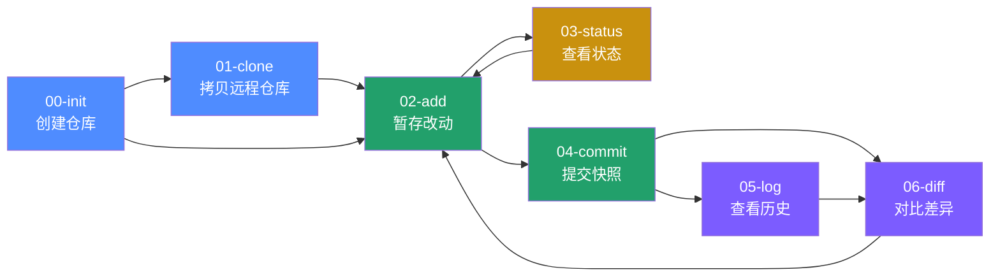
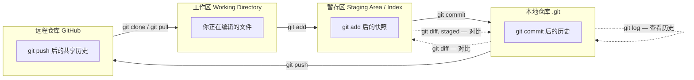
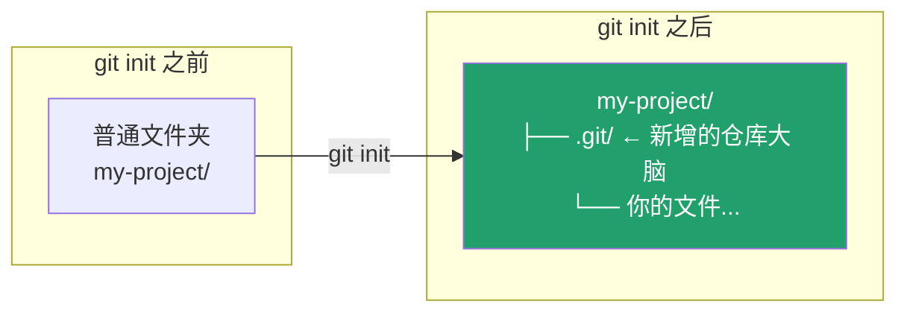

# Git 命令行基础，第 00 步 —— `git init`

English version: [README.md](README.md)

> 这是 7 个章节中的第一章，覆盖 Git 命令行最核心的命令，按日常使用顺序编号：`00-init` → `01-clone` → `02-add` → `03-status` → `04-commit` → `05-log` → `06-diff`。每一章都是 `Git/` 下的一个同级子目录——按数字顺序读下去即可，也可以直接跳到你需要的命令。
>
> 面向零基础/初学者。如果你已经熟悉基本用法、需要面向运维/生产场景的进阶速查表，请看上一级的 [Git/README.md](../README.md)。

## 学习路线图



## 目录导航

| 步骤 | 命令 | 一句话理解 |
|---|---|---|
| 00 | `git init` | 把一个普通文件夹变成 Git 仓库 *（当前所在位置）* |
| 01 | `git clone` | 把远程仓库完整复制到本地 —— [../01-clone](../01-clone/README_ZH.md) |
| 02 | `git add` | 把改动放进"待提交"暂存区 —— [../02-add](../02-add/README_ZH.md) |
| 03 | `git status` | 看清当前工作区/暂存区的状态 —— [../03-status](../03-status/README_ZH.md) |
| 04 | `git commit` | 把暂存区内容打包成一次历史快照 —— [../04-commit](../04-commit/README_ZH.md) |
| 05 | `git log` | 查看提交历史 —— [../05-log](../05-log/README_ZH.md) |
| 06 | `git diff` | 对比两个版本之间的具体差异 —— [../06-diff](../06-diff/README_ZH.md) |

## 核心心智模型（先建立这个，再看每个命令）

Git 管理你代码的"三个区域"，理解了这张图，7 个命令的作用就都说得通了：



- **`git status`** 是"体检报告"：随时告诉你三个区域现在的差异在哪。
- **`git diff`** 是"放大镜"：具体看差异的每一行内容。
- **`git log`** 是"时间机器的目录"：看仓库历史上都发生了什么。

---

## `git init` —— 创建你的第一个仓库

### 这一步在做什么

`git init` 把当前文件夹变成一个 Git 仓库：它会在文件夹里创建一个隐藏的 `.git/` 目录，Git 之后所有的历史记录、分支信息、配置都存在这里面。**在此之前，Git 完全不知道这个文件夹的存在。**



### 常用操作

```bash
# 方式一：在当前目录初始化
mkdir my-project && cd my-project
git init

# 方式二：直接指定目录名初始化（会自动创建文件夹）
git init my-project

# 初始化时指定默认分支名（推荐，避免 master/main 混乱）
git init -b main
```

### 参数说明

| 参数 | 作用 |
|---|---|
| `-b <name>` / `--initial-branch=<name>` | 指定初始分支名（如 `main`），否则会用 Git 全局配置的默认值 |
| `--bare` | 创建一个没有工作区、只存历史的"裸仓库"，通常用在服务器端作为远程仓库 |
| `-q` / `--quiet` | 静默模式，不输出提示信息 |

### 验证你做对了

```bash
ls -la          # 应该能看到 .git 目录
git status      # 应显示 "On branch main / No commits yet"
```

### 常见坑

- ⚠️ 不要在已经是 Git 仓库的目录里手动删除 `.git` 再重新 `init`——这会丢失全部历史，如果不确定先用 `git status` 检查工作区是否干净。
- ⚠️ 在自己主目录（`~`）或系统盘根目录执行 `git init` 是常见误操作，Git 会把整个目录当仓库跟踪，务必先 `cd` 到目标项目文件夹。

### 承上启下

`git init` 是"从零开始"的起点。但更常见的现实场景是：项目已经存在于 GitHub 上，你只是想把它下载到本地——这时候用的不是 `init`，而是下一节的 **`git clone`**。

👉 下一站：[01-clone —— 拷贝一个已存在的远程仓库](../01-clone/README_ZH.md)

---
参考：[Pro Git Book（官方免费电子书，中文版）](https://git-scm.com/book/zh/v2) ｜ [Git 官方命令参考手册](https://git-scm.com/docs) ｜ [Learn Git Branching（交互式练习）](https://learngitbranching.js.org/) ｜ [Pro Git 2.1 起步 - 关于版本控制](https://git-scm.com/book/zh/v2/起步-关于版本控制) ｜ [git-init 官方手册](https://git-scm.com/docs/git-init)

学完之后，进阶到面向生产/团队协作的场景，请看 [Git/README.md —— 运维视角的 Git 速查表](../README.md)。
