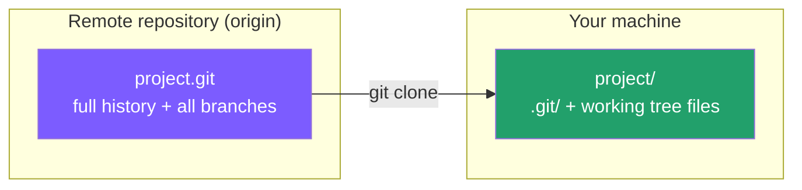

← [Back to index](../00-init/README.md) ｜ Previous: [Git/init](../00-init/README.md)

Chinese version: [README_ZH.md](README_ZH.md)

# `git clone` — Copy an Existing Remote Repository

## What this does

`git clone` makes a **complete copy** of a remote repository (say, a project on GitHub) onto your machine, including all commit history and every branch. Once cloning finishes, Git automatically records the remote address as `origin` — the local and remote repositories are already linked, so you don't need to run `git init` or configure a remote by hand.



## Common commands

```bash
# Clone over HTTPS (most common; requires account permission or a public repo)
git clone https://github.com/owner/repo.git

# Clone over SSH (requires an SSH key configured beforehand; recommended for daily use)
git clone git@github.com:owner/repo.git

# Clone into a specific local folder name
git clone https://github.com/owner/repo.git my-folder

# Clone only one branch, keeping only the most recent commit (shallow clone — saves time and space)
git clone --branch main --depth 1 https://github.com/owner/repo.git
```

## Flags

| Flag | Effect |
|---|---|
| `--branch <name>` / `-b` | Checks out the given branch right after cloning, instead of the default branch |
| `--depth <n>` | Shallow clone: fetches only the last n commits of history — good when you just want the code and don't need full history |
| `--recurse-submodules` | Also clones any submodules the repository references |
| `--origin <name>` | Custom name for the remote alias, instead of the default `origin` |

## Verify it worked

```bash
cd repo
git remote -v     # should show origin  https://github.com/owner/repo.git (fetch/push)
git log --oneline -5   # should show recent commit history
```

## Common pitfalls

- ⚠️ HTTPS may prompt for a username/token on every push; SSH only needs a one-time key setup. For team collaboration, SSH is recommended.
- ⚠️ A `--depth 1` shallow clone has no full history — if you later want `git log` to show everything or need to `rebase`, run `git fetch --unshallow` first to backfill history.

## What's next

Once cloned, you have a working tree identical to the remote. As soon as you start editing files, Git will notice a difference between your "working tree" and the "staging area/repository" — and the first command you'll reach for is **`git add`**, to put your intended changes into the staging area.

👉 Next: [Git/add — stage changes for the next commit](../02-add/README.md)

---
References: [Pro Git 2.1 — Getting a Git Repository](https://git-scm.com/book/en/v2/Git-Basics-Getting-a-Git-Repository) | [git-clone manual](https://git-scm.com/docs/git-clone)
