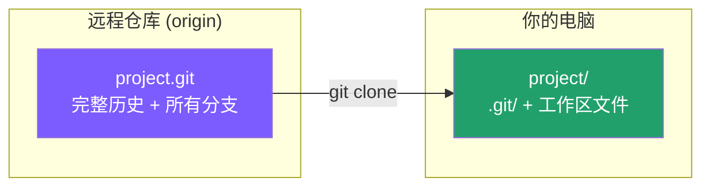

← [返回目录](../basics/README_ZH.md) ｜ 上一站：[Git/init](../init/README_ZH.md)

English version: [README.md](README.md)

# `git clone` —— 拷贝一个已存在的远程仓库

## 这一步在做什么

`git clone` 把远程仓库（比如 GitHub 上的项目）**完整复制**到本地，包括全部历史提交、所有分支信息。克隆完成后，Git 会自动把远程地址记为 `origin`，本地仓库和远程仓库自动建立好连接，不需要再手动 `git init` 或配置远程。



## 常用操作

```bash
# 通过 HTTPS 克隆（最常见，需要账号权限或公开仓库）
git clone https://github.com/owner/repo.git

# 通过 SSH 克隆（需要提前配置好 SSH key，日常开发推荐）
git clone git@github.com:owner/repo.git

# 克隆到指定的本地文件夹名
git clone https://github.com/owner/repo.git my-folder

# 只克隆某个分支，且只保留最近1次提交（浅克隆，节省时间和空间）
git clone --branch main --depth 1 https://github.com/owner/repo.git
```

## 参数说明

| 参数 | 作用 |
|---|---|
| `--branch <name>` / `-b` | 克隆后直接检出（checkout）到指定分支，而不是默认分支 |
| `--depth <n>` | 浅克隆，只拉取最近 n 次提交的历史，适合只是想看代码、不需要完整历史时 |
| `--recurse-submodules` | 同时克隆仓库里引用的子模块（submodule） |
| `--origin <name>` | 自定义远程别名，默认叫 `origin` |

## 验证你做对了

```bash
cd repo
git remote -v     # 应显示 origin  https://github.com/owner/repo.git (fetch/push)
git log --oneline -5   # 能看到最近的提交历史
```

## 常见坑

- ⚠️ HTTPS 方式每次 push 可能需要输入账号密码/token；SSH 方式配置一次 key 后无需重复输入，团队协作建议用 SSH。
- ⚠️ `--depth 1` 的浅克隆没有完整历史，之后如果想 `git log` 看全部提交或做 `rebase`，需要先 `git fetch --unshallow` 补全历史。

## 承上启下

克隆下来之后，你就有了一个和远程一模一样的工作区。接下来只要你开始改动文件，Git 就会察觉到"工作区"和"暂存区/仓库"之间出现了差异——这时候第一个要用的命令就是 **`git add`**，把你想要的改动放进暂存区。

👉 下一站：[Git/add —— 把改动放进暂存区](../add/README_ZH.md)

---
参考：[Pro Git 2.2 - 获取一个 Git 仓库](https://git-scm.com/book/zh/v2/Git-基础-获取-Git-仓库) ｜ [git-clone 官方手册](https://git-scm.com/docs/git-clone)
