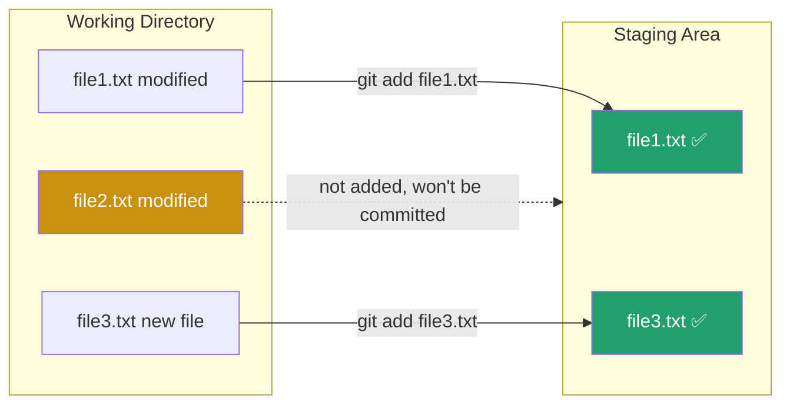

← [Back to index](../basics/README.md) ｜ Previous: [Git/clone](../clone/README.md)

Chinese version: [README_ZH.md](README_ZH.md)

# `git add` — Stage Changes for the Next Commit

## What this does

When you edit files, Git already notices "these files changed" — but it **never commits automatically**. `git add` moves your chosen changes **into the staging area (index)**, effectively telling `git commit`: "only package these changes into the next commit; leave everything else out for now."



**Why have a staging area at all?** It lets you **split** a pile of mixed changes into several logically clean commits — for instance, if you fixed a bug and updated docs at the same time, you can `add` + `commit` them separately instead of lumping everything into one commit.

## Common commands

```bash
# Stage a single file
git add file1.txt

# Stage several specific files
git add file1.txt file2.txt

# Stage all changes under a directory
git add src/

# Stage all changes in the current directory and subdirectories (most common)
git add .

# Stage every change in the whole repository (including other directories)
git add -A

# Interactively choose changes, even down to individual hunks within a file
git add -p file1.txt
```

## Flags

| Flag | Effect |
|---|---|
| `.` | Stages all added/modified/deleted files under the current directory (not parent directories) |
| `-A` / `--all` | Stages all changes across the entire repository |
| `-p` / `--patch` | Interactively confirms each hunk — useful when you only want to commit part of a file's changes |
| `-u` / `--update` | Stages modifications/deletions only for files Git already tracks; skips new files |

## Verify it worked

`git add` produces no output itself — check with `git status`, covered in the next section:

```bash
git status
# Green text = staged, will be included in the next commit
# Red text   = still in the working tree, not staged
```

## Common pitfalls

- ⚠️ `git add .` will also pick up `.env` files, secrets, etc. Always check `git status` before committing, and add sensitive files to `.gitignore`.
- ⚠️ Edited a file again after `add`-ing it? The change won't automatically sync into the staging area — you need to `git add` it again, or `commit` will still include the old version.
- ⚠️ To undo an `add` (without deleting the file, just moving it back out of staging): `git restore --staged file1.txt`.

## What's next

After staging your changes, before actually committing, you'll want to confirm: "what exactly did I stage? Did I miss anything?" — that's exactly what the next section, **`git status`**, answers.

👉 Next: [Git/status — check the current state](../status/README.md)

---
References: [Pro Git 2.2 — Recording Changes to the Repository](https://git-scm.com/book/en/v2/Git-Basics-Recording-Changes-to-the-Repository) | [git-add manual](https://git-scm.com/docs/git-add)
