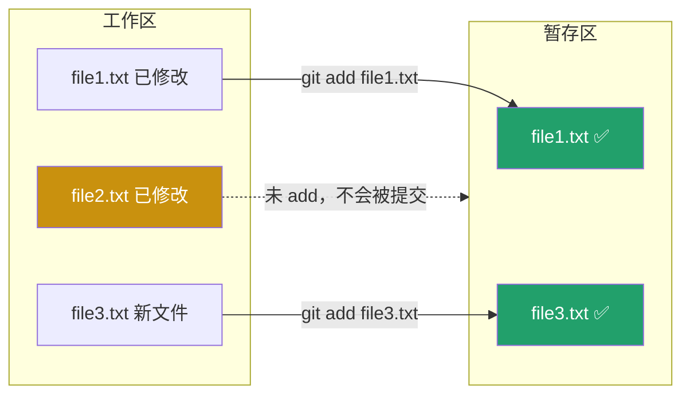

← [返回目录](../basics/README_ZH.md) ｜ 上一站：[Git/clone](../clone/README_ZH.md)

English version: [README.md](README.md)

# `git add` —— 把改动放进暂存区

## 这一步在做什么

你在工作区改了文件，Git 已经能感知到"这些文件变了"，但**默认不会自动提交**。`git add` 的作用是把你选中的改动**搬进暂存区（Staging Area）**，相当于对 `git commit` 说："只把这些改动打包进下一次提交，其他没 add 的先不要。"



**为什么要有暂存区这一层？** 因为它让你可以把一堆混杂的改动**拆分**成多个逻辑清晰的提交——比如同时改了 bug 修复和文档，你可以分两次 `add` + `commit`，而不是一股脑全部糊在一次提交里。

## 常用操作

```bash
# 暂存单个文件
git add file1.txt

# 暂存多个指定文件
git add file1.txt file2.txt

# 暂存某个目录下的所有改动
git add src/

# 暂存当前目录及子目录下所有改动（最常用）
git add .

# 暂存仓库内所有改动（包括其他目录）
git add -A

# 交互式选择，甚至可以只暂存文件里的部分代码块（hunk）
git add -p file1.txt
```

## 参数说明

| 参数 | 作用 |
|---|---|
| `.` | 暂存当前目录下所有新增/修改/删除的文件（不含上级目录） |
| `-A` / `--all` | 暂存整个仓库范围内的所有改动 |
| `-p` / `--patch` | 逐块（hunk）交互确认要不要暂存，适合一个文件里只想提交部分改动 |
| `-u` / `--update` | 只暂存已被 Git 跟踪的文件的修改/删除，不添加新文件 |

## 验证你做对了

`git add` 本身没有输出，用下一节的 `git status` 检查：

```bash
git status
# 绿色文字 = 已暂存，会被下次 commit 包含
# 红色文字 = 还在工作区，未暂存
```

## 常见坑

- ⚠️ `git add .` 会连同 `.env`、密钥文件等一起加入，提交前务必先看 `git status` 确认列表，敏感文件要写进 `.gitignore`。
- ⚠️ `add` 之后又改了文件？改动不会自动同步进暂存区，需要重新 `git add` 一次，否则 `commit` 里包含的还是旧版本。
- ⚠️ 想撤销 add（不删文件，只是移出暂存区）：`git restore --staged file1.txt`。

## 承上启下

暂存了改动之后，在真正提交之前，你一定想先确认："我到底暂存了什么？还有什么漏了？" ——这正是下一节 **`git status`** 要回答的问题。

👉 下一站：[Git/status —— 查看当前状态](../status/README_ZH.md)

---
参考：[Pro Git 2.2 - 记录每次更新到仓库](https://git-scm.com/book/zh/v2/Git-基础-记录每次更新到仓库) ｜ [git-add 官方手册](https://git-scm.com/docs/git-add)
