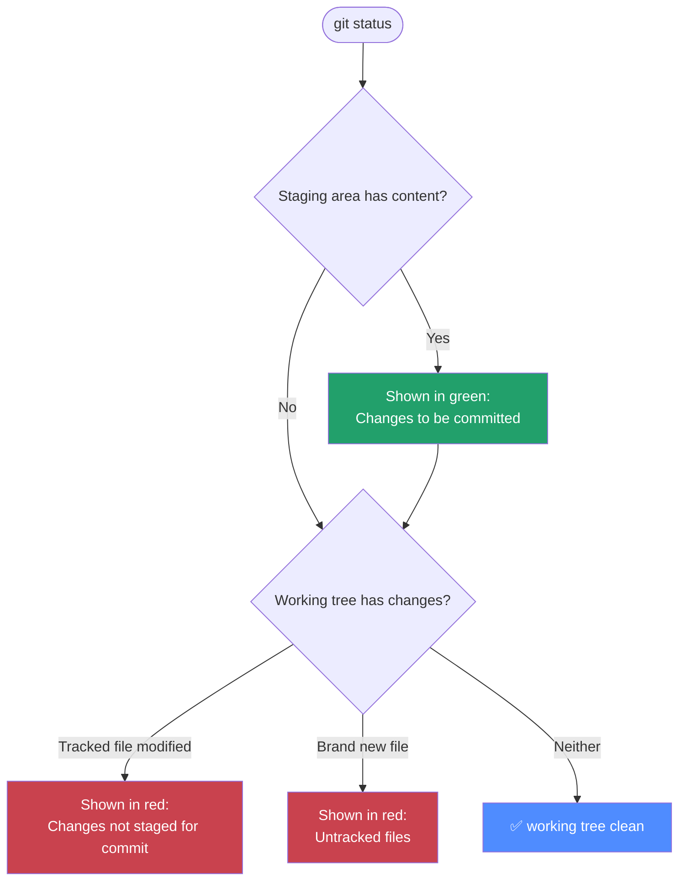

← [Back to index](../basics/README.md) ｜ Previous: [Git/add](../add/README.md)

Chinese version: [README_ZH.md](README_ZH.md)

# `git status` — Check the Current State

## What this does

`git status` is the command you'll run more than any other. It's a "health check" that tells you at a glance:

1. Which branch you're on
2. What's in the staging area (about to be committed)
3. What changes in the working tree are still unstaged
4. Whether there are any brand-new files Git doesn't recognize yet (untracked)



## Common commands

```bash
# Full output (recommended for beginners, most information)
git status

# Short output, one line per file — a quick scan once you're comfortable
git status -s
# or
git status --short
```

## Short-mode (`-s`) symbol cheat sheet

| Symbol | Meaning |
|---|---|
| `??` | Brand new file, completely untracked by Git |
| ` M` | Modified in the working tree, but **not staged** |
| `M ` | Staged modification (left column = staging-area state) |
| `MM` | Staged, then modified again — both staging area and working tree differ |
| `A ` | New file, already staged (Added) |
| ` D` | Deleted in the working tree, but not staged |

> Memory trick: the **two columns** in `git status -s` output correspond to the **staging area** (left) and the **working tree** (right), each relative to the last commit.

## Verify you understood it

```bash
echo "test" >> file1.txt   # create a change
git status                  # file1.txt should show under "not staged"
git add file1.txt
git status                  # it should now show under "to be committed"
```

## Common pitfalls

- ⚠️ Seeing a pile of files that shouldn't be tracked (`node_modules/`, `.DS_Store`)? You're missing a `.gitignore` — add them there instead of ignoring them manually each time.
- ⚠️ `status` is **read-only** and never changes any state, so run it as often as you like — make "run status after every change" a habit.

## What's next

`git status` tells you **which files** changed, but not **exactly which lines**. To see the real line-by-line differences, you need the next section: **`git diff`**.

👉 Next: [Git/diff — compare the exact differences](../diff/README.md) (or read [Git/commit](../commit/README.md) first and come back to diff — the order doesn't matter)

---
References: [Pro Git 2.2 — Checking the Status of Your Files](https://git-scm.com/book/en/v2/Git-Basics-Recording-Changes-to-the-Repository) | [git-status manual](https://git-scm.com/docs/git-status)
