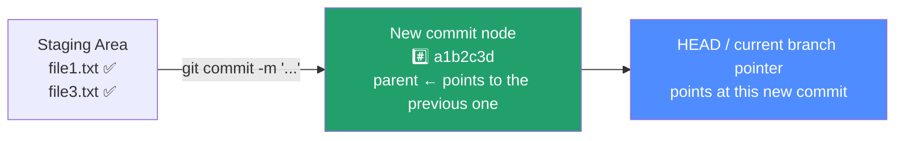
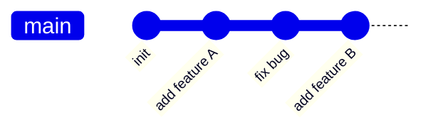

← [Back to index](../00-init/README.md) ｜ Previous: [Git/status](../03-status/README.md)

Chinese version: [README_ZH.md](README_ZH.md)

# `git commit` — Package the Staging Area into a History Snapshot

## What this does

`git commit` **permanently records** the current content of the staging area into the repository's history, producing a "snapshot point" with a unique hash (e.g. `a1b2c3d`). From then on, no matter how the working tree changes, this commit's content is never lost — you can always inspect or return to it with `log`/`diff`/`checkout`.



Understanding the commit chain: every commit records "who came before it", and chaining those together forms a history — which is exactly what `git log` shows you.



## Common commands

```bash
# Commit staged content with a message
git commit -m "feat: add login functionality"

# Skip add, commit all changes to already-tracked files directly (new files still need add first)
git commit -am "fix: fix null pointer exception"

# Open an editor for a multi-line, detailed commit message (recommended for complex changes)
git commit

# Amend the most recent commit (fix the message or add missed files); use only before pushing
git commit --amend
```

## Flags

| Flag | Effect |
|---|---|
| `-m "<msg>"` | Specifies the commit message directly on the command line, skipping the editor |
| `-a` | Automatically adds all modifications to already-tracked files (not new files), skipping manual `git add` |
| `--amend` | Fixes the most recent commit instead of creating a new one (changes its hash) |
| `--no-verify` | Skips pre-commit hook validation (⚠️ not recommended for routine use unless truly necessary) |

## What a good commit message looks like

[Conventional Commits](https://www.conventionalcommits.org/) style is recommended:

```
<type>: <short description, imperative mood, under 50 characters>

<optional detailed explanation of "why", not "what">
```

Common types: `feat` (new feature), `fix` (bug fix), `docs` (documentation), `refactor`, `test`, `chore` (misc).

## Verify it worked

```bash
git commit -m "docs: add git tutorial"
git log -1          # should show this commit at the top
git status          # should show "nothing to commit, working tree clean"
```

## Common pitfalls

- ⚠️ `--amend` changes the commit's hash. **Never amend a commit that's already been pushed and pulled by others** — it forks history. On shared branches, use `git revert` instead.
- ⚠️ Empty or vague messages like "update" make `git log` useless when debugging later — spend 10 seconds writing something clear and your future self will thank you.

## What's next

With your first commit, you officially have "history". The natural next question is: **what has actually been committed to this repository?** That's answered in the next section, **`git log`**.

👉 Next: [Git/log — browse commit history](../05-log/README.md)

---
References: [Pro Git 2.2 — Committing Your Changes](https://git-scm.com/book/en/v2/Git-Basics-Recording-Changes-to-the-Repository#_committing_changes) | [git-commit manual](https://git-scm.com/docs/git-commit)
