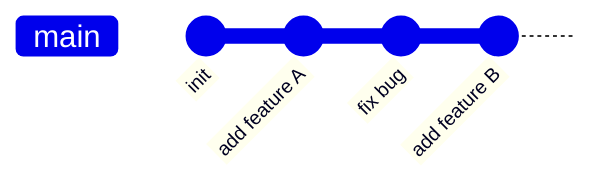

← [返回目录](../00-init/README_ZH.md) ｜ 上一站：[Git/status](../03-status/README_ZH.md)

English version: [README.md](README.md)

# `git commit` —— 把暂存区打包成一次历史快照

## 这一步在做什么

`git commit` 把暂存区当前的内容**永久记录**进仓库历史，生成一个带唯一哈希值（如 `a1b2c3d`）的"快照点"。之后无论工作区怎么改，这次提交的内容都不会丢失，你随时可以用 `log`/`diff`/`checkout` 回看或回到这个点。


理解提交链：每个提交都记录着"它的上一个提交是谁"，这样串起来就是一条历史链，`git log` 看到的就是这条链。



## 常用操作

```bash
# 提交暂存区内容，附带提交信息
git commit -m "feat: 添加登录功能"

# 跳过 add，直接提交所有【已跟踪文件】的修改（新文件不算，仍需先 add）
git commit -am "fix: 修复空指针异常"

# 打开编辑器写多行详细提交信息（推荐用于复杂改动）
git commit

# 修改最近一次提交（改提交信息或补充漏提交的文件），未 push 前使用
git commit --amend
```

## 参数说明

| 参数 | 作用 |
|---|---|
| `-m "<msg>"` | 直接在命令行指定提交信息，避免打开编辑器 |
| `-a` | 自动 add 所有已跟踪文件的修改（不含全新文件），跳过手动 `git add` |
| `--amend` | 修正最近一次提交，而不是创建新提交（会改变提交哈希） |
| `--no-verify` | 跳过 pre-commit 钩子校验（⚠️ 除非确有必要，不建议日常使用） |

## 好的提交信息长什么样

推荐用 [Conventional Commits](https://www.conventionalcommits.org/zh-hans/) 风格：

```
<type>: <简短描述，祈使句，不超过50字符>

<可选的详细说明，解释"为什么"而不是"做了什么">
```

常见 type：`feat`（新功能）、`fix`（修bug）、`docs`（文档）、`refactor`（重构）、`test`（测试）、`chore`（杂项）。

## 验证你做对了

```bash
git commit -m "docs: 添加 git 教程"
git log -1          # 应看到刚才的提交出现在最顶部
git status          # 应显示 "nothing to commit, working tree clean"
```

## 常见坑

- ⚠️ `--amend` 会改变提交的哈希值，**如果这个提交已经 push 到远程且被他人拉取过，千万不要 amend**，否则会造成历史分叉，团队协作要用 `git revert` 代替。
- ⚠️ 提交信息为空或写"update"这种无意义描述，会让 `git log` 排查问题时毫无价值——花10秒写清楚，未来的自己会感谢现在的你。

## 承上启下

有了第一次提交，你就正式拥有了"历史"。接下来自然要问：**这个仓库到底提交过什么？** 答案在下一节 **`git log`**。

👉 下一站：[Git/log —— 查看提交历史](../05-log/README_ZH.md)

---
参考：[Pro Git 2.2 - 提交更新](https://git-scm.com/book/zh/v2/Git-基础-记录每次更新到仓库#r_committing_changes) ｜ [git-commit 官方手册](https://git-scm.com/docs/git-commit)
