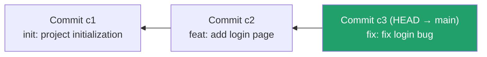

← [Back to index](../00-init/README.md) ｜ Previous: [Git/commit](../04-commit/README.md)

Chinese version: [README_ZH.md](README_ZH.md)

# `git log` — Browse Commit History

## What this does

`git log` shows the commit history of the current branch, tracing backward from the newest commit to the earliest — a "table of contents for a time machine". Each entry includes the commit hash, author, date, and message.



`git log`'s default output prints this chain **right to left** (newest to oldest).

## Common commands

```bash
# Default, detailed mode
git log

# Compress each commit to one line — the most common daily view
git log --oneline

# Graphical view of branches and merges (very useful for team collaboration)
git log --oneline --graph --all

# Only the last 5 commits
git log -5

# Only commits by a specific author
git log --author="Jane Doe"

# Only the history of a specific file
git log --follow -- src/app.js

# Search commit messages for a keyword
git log --grep="fix"

# Show exactly what each commit changed (combines log with diff)
git log -p
```

## Flags

| Flag | Effect |
|---|---|
| `--oneline` | Compresses each commit to one line: `hash prefix + message` |
| `--graph` | Draws an ASCII graph of branches and merges |
| `--all` | Shows commits across all branches, not just the current one |
| `-p` / `--patch` | Also shows each commit's exact code diff |
| `--stat` | Shows which files each commit touched and how many lines changed (more concise than `-p`) |

## A useful alias worth adding

```bash
git config --global alias.lg "log --oneline --graph --all --decorate"
# then just type
git lg
```

## Verify you understood it

```bash
git log --oneline
# The 7 characters at the start of each line (e.g. a1b2c3d) are the commit hash
# Use it to reference a specific commit, e.g. git show a1b2c3d
```

## Common pitfalls

- ⚠️ Default `git log` output can be long — press `q` to exit the pager (Git uses `less` by default).
- ⚠️ `--follow` only tracks rename history for a single file; run it separately for other files.

## What's next

`git log` tells you **what happened in history**, but if you want to know exactly which lines differ **right now** vs. a given commit, or **between two commits**, you need the final section: **`git diff`**.

👉 Next: [Git/diff — compare the exact differences](../06-diff/README.md)

---
References: [Pro Git 2.3 — Viewing the Commit History](https://git-scm.com/book/en/v2/Git-Basics-Viewing-the-Commit-History) | [git-log manual](https://git-scm.com/docs/git-log)
