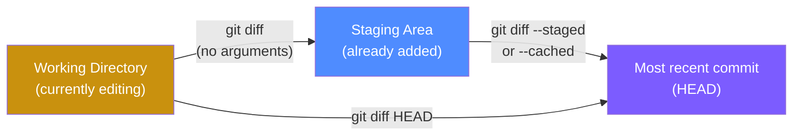
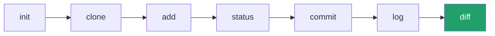

← [Back to index](../basics/README.md) ｜ Previous: [Git/log](../log/README.md)

Chinese version: [README_ZH.md](README_ZH.md)

# `git diff` — Compare the Exact Differences

## What this does

`git diff` is a "magnifying glass": `git status` tells you which files changed, `git diff` tells you **exactly which lines** changed, what was added, what was removed. It can compare three different ranges, which is the easiest part to confuse — look closely at the diagram below:



> One-line memory trick: **`git diff`** with no flags shows "changes I haven't added yet"; **`git diff --staged`** shows "changes I've already added and am about to commit".

## Common commands

```bash
# Working tree vs staging area (changes not yet added)
git diff

# Staging area vs most recent commit (added, not yet committed)
git diff --staged
# equivalent
git diff --cached

# Working tree vs most recent commit, all at once (skips the staging-area distinction)
git diff HEAD

# Compare between two specific commits
git diff a1b2c3d..e4f5g6h

# Compare between two branches
git diff main..feature/login

# Only a single file's diff
git diff -- src/app.js

# File-level stats only (which files changed, line counts), no actual content
git diff --stat
```

## Reading diff output

```diff
diff --git a/app.js b/app.js
index 83db48f..bf269b4 100644
--- a/app.js
+++ b/app.js
@@ -10,7 +10,7 @@ function login(user) {
-  if (user.name) {
+  if (user.name && user.password) {
     return true;
   }
```

| Symbol | Meaning |
|---|---|
| `---` / `+++` | The "before" (a) and "after" (b) versions, respectively |
| `@@ -10,7 +10,7 @@` | Locates line 10 for 7 lines in the original file, and the same position in the new file |
| Lines starting with `-` | Old code removed/replaced (shown in red) |
| Lines starting with `+` | New code added (shown in green) |

## Flags

| Flag | Effect |
|---|---|
| `--staged` / `--cached` | Compares the staging area against the most recent commit |
| `--stat` | Shows only file-level added/removed line counts, no actual code |
| `--word-diff` | Highlights differences at the word level instead of the whole line — good for prose/docs |
| `--color-words` | Similar to `--word-diff`, more compact output |

## Verify you understood it

```bash
echo "// new comment" >> file1.txt
git diff                 # should show this new line, marked green with +
git add file1.txt
git diff                 # should now show nothing (it's in the staging area, not a working-tree diff anymore)
git diff --staged        # should now show that line's diff
```

## Common pitfalls

- ⚠️ Forgetting to run `git diff --staged` as a final check before committing can let debug `console.log` calls or temporary code slip into a commit.
- ⚠️ Binary files (images, etc.) can't be diffed for content — Git will say `Binary files differ`, which is expected.

## Recap: you've finished all 7 core commands 🎉



At this point you can complete the full loop: "create/copy a repo → change files → stage → check → commit → view history → compare differences". Next, move on to branching and merging (`branch` / `merge` / `rebase`) — [Learn Git Branching](https://learngitbranching.js.org/) is a great interactive way to solidify it.

👈 Back to: [Git tutorial home](../basics/README.md)

---
References: [Pro Git 2.2 — Viewing Your Staged and Unstaged Changes](https://git-scm.com/book/en/v2/Git-Basics-Recording-Changes-to-the-Repository#_git_diff) | [git-diff manual](https://git-scm.com/docs/git-diff)
