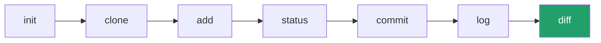

← [返回目录](../basics/README_ZH.md) ｜ 上一站：[Git/log](../log/README_ZH.md)

English version: [README.md](README.md)

# `git diff` —— 对比具体差异

## 这一步在做什么

`git diff` 是"放大镜"：`git status` 告诉你哪些文件变了，`git diff` 告诉你**具体哪一行**变了、加了什么、删了什么。它可以对比三种不同的范围，这是最容易搞混的地方，务必看清下图：


> 一句话记忆：**不带参数的 `git diff`** 看的是"我还没 add 的改动"；**`git diff --staged`** 看的是"我已经 add、马上要 commit 的改动"。

## 常用操作

```bash
# 查看工作区 vs 暂存区的差异（还没 add 的改动）
git diff

# 查看暂存区 vs 最近一次提交的差异（已 add、还没 commit 的改动）
git diff --staged
# 等价写法
git diff --cached

# 查看工作区 vs 最近一次提交的全部差异（跳过暂存区概念，一次看全）
git diff HEAD

# 对比两次具体提交之间的差异
git diff a1b2c3d..e4f5g6h

# 对比两个分支的差异
git diff main..feature/login

# 只看某一个文件的差异
git diff -- src/app.js

# 只显示改了哪些文件及行数统计，不显示具体内容
git diff --stat
```

## 读懂 diff 输出

```diff
diff --git a/app.js b/app.js
index 83db48f..bf269b4 100644
--- a/app.js
+++ b/app.js
@@ -10,7 +10,7 @@ function login(user) {
-  if (user.name) {
+  if (user.name && user.password) {
     return true;
   }
```

| 符号 | 含义 |
|---|---|
| `---` / `+++` | 分别代表"改动前"（a）和"改动后"（b）版本 |
| `@@ -10,7 +10,7 @@` | 定位到原文件第10行开始的7行，对应新文件同样位置 |
| `-` 开头的行 | 被删除/替换掉的旧代码（红色） |
| `+` 开头的行 | 新增的代码（绿色） |

## 参数说明

| 参数 | 作用 |
|---|---|
| `--staged` / `--cached` | 对比暂存区与最近提交 |
| `--stat` | 仅显示文件级别的增删行数统计，不展示具体代码 |
| `--word-diff` | 按单词级别高亮差异，而不是整行，适合看文档改动 |
| `--color-words` | 类似 `--word-diff`，输出更紧凑 |

## 验证你理解对了

```bash
echo "// 新注释" >> file1.txt
git diff                 # 应该能看到刚加的这一行，标绿色 +
git add file1.txt
git diff                 # 现在应该没有输出了（已经在暂存区，不在工作区差异里）
git diff --staged        # 这时候能看到刚才那行差异
```

## 常见坑

- ⚠️ 提交前忘记 `git diff --staged` 走一遍最终确认，容易把调试用的 `console.log`、临时代码一起提交上去。
- ⚠️ 二进制文件（图片等）diff 不出内容，Git 会提示 `Binary files differ`，属正常现象。

## 回顾：你已经学完了 7 个核心命令 🎉



至此，你已经能完成"创建/拷贝仓库 → 改动 → 暂存 → 检查 → 提交 → 查历史 → 看差异"的完整闭环。下一阶段可以进入分支与合并（`branch` / `merge` / `rebase`），推荐直接上手 [Learn Git Branching](https://learngitbranching.js.org/) 交互式练习巩固。

👈 返回：[Git 教程首页](../basics/README_ZH.md)

---
参考：[Pro Git 2.2 - 查看已暂存和未暂存的修改](https://git-scm.com/book/zh/v2/Git-基础-记录每次更新到仓库#_git_diff) ｜ [git-diff 官方手册](https://git-scm.com/docs/git-diff)
