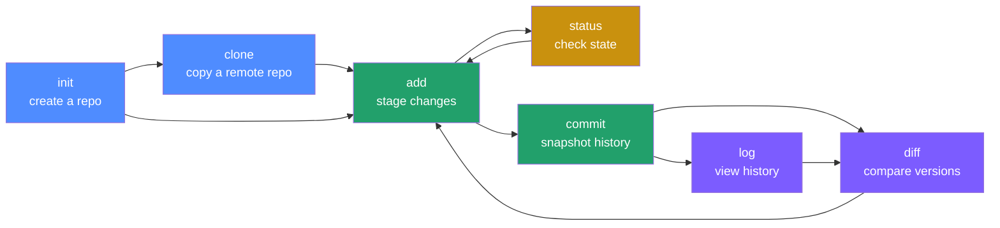

# Git Command-Line Basics — A Visual Tutorial

Chinese version: [README_ZH.md](README_ZH.md)

> This tutorial covers the 7 most essential Git command-line commands, ordered by how you'd actually use them day to day. Each command gets its own subdirectory with a concept diagram, common invocations, hands-on steps, common pitfalls, and a link forward to the next one.
>
> Written for absolute beginners. If you're already comfortable with basic Git and need a production/ops-oriented reference instead, see [Git/README.md](../README.md) one level up.

## Learning roadmap



## Contents

| Order | Command | One-line takeaway | Link |
|---|---|---|---|
| 1 | `git init` | Turn a plain folder into a Git repository | [../init](../init/README.md) |
| 2 | `git clone` | Copy a remote repository to your machine | [../clone](../clone/README.md) |
| 3 | `git add` | Stage changes for the next commit | [../add](../add/README.md) |
| 4 | `git status` | Inspect the current state of your working tree/index | [../status](../status/README.md) |
| 5 | `git commit` | Turn the staged content into a permanent snapshot | [../commit](../commit/README.md) |
| 6 | `git log` | Browse commit history | [../log](../log/README.md) |
| 7 | `git diff` | Compare the exact differences between two versions | [../diff](../diff/README.md) |

## The core mental model (learn this first, everything else follows)

Git manages your code across "three areas". Once this clicks, every one of the 7 commands makes sense:

```mermaid
flowchart LR
    accTitle: Git's three areas and how commands move content between them
    accDescr: The working directory moves into the staging area via add, the staging area moves into the local repository via commit, and the local repository moves into the remote via push. Clone or pull bring the remote back into the working directory. Diff compares the staging area against the repository, or the working directory against the staging area; log inspects repository history.
    subgraph WD[Working Directory]
        F1[Files you're currently editing]
    end
    subgraph SA[Staging Area / Index]
        F2[Snapshot after git add]
    end
    subgraph REPO[Local Repository .git]
        F3[History after git commit]
    end
    subgraph REMOTE[Remote Repository GitHub]
        F4[Shared history after git push]
    end

    WD -- "git add" --> SA
    SA -- "git commit" --> REPO
    REPO -- "git push" --> REMOTE
    REMOTE -- "git clone / git pull" --> WD
    REPO -- "git diff" -.compares.-> SA
    SA -- "git diff --staged" -.compares.-> REPO
    REPO -- "git log" -.inspects history.-> REPO
```

- **`git status`** is a "health check": it always tells you where the three areas currently differ.
- **`git diff`** is a "magnifying glass": it shows the exact line-by-line content of a difference.
- **`git log`** is the "table of contents for a time machine": it shows what happened in the repository's history.

Ready? Start at station one 👉 [Git/init — create your first repository](../init/README.md)

---

## References

- [Pro Git Book (free official ebook)](https://git-scm.com/book/en/v2)
- [Official Git command reference](https://git-scm.com/docs)
- [Learn Git Branching (interactive exercises)](https://learngitbranching.js.org/)

Once you've finished this series, move on to the production/team-collaboration reference at [Git/README.md](../README.md).
