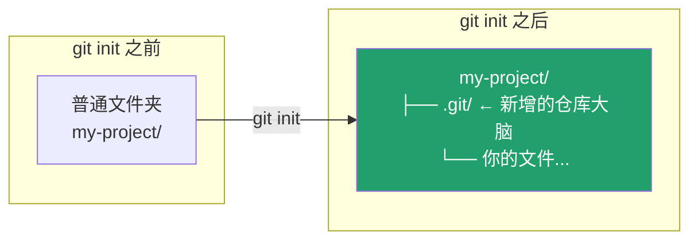

← [返回目录](../basics/README.md)

# `git init` —— 创建你的第一个仓库

## 这一步在做什么

`git init` 把当前文件夹变成一个 Git 仓库：它会在文件夹里创建一个隐藏的 `.git/` 目录，Git 之后所有的历史记录、分支信息、配置都存在这里面。**在此之前，Git 完全不知道这个文件夹的存在。**



## 常用操作

```bash
# 方式一：在当前目录初始化
mkdir my-project && cd my-project
git init

# 方式二：直接指定目录名初始化（会自动创建文件夹）
git init my-project

# 初始化时指定默认分支名（推荐，避免 master/main 混乱）
git init -b main
```

## 参数说明

| 参数 | 作用 |
|---|---|
| `-b <name>` / `--initial-branch=<name>` | 指定初始分支名（如 `main`），否则会用 Git 全局配置的默认值 |
| `--bare` | 创建一个没有工作区、只存历史的"裸仓库"，通常用在服务器端作为远程仓库 |
| `-q` / `--quiet` | 静默模式，不输出提示信息 |

## 验证你做对了

```bash
ls -la          # 应该能看到 .git 目录
git status      # 应显示 "On branch main / No commits yet"
```

## 常见坑

- ⚠️ 不要在已经是 Git 仓库的目录里手动删除 `.git` 再重新 `init`——这会丢失全部历史，如果不确定先用 `git status` 检查工作区是否干净。
- ⚠️ 在自己主目录（`~`）或系统盘根目录执行 `git init` 是常见误操作，Git 会把整个目录当仓库跟踪，务必先 `cd` 到目标项目文件夹。

## 承上启下

`git init` 是"从零开始"的起点。但更常见的现实场景是：项目已经存在于 GitHub 上，你只是想把它下载到本地——这时候用的不是 `init`，而是下一节的 **`git clone`**。

👉 下一站：[Git/clone —— 拷贝一个已存在的远程仓库](../clone/README.md)

---
参考：[Pro Git 2.1 起步 - 关于版本控制](https://git-scm.com/book/zh/v2/起步-关于版本控制) ｜ [git-init 官方手册](https://git-scm.com/docs/git-init)
