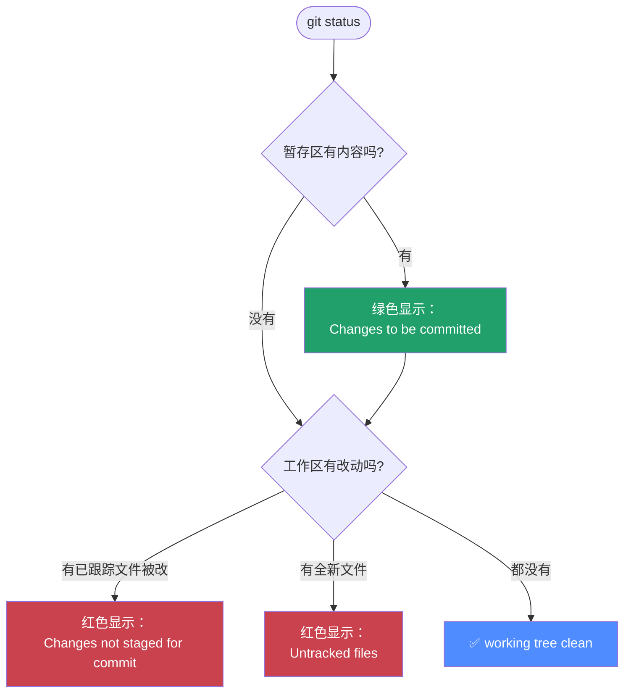

← [返回目录](../README.md) ｜ 上一站：[Git/add](../add/README.md)

# `git status` —— 查看当前状态

## 这一步在做什么

`git status` 是你最高频会用的命令，没有之一。它像一份"体检报告"，一眼告诉你：

1. 当前在哪个分支
2. 暂存区里有什么（马上会被提交的内容）
3. 工作区里还有什么改动没暂存
4. 有没有 Git 完全不认识的新文件（Untracked）



## 常用操作

```bash
# 完整版输出（新手推荐，信息最全）
git status

# 简洁版输出，一行一个文件，适合熟练后快速扫一眼
git status -s
# 或
git status --short
```

## `-s` 简洁模式的符号速查

| 符号 | 含义 |
|---|---|
| `??` | 全新文件，Git 完全没跟踪过（Untracked） |
| ` M` | 工作区有修改，但**未暂存** |
| `M ` | 已暂存的修改（左列 = 暂存区状态） |
| `MM` | 暂存后又继续改了，暂存区和工作区都有差异 |
| `A ` | 新文件已暂存（Added） |
| ` D` | 工作区中文件被删除，但未暂存 |

> 记忆技巧：`git status -s` 输出的**两列字符**分别对应**暂存区**（左）和**工作区**（右）相对上一次提交的状态。

## 验证你理解对了

```bash
echo "test" >> file1.txt   # 制造一个改动
git status                  # 应该看到 file1.txt 出现在 "not staged" 区域
git add file1.txt
git status                  # 现在应该出现在 "to be committed" 区域
```

## 常见坑

- ⚠️ 看到一大堆不该被跟踪的文件（如 `node_modules/`、`.DS_Store`）？说明缺少 `.gitignore`，把它们加进去而不是每次手动忽略。
- ⚠️ `status` 只是**只读查看**，不会改变任何状态，可以随时放心地反复执行，养成"改完就 status 一下"的习惯。

## 承上启下

`git status` 告诉你"哪些文件变了"，但不会告诉你**具体改了哪一行**。想看到逐行的真实差异内容，需要下一节的 **`git diff`**。

👉 下一站：[Git/diff —— 对比具体差异](../diff/README.md)（也可以先看完 [Git/commit](../commit/README.md) 再回头看 diff，两者顺序不冲突）

---
参考：[Pro Git 2.2 - 检查当前文件状态](https://git-scm.com/book/zh/v2/Git-基础-记录每次更新到仓库) ｜ [git-status 官方手册](https://git-scm.com/docs/git-status)
