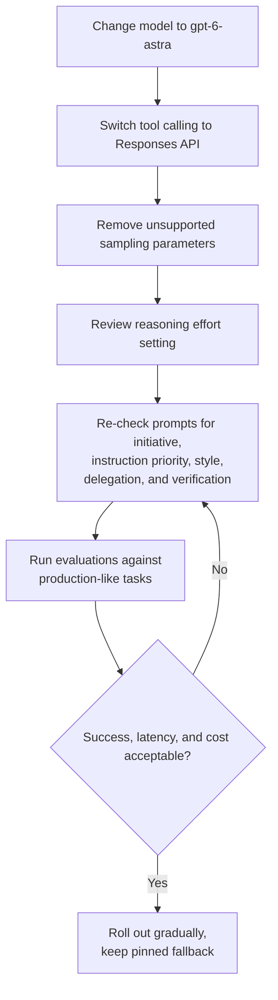

# OpenAI Latest Model Guidance

English · [简体中文](README_ZH.md)

## Mental model

> Moving to GPT-6 Astra is an evaluated configuration change, not a drop-in rename: the API surface (Responses, supported parameters) and the model's default behavior (initiative, instruction weight, style, delegation, verification) both shift, so each must be checked and, if needed, re-pinned with prompt instructions.

## Source

- Official guide: [Model guidance](https://developers.openai.com/api/docs/guides/latest-model)
- Publisher: OpenAI
- Reviewed: September 14, 2026
- Model covered at review time: `gpt-6-astra`

The source is a rolling guide whose default model can change. Check the official page before making
production model or API decisions.

## Summary

OpenAI recommends GPT-6 Astra for demanding, end-to-end API work involving reasoning, coding,
browsing, computer use, science, and professional workflows. Use it through the Responses API with
`model: "gpt-6-astra"`.

The migration is more than a model-name change. Applications should review reasoning effort, tool
calling, unsupported sampling parameters, prompt caching, and prompts that govern autonomy, style,
delegation, and verification.

## What GPT-6 Astra adds

- **Async tool calling:** mark a function or custom tool with `async: true`; the model can continue
  useful work while the application executes the tool, then consume the result using its `call_id`.
- **Mid-turn steering:** over a WebSocket Responses API connection, applications can add user
  instructions while a response is in progress without discarding completed work.
- **Mid-conversation reasoning changes:** a `configuration_update` input item can change reasoning
  effort while preserving the stable prompt prefix for caching.
- **Existing agent capabilities:** computer use, Structured Outputs, streaming, programmatic tool
  calling, multi-agent orchestration, prompt caching, persisted reasoning, compaction, and pro mode.
- **Misalignment monitoring:** OpenAI states that asynchronous safeguards monitor for possible
  misalignment and can trigger alerts.

The application still executes tools and manages pending calls; async tool calling does not move
that responsibility into the model.

## Prompting behavior to account for

### Initiative and follow-through

GPT-6 Astra is more likely than earlier models to ask a clarifying question when an answer could
change the outcome. If an application expects autonomous completion, explicitly tell the model to
infer routine details, act within the authorized scope, persist until done, and ask only when a
decision materially affects the result.

### Instruction following

The model follows long instructions more reliably and is also more sensitive to instructions in
skills, `AGENTS.md`, and other context files. Audit these files for stale, hidden, or conflicting
guidance, and state which instruction source has priority.

### Writing style

Default answers may be detailed and heavily formatted. Specify the desired length, structure,
vocabulary, and audience rather than expecting a consistent house style without instruction.

### Delegation

If a workflow benefits from parallel agents, tell the model when delegation is expected and how much
work to delegate. Do not assume it will choose the desired degree of parallelism by itself.

### Testing

The model may perform broad verification for small coding changes. Define proportionate checks and
make it clear when required tests are sufficient, so it expands testing only after a failure, a new
change, or an unresolved risk.

## Migration checklist

1. Change the model to `gpt-6-astra`.
2. Use the Responses API for tool calling. Chat Completions is supported, but GPT-6 Astra tool calls
   require Responses.
3. If the old reasoning effort is `none` or `minimal`, begin with `low`; otherwise preserve the
   effective setting and compare quality, latency, and cost with evaluations.
4. Remove unsupported parameters: `temperature`, `top_p`, and `top_logprobs`. For Chat Completions,
   also remove `logprobs`; for Responses, remove `message.output_text.logprobs` from `include`.
5. When changing reasoning effort between responses, prefer `configuration_update` in compatible,
   standard single-agent requests so the cached prompt prefix remains stable.
6. When migrating from GPT-5.5 or earlier, replace `prompt_cache_retention` with
   `prompt_cache_options.ttl: "30m"` and review the new cache boundaries and write billing.
7. Re-run application evaluations and tune prompts for initiative, instruction priority, writing
   style, delegation, and verification.

## Important limits

- GPT-6 Astra does not support `none` reasoning effort.
- Tool calling requires the Responses API.
- With EU data residency, use Standard processing: GPT-6 Astra does not support the `fast` or
  `priority` service tier there.
- Fast mode has no latency service-level agreement.
- Availability, limits, pricing, and supported features can change; verify them in current official
  documentation before rollout.

## Practical recommendation

Treat migration as an evaluated configuration change:

1. Start with a representative task set from production.
2. Change the model and required API parameters.
3. Keep the existing prompt initially, then fix observed behavior rather than rewriting everything.
4. Compare task success, tool correctness, latency, output tokens, and total cost per completed task.
5. Roll out gradually and keep a pinned fallback until the new configuration is proven.

## Key takeaway

GPT-6 Astra is designed for complex agentic work, but reliable adoption depends on the surrounding
system. Use Responses, preserve only supported parameters, define the model's operating behavior
explicitly, and validate the complete workflow with real tasks.
