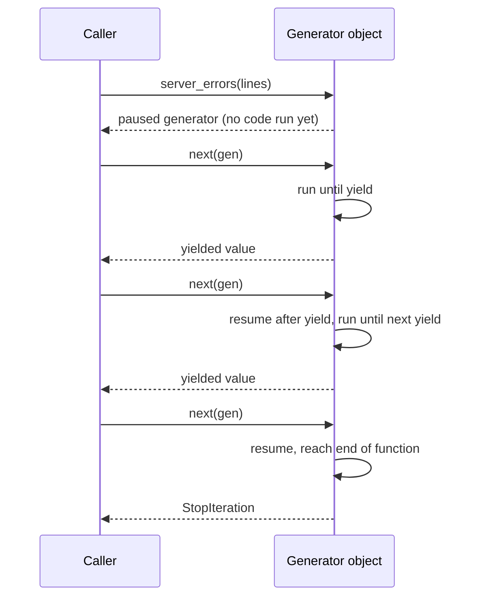

# Python Iterators and Generators Cheatsheet

> A generator function does not run when you call it; it returns a paused generator object that executes up to the next `yield` only when something asks for a value, and remembers exactly where it left off.



An iterable can produce an iterator; an iterator produces one value at a time.

```python
items = iter([10, 20])
next(items)  # 10
next(items)  # 20
```

A generator function pauses at each `yield` and resumes when the next value is requested. For well-formed combined access logs, the status is the first field after the quoted request:

```python
def server_errors(lines: list[str]):
    for line in lines:
        status = int(line.split('"')[2].split()[0])
        if 500 <= status <= 599:
            yield line


for line in server_errors(log_lines):
    print(line)
```

Generator expressions are lazy: `sum(number * number for number in values)`. They are useful for streams and large inputs, but an iterator is normally consumed only once.
