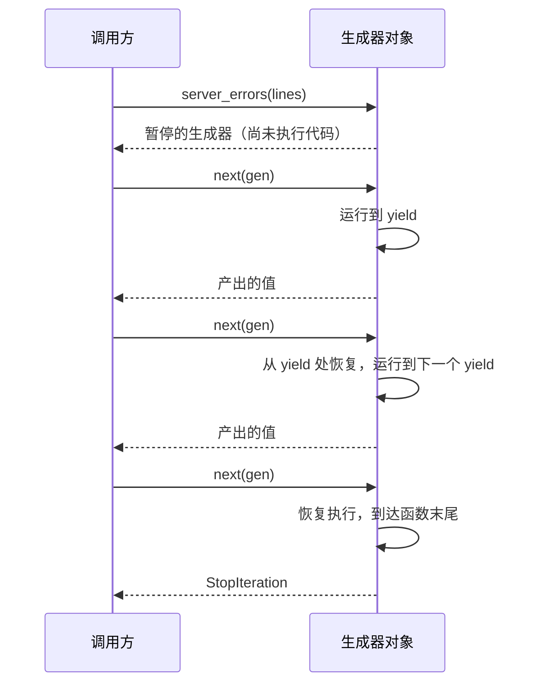

# Python 迭代器与生成器速查表

English version: [README.md](README.md)

## 心智模型

> 调用生成器函数时，函数体并不会立即执行；它只会返回一个处于暂停状态的生成器对象，只有当外部请求下一个值时，才会执行到下一个 `yield`，并且能准确记住上次暂停的位置。



可迭代对象能产生迭代器；迭代器每次产生一个值。

```python
items = iter([10, 20])
next(items)  # 10
next(items)  # 20
```

生成器函数会在每个 `yield` 处暂停，并在请求下一个值时继续。对于格式正确的 combined access log，状态码是带引号的请求之后的第一个字段：

```python
def server_errors(lines: list[str]):
    for line in lines:
        status = int(line.split('"')[2].split()[0])
        if 500 <= status <= 599:
            yield line


for line in server_errors(log_lines):
    print(line)
```

生成器表达式会惰性求值，例如 `sum(number * number for number in values)`。它适合数据流和大型输入，但迭代器通常只能消费一次。
