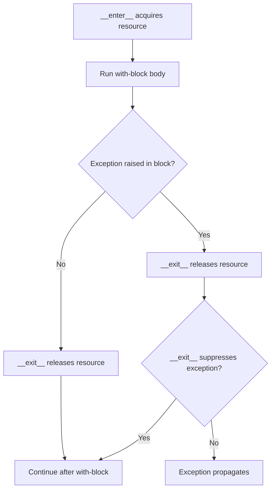

# Python Context Managers Cheatsheet

> `with` guarantees a cleanup call happens exactly once, whether the block finishes normally or raises: entry runs before the block, and exit always runs after it, even on an exception.



A context manager acquires a resource on entry and reliably releases it on exit.

```python
from pathlib import Path

with Path("app.log").open(encoding="utf-8") as file:
    first_line = file.readline()
```

Use `contextlib.contextmanager` for a small function-based context manager:

```python
from collections.abc import Iterator
from contextlib import contextmanager


@contextmanager
def transaction(database: object) -> Iterator[object]:
    try:
        yield database
        database.commit()
    except Exception:
        database.rollback()
        raise
```

Use `with` for files, locks, database transactions, and temporary state. Do not replace it with manual cleanup when the object already supports the context-manager protocol.
