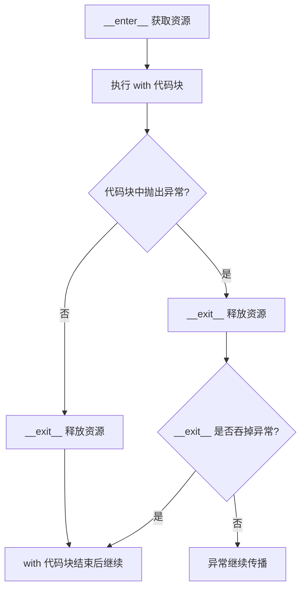

# Python 上下文管理器速查表

English version: [README.md](README.md)

## 心智模型

> `with` 保证清理动作恰好执行一次：无论代码块正常结束还是抛出异常，进入时的获取动作都会在代码块之前运行，退出时的释放动作都会在代码块之后运行。



上下文管理器在进入代码块时取得资源，并在退出时可靠地释放资源。

```python
from pathlib import Path

with Path("app.log").open(encoding="utf-8") as file:
    first_line = file.readline()
```

小型的函数式上下文管理器可以使用 `contextlib.contextmanager`：

```python
from collections.abc import Iterator
from contextlib import contextmanager


@contextmanager
def transaction(database: object) -> Iterator[object]:
    try:
        yield database
        database.commit()
    except Exception:
        database.rollback()
        raise
```

文件、锁、数据库事务和临时状态都适合使用 `with`。对象已经支持上下文管理器协议时，不要改成手动清理。
