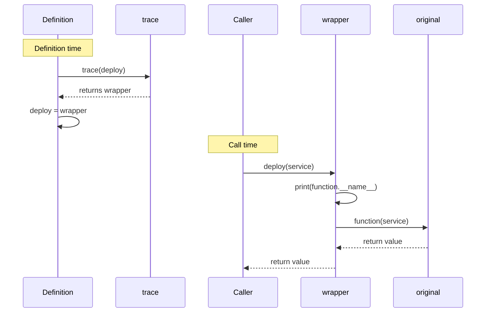

# Python Decorators Cheatsheet

Chinese version: [README_ZH.md](README_ZH.md)

## Mental model

> `@trace` on a function definition is syntax sugar for reassigning the name: `deploy = trace(deploy)`. The name `deploy` ends up bound to the wrapper, so every call to `deploy(...)` actually calls the wrapper first.



A decorator receives a callable and returns a callable.

```python
from collections.abc import Callable
from functools import wraps


def trace(function: Callable[..., object]) -> Callable[..., object]:
    @wraps(function)
    def wrapper(*args: object, **kwargs: object) -> object:
        print(function.__name__)
        return function(*args, **kwargs)

    return wrapper


@trace
def deploy(service: str) -> None:
    print(f"deploying {service}")
```

`@trace` is equivalent to `deploy = trace(deploy)`. Use `functools.wraps` so the wrapper preserves the original function's name and documentation. Prefer a direct function call when behavior does not need to apply across several functions.
