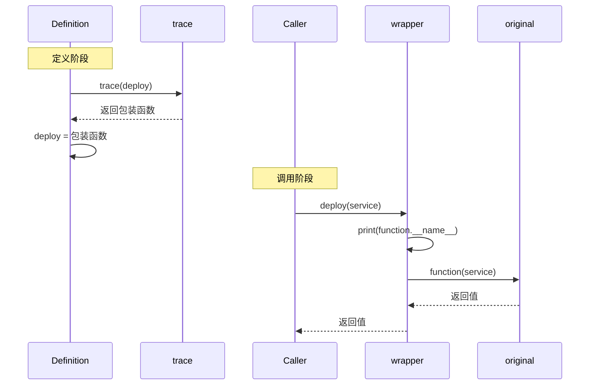

# Python 装饰器速查表

English version: [README.md](README.md)

## 心智模型

> 写在函数定义上方的 `@trace` 只是重新赋值的语法糖：等价于 `deploy = trace(deploy)`。名字 `deploy` 最终绑定到包装函数上，因此之后每次调用 `deploy(...)` 实际上先调用的是包装函数。



装饰器接收一个可调用对象，并返回一个可调用对象。

```python
from collections.abc import Callable
from functools import wraps


def trace(function: Callable[..., object]) -> Callable[..., object]:
    @wraps(function)
    def wrapper(*args: object, **kwargs: object) -> object:
        print(function.__name__)
        return function(*args, **kwargs)

    return wrapper


@trace
def deploy(service: str) -> None:
    print(f"正在部署 {service}")
```

`@trace` 等同于 `deploy = trace(deploy)`。使用 `functools.wraps`，让包装函数保留原函数的名称和文档。不需要把行为应用到多个函数时，直接调用函数会更清楚。
