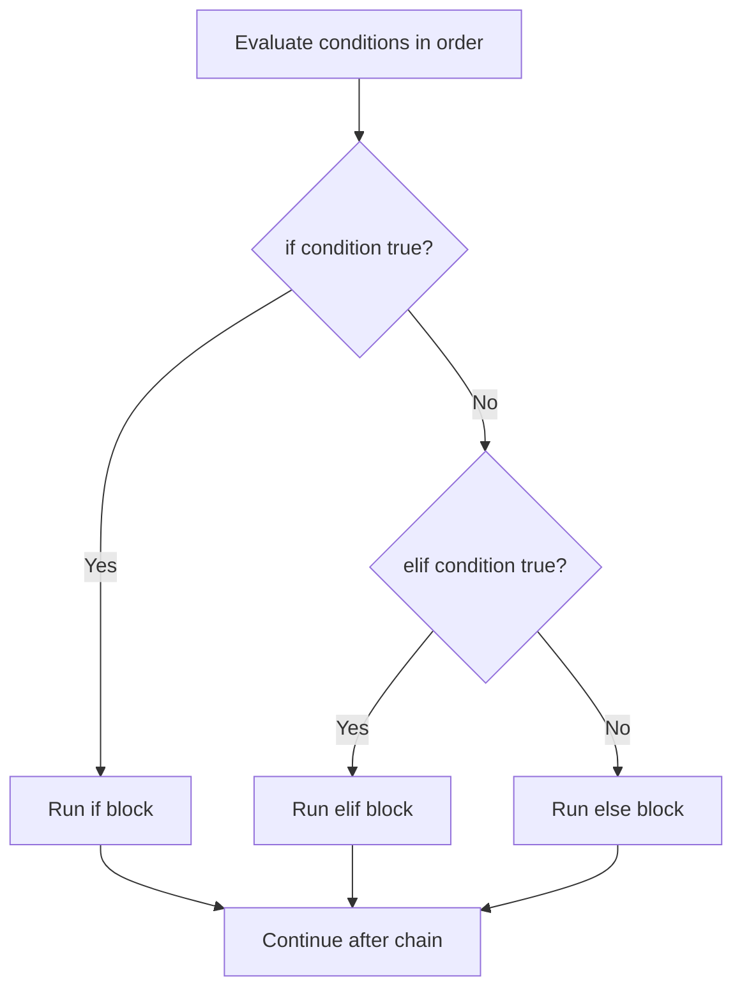

# Python Control Flow Cheatsheet

> Control flow always picks exactly one path: the first true condition in an `if`/`elif`/`else` chain wins, and later branches are never evaluated.



Only one branch ever runs, and the rest of the chain is skipped once a match is found.

## Conditions

```python
status = 503

if 500 <= status < 600:
    print("server error")
elif 400 <= status < 500:
    print("client error")
else:
    print("other")
```

Empty strings, collections, zero, and `None` are false; most other values are true.

```python
if not response:
    print("empty response")

if user is None:
    print("missing user")
```

Use `is None`, not `== None`. Comparisons can be chained, as in `500 <= status < 600`.

## Boolean operators

```python
if enabled and retries < 3:
    retry()

if cached or fetch():
    serve()
```

`and` and `or` short-circuit: Python stops as soon as the result is known. Precedence is `not`, then `and`, then `or`; add parentheses when the expression is not immediately clear.

## Conditional expression

```python
label = "healthy" if status == 200 else "unhealthy"
```

Use it for a single simple value. Use a normal `if` block for multiple actions.

## Pattern matching (Python 3.10+)

```python
match response:
    case {"status": 200, "data": data}:
        handle(data)
    case {"status": status} if status >= 500:
        alert(status)
    case _:
        ignore()
```

`case _` is the fallback. Prefer `if` when matching only one or two basic conditions.

## Common pitfall

```python
# Wrong: this checks whether status equals 200 or truthy 201.
if status == 200 or 201:
    ...

# Correct
if status in (200, 201):
    ...
```
