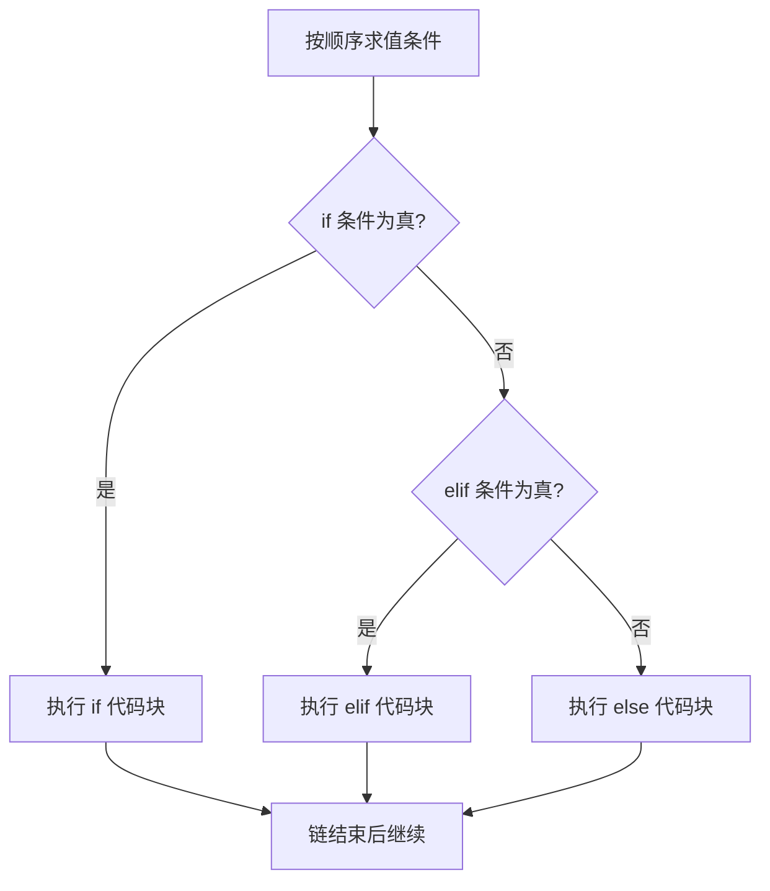

# Python 流程控制速查表

English version: [README.md](README.md)

## 心智模型

> 流程控制总是精确地选中一条路径：`if`/`elif`/`else` 链中第一个为真的条件获胜，后面的分支不会再被求值。



只有一个分支会被执行，一旦匹配成功，链中剩余部分都会被跳过。

## 条件判断

```python
status = 503

if 500 <= status < 600:
    print("服务端错误")
elif 400 <= status < 500:
    print("客户端错误")
else:
    print("其他状态")
```

空字符串、空集合、数字零和 `None` 为假；大多数其他值为真。

```python
if not response:
    print("响应为空")

if user is None:
    print("缺少用户")
```

判断 `None` 应使用 `is None`，不要使用 `== None`。比较可以连写，例如 `500 <= status < 600`。

## 布尔运算符

```python
if enabled and retries < 3:
    retry()

if cached or fetch():
    serve()
```

`and` 和 `or` 会短路求值：结果确定后，Python 不再计算后面的表达式。优先级依次为 `not`、`and`、`or`；表达式不够直观时应加括号。

## 条件表达式

```python
label = "正常" if status == 200 else "异常"
```

它适合选择一个简单值。需要执行多个操作时，应使用普通 `if` 代码块。

## 模式匹配（Python 3.10+）

```python
match response:
    case {"status": 200, "data": data}:
        handle(data)
    case {"status": status} if status >= 500:
        alert(status)
    case _:
        ignore()
```

`case _` 是兜底分支。只有一两个简单条件时，优先使用 `if`。

## 常见错误

```python
# 错误：这里实际判断 status == 200 或真值 201。
if status == 200 or 201:
    ...

# 正确
if status in (200, 201):
    ...
```
