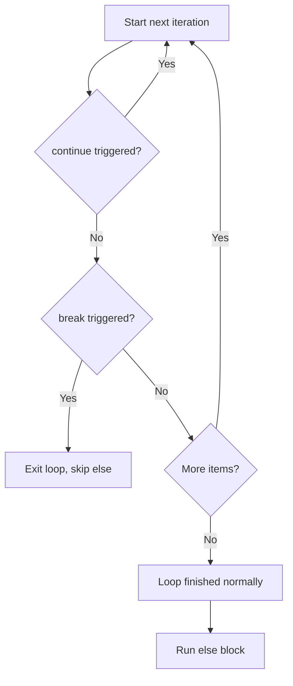

# Python Loops Cheatsheet

> A loop's `else` block is a "did we ever `break`?" check: it runs only when the loop reaches its natural end without a `break`, which is why it pairs naturally with a search.



## Iterate over values

```python
for status in [200, 404, 500]:
    print(status)
```

Iterate directly over values instead of manually managing an index.

## Indexes, pairs, and dictionaries

```python
for index, status in enumerate(statuses, start=1):
    print(index, status)

for name, status in zip(names, statuses, strict=True):
    print(name, status)

for path, count in requests.items():
    print(path, count)
```

`zip(..., strict=True)` raises `ValueError` when inputs have different lengths (Python 3.10+).

## Repeat with `range`

```python
for number in range(5):       # 0, 1, 2, 3, 4
    print(number)

for number in range(2, 8, 2): # 2, 4, 6
    print(number)
```

The stop value is excluded.

## `break`, `continue`, and loop `else`

```python
for status in statuses:
    if status < 0:
        continue
    if status >= 500:
        print("found server error")
        break
else:
    print("no server error")
```

`continue` starts the next iteration. `break` exits the loop. The `else` block runs only when the loop finishes without `break`.

## `while`

```python
retries = 3

while retries > 0:
    if request_succeeded():
        break
    retries -= 1
```

Use `while` when repetition depends on a changing condition. Ensure the condition changes or the loop can run forever.

## Common pitfalls

Do not change a list while iterating over it. Build a new list instead:

```python
active = [user for user in users if user.enabled]
```

Use `_` when the repeated value is intentionally unused:

```python
for _ in range(3):
    retry()
```
