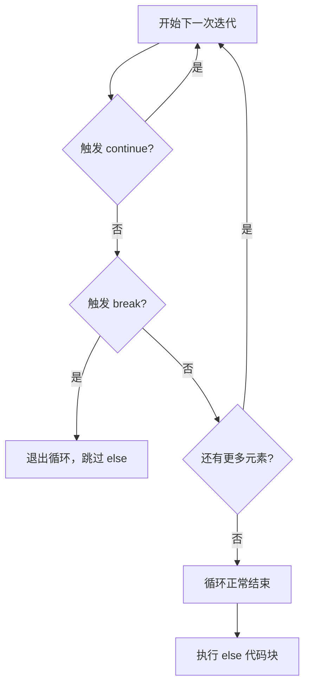

# Python 循环速查表

English version: [README.md](README.md)

## 心智模型

> 循环的 `else` 代码块本质是在问「循环中有没有触发过 `break`」：只有循环正常遍历完、从未 `break` 时才会执行，因此它天然适合搭配查找逻辑。



## 遍历值

```python
for status in [200, 404, 500]:
    print(status)
```

能直接遍历值时，不要手动维护索引。

## 索引、成对遍历和字典

```python
for index, status in enumerate(statuses, start=1):
    print(index, status)

for name, status in zip(names, statuses, strict=True):
    print(name, status)

for path, count in requests.items():
    print(path, count)
```

输入长度不同时，`zip(..., strict=True)` 会抛出 `ValueError`（Python 3.10+）。

## 使用 `range` 重复

```python
for number in range(5):       # 0、1、2、3、4
    print(number)

for number in range(2, 8, 2): # 2、4、6
    print(number)
```

`range` 不包含停止值。

## `break`、`continue` 和循环 `else`

```python
for status in statuses:
    if status < 0:
        continue
    if status >= 500:
        print("发现服务端错误")
        break
else:
    print("没有服务端错误")
```

`continue` 开始下一次迭代，`break` 退出循环。只有循环没有执行 `break` 而正常结束时，`else` 代码块才会运行。

## `while`

```python
retries = 3

while retries > 0:
    if request_succeeded():
        break
    retries -= 1
```

重复次数取决于变化中的条件时使用 `while`。必须确保条件会变化，否则循环可能永远不会结束。

## 常见错误

不要在遍历列表时修改它，应创建新列表：

```python
active = [user for user in users if user.enabled]
```

重复时不需要使用循环值，可以用 `_`：

```python
for _ in range(3):
    retry()
```
