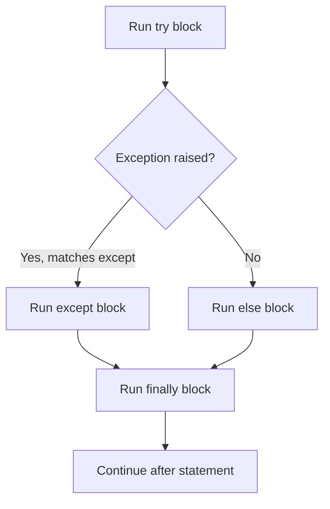

# Python Exceptions Cheatsheet

Chinese version: [README_ZH.md](README_ZH.md)

## Mental model

> `try`/`except`/`else`/`finally` are four mutually exclusive-or-guaranteed blocks: exactly one of `except` or `else` runs depending on whether an exception occurred, and `finally` always runs regardless.



```python
try:
    port = int(raw_port)
except ValueError as error:
    print(f"invalid port: {error}")
else:
    connect(port)
finally:
    cleanup()
```

Catch the narrowest expected exception. `else` runs only when no exception occurs; `finally` runs whether an exception occurs or not.

```python
if not 1 <= port <= 65535:
    raise ValueError("port must be between 1 and 65535")

try:
    load_config()
except OSError as error:
    raise RuntimeError("could not load configuration") from error
```

Do not use a bare `except:` unless you must also intercept process-exit and cancellation signals. Avoid silently swallowing errors.
