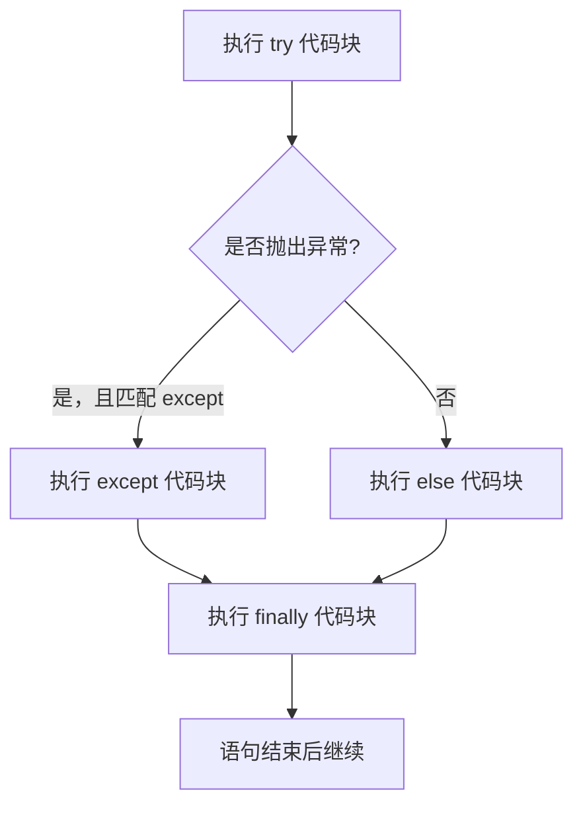

# Python 异常速查表

English version: [README.md](README.md)

## 心智模型

> `try`/`except`/`else`/`finally` 是四个互斥或必定执行的代码块：根据是否发生异常，`except` 和 `else` 中恰好一个会执行；`finally` 无论如何都会执行。



```python
try:
    port = int(raw_port)
except ValueError as error:
    print(f"端口无效：{error}")
else:
    connect(port)
finally:
    cleanup()
```

只捕获预期的最具体异常。没有异常时才执行 `else`；无论是否发生异常都会执行 `finally`。

```python
if not 1 <= port <= 65535:
    raise ValueError("端口必须介于 1 和 65535 之间")

try:
    load_config()
except OSError as error:
    raise RuntimeError("无法载入配置") from error
```

除非确实需要拦截程序退出和取消信号，否则不要使用裸 `except:`。不要静默忽略错误。
