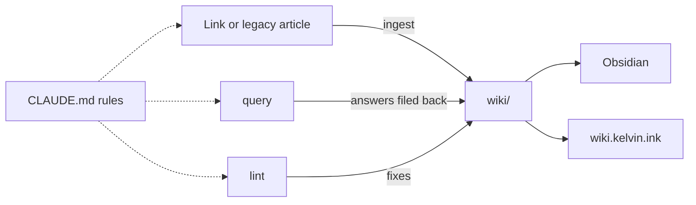

# Kelvin's Engineering Wiki

> A personal engineering knowledge base maintained by an LLM. Sources go in; the LLM compiles
> them into interlinked wiki pages and keeps those pages current as new sources arrive.

**Read it at <https://wiki.kelvin.ink/>**, or open the [`wiki/`](wiki/index.md) folder in
Obsidian.

The approach follows Andrej Karpathy's [LLM Wiki](https://gist.github.com/karpathy/442a6bf555914893e9891c11519de94f)
pattern. Most AI note tools look up raw documents again for every question. Here the LLM files
each source into the wiki once: it updates the pages that source touches and notes where sources
disagree. Pages use the [Open Knowledge Format v0.2](https://github.com/GoogleCloudPlatform/open-knowledge-format/blob/main/SPEC.md)
(OKF): plain Markdown with a small YAML header that records each page's type, sources, and
review status.

## How the pieces fit

Where does knowledge come from, and who is allowed to change what?



Knowledge flows one way: into `wiki/` from sources, then out to readers. Sources are never
edited after the fact, and people read the wiki rather than write it.

| Layer | Where | Who changes it |
| --- | --- | --- |
| Raw sources | `raw/` (snapshots of links) and the frozen legacy articles in the topic folders (`AWS/`, `Claude/`, `Git/`, and so on) | Append only; existing sources are never edited |
| Wiki | [`wiki/`](wiki/index.md) | The LLM, through pull requests you review |
| Rules | [`CLAUDE.md`](CLAUDE.md) and [`.claude/skills/wiki/`](.claude/skills/wiki/SKILL.md) | You and the LLM together |

## Using it

Work happens in a Claude Code session in this repository:

| You do | What happens |
| --- | --- |
| Send a link, or `/ingest <link or legacy article>` | The LLM saves a snapshot to `raw/`, writes a source summary, creates or updates the concept pages it touches, updates the indexes and `wiki/log.md`, and opens a pull request |
| Ask a question | The LLM answers from the wiki with links to the pages it used, and offers to file a useful answer under `wiki/syntheses/` |
| Ask for a health check | The LLM lists contradictions, stale or orphaned pages, and missing concepts, and fixes the mechanical ones |

New pages start as `status: draft`. A page counts as reviewed once you add
`verified: { by: human:kelvinlee97, at: ... }` to it.

## Working locally

Open `wiki/` as an Obsidian vault. Under **Settings → Files and links**, turn off
**Use [[Wikilinks]]** and set **New link format** to **Path from current file**, so any link you
add matches the existing ones. Use Obsidian for reading; edits go through the LLM so the
indexes and checks stay consistent.

To preview the site (needs Python 3 and Node 22):

```bash
pip3 install pyyaml
python3 scripts/build_site.py build
python3 scripts/build_site.py check
cd .site-build/quartz && npx quartz build -d ../content --serve   # http://localhost:8080
```

## Checks

Every pull request runs these in CI; run them locally before pushing:

| Check | Command | Catches |
| --- | --- | --- |
| Wiki | `python3 scripts/wiki_check.py` | Missing frontmatter or `type`, index entries that disagree with pages, uncited sources, broken page format, edits to frozen sources |
| Site | `python3 scripts/build_site.py build && python3 scripts/build_site.py check` | Pages missing from the build, broken links on the site |
| Diagrams | `python3 scripts/check_mermaid_diagrams.py` | Mermaid diagrams that fail to render |
| Tooling | `uvx ruff check .`, `mypy`, `python -m unittest discover -s scripts/tests -p 'test_*.py'` | Lint, type, and test failures in `scripts/` |

## Repository layout

| Path | Contents |
| --- | --- |
| `wiki/` | The wiki: `index.md`, `log.md`, `sources/`, `engineering/<domain>/`, `syntheses/` |
| `raw/` | Snapshots of ingested links |
| `AWS/`, `Bash/`, `Claude/`, `Ghostty/`, `Git/`, `Kubernetes/`, `Nginx/`, `Nodejs/`, `Python/`, `Ubuntu/`, `YouTube/`, `ZooKeeper/`, `apple/` | Legacy articles, now frozen raw sources |
| `site/` | Quartz configuration for wiki.kelvin.ink |
| `scripts/` | Wiki checker, site builder, diagram renderer, and their tests |
| `youtube-transcript/` | Tool for fetching YouTube transcripts |
| `.claude/`, `.agents/` | Skills and commands for the LLM |

## About the content

These are personal study notes, not official product documentation. Each page lists the
sources it draws on and marks the author's own analysis as analysis. Do not contribute
credentials, employer or client code, or other confidential material.
