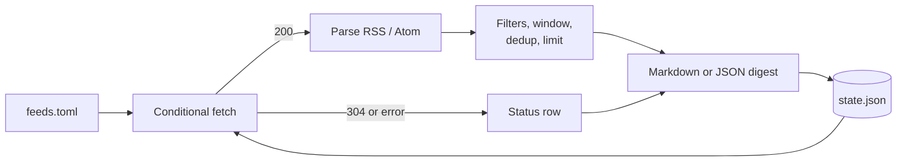

# RSS Digest Tool

中文版本：[README_ZH.md](README_ZH.md)

## Mental model

> One TOML file lists the feeds you care about. One command reads them all, drops what you have already seen, and writes a single Markdown digest grouped by topic. Nothing is fetched twice unnecessarily, and a broken feed degrades to a row in a status table instead of failing the run.

The tool is deliberately small: standard library only, no database, no daemon. State is one JSON file holding per-feed HTTP validators (`ETag` / `Last-Modified`) and the keys of entries already reported. That is what makes the second run cheap and the digest free of repeats.



## Install and run

```bash
cd rss-digest
uv sync --group dev
cp feeds.example.toml feeds.toml   # then edit it
uv run rss-digest --config feeds.toml --days 7
```

The digest goes to stdout by default. Write it to a file instead with `--output digest.md`, and machine-readable output with `--format json`.

## Configuring feeds

```toml
limit = 8                 # default number of items kept per feed

[[feeds]]
name = "AWS what's new"   # optional; defaults to the URL
url = "https://aws.amazon.com/about-aws/whats-new/recent/feed/"
topic = "infrastructure"  # digest section heading
limit = 15                # overrides the top-level default
include = ["eks", "vpc"]  # keep an item only if it matches one of these
exclude = ["preview"]     # drop an item matching any of these
```

Keyword matching is case-insensitive and runs over the title plus the summary. A malformed table — no URL, a non-HTTP URL, a duplicate feed name, a zero limit — fails the whole run with exit code 2 rather than silently skipping a source.

## Command reference

| Flag | Default | What it does |
| --- | --- | --- |
| `--config` | `feeds.toml` | Feed list to read. |
| `--state` | `.local/rss-digest/state.json` | ETag and seen-entry ledger. |
| `--output` | stdout | Write the digest to a file. |
| `--format` | `markdown` | `markdown` or `json`. |
| `--days` | `7` | Age window; `0` disables it. |
| `--all` | off | Ignore the seen ledger and report everything in the window. |
| `--dry-run` | off | Render without recording validators or seen keys. |

Exit codes: `0` success (including partial failures), `1` every source failed, `2` bad configuration.

## What the digest looks like

```markdown
# RSS digest — 2025-09-10 08:00 UTC

> 12 new items from 5/6 readable sources.

## infrastructure

### AWS what's new

- **[Amazon EKS now supports …](https://…)** — 2025-09-09 21:14 UTC
  - Short, tag-stripped summary of the item.

## Source status

| Source | Status | Items | Note |
| --- | --- | --- | --- |
| AWS what's new | ok | 7 | |
| Some blog | error | 0 | HTTP 503 |
```

The status table is not decoration — it is how you tell "nothing new was published" apart from "that feed has been broken for a week".

## Scheduling

The tool holds no timer of its own. Run it from cron or a systemd timer and let the state file do the incremental work:

```cron
0 8 * * * cd /path/to/rss-digest && uv run rss-digest --output ~/digests/$(date +\%F).md
```

## Limits worth knowing

- Entries without a `pubDate`/`updated` element sort last and are never excluded by `--days`; an undated feed will keep surfacing until its items fall out of the feed itself.
- Deduplication uses `guid`, falling back to the link, then to source plus title. A feed that rewrites its GUIDs on every publish will produce repeats.
- The seen ledger keeps the most recent 5,000 keys. Beyond that, very old items can reappear.
- Summaries are tag-stripped and truncated to 400 characters. The tool does not fetch the linked article, and it does not summarize with a model — it aggregates and filters, and leaves reading to you.
