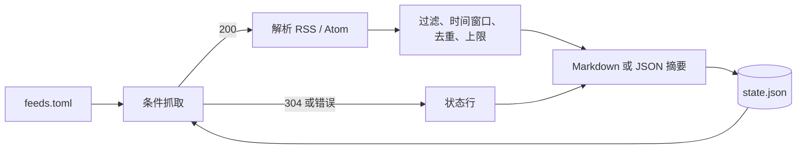

# RSS 聚合工具

English version: [README.md](README.md)

## 心智模型

> 一个 TOML 文件列出你关心的信息源。一条命令读取全部源、剔除已经看过的条目，然后按主题输出一份 Markdown 摘要。不会做无谓的重复抓取，单个源出错也只会变成状态表里的一行，而不会让整次运行失败。

这个工具刻意做得很小：只用标准库，没有数据库，没有常驻进程。状态保存在一个 JSON 文件里，记录每个源的 HTTP 校验标记（`ETag` / `Last-Modified`）以及已经报告过的条目键。正因如此，第二次运行才既便宜又不重复。



## 安装与运行

```bash
cd rss-digest
uv sync --group dev
cp feeds.example.toml feeds.toml   # 然后编辑它
uv run rss-digest --config feeds.toml --days 7
```

摘要默认输出到 stdout。用 `--output digest.md` 写入文件，用 `--format json` 得到机器可读的输出。

## 配置信息源

```toml
limit = 8                 # 每个源默认保留的条目数

[[feeds]]
name = "AWS what's new"   # 可选；默认取 URL
url = "https://aws.amazon.com/about-aws/whats-new/recent/feed/"
topic = "infrastructure"  # 摘要中的分节标题
limit = 15                # 覆盖顶层默认值
include = ["eks", "vpc"]  # 命中其中之一才保留
exclude = ["preview"]     # 命中任意一个即丢弃
```

关键词匹配不区分大小写，作用于标题加摘要。配置表有问题——缺少 URL、非 HTTP 的 URL、重复的源名称、上限为零——会让整次运行以退出码 2 失败，而不是悄悄跳过某个源。

## 命令参数

| 参数 | 默认值 | 作用 |
| --- | --- | --- |
| `--config` | `feeds.toml` | 要读取的信息源列表。 |
| `--state` | `.local/rss-digest/state.json` | ETag 与已见条目账本。 |
| `--output` | stdout | 把摘要写入文件。 |
| `--format` | `markdown` | `markdown` 或 `json`。 |
| `--days` | `7` | 时间窗口；`0` 表示不限制。 |
| `--all` | 关闭 | 忽略已见账本，输出窗口内的全部条目。 |
| `--dry-run` | 关闭 | 只渲染，不记录校验标记与已见键。 |

退出码：`0` 成功（包括部分源失败），`1` 所有源都失败，`2` 配置有误。

## 摘要长什么样

```markdown
# RSS digest — 2025-09-10 08:00 UTC

> 12 new items from 5/6 readable sources.

## infrastructure

### AWS what's new

- **[Amazon EKS now supports …](https://…)** — 2025-09-09 21:14 UTC
  - 去除标签后的简短摘要。

## Source status

| Source | Status | Items | Note |
| --- | --- | --- | --- |
| AWS what's new | ok | 7 | |
| Some blog | error | 0 | HTTP 503 |
```

状态表不是装饰——它让你能区分"这段时间确实没有新内容"和"这个源已经坏了一周"。

## 定时运行

工具本身不带定时器。用 cron 或 systemd timer 调度它，让状态文件承担增量的部分：

```cron
0 8 * * * cd /path/to/rss-digest && uv run rss-digest --output ~/digests/$(date +\%F).md
```

## 需要知道的限制

- 没有 `pubDate`/`updated` 的条目排在最后，且永远不会被 `--days` 排除；一个不带日期的源会持续出现，直到条目自身从 feed 中消失。
- 去重使用 `guid`，其次回退到链接，再回退到"源 + 标题"。如果某个源每次发布都重写 GUID，就会出现重复。
- 已见账本只保留最近 5000 个键。超出之后，非常旧的条目可能再次出现。
- 摘要会去除标签并截断到 400 字符。工具不会抓取原文链接，也不会用模型做总结——它只负责聚合与过滤，阅读仍然交给你。
