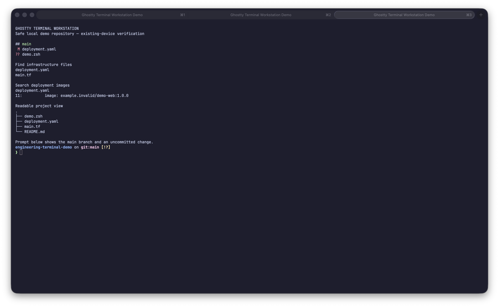

# Ghostty Terminal Workstation for a Fresh Mac

Chinese version: [README_ZH.md](README_ZH.md)

This module builds a portable command-line workstation on a newly initialized Mac. Ghostty is the only graphical terminal. Native zsh runs the shell, Starship keeps the prompt concise, tmux preserves long-running sessions, and a small set of focused CLI tools improves navigation, search, and inspection.

The repository is a rebuild recipe, not a backup of an existing computer. It intentionally excludes credentials, SSH keys, cloud profiles, Kubernetes configuration, shell history, employer data, and machine-specific paths.

> Release status: the files on `main` are a release candidate. The `v1.0.0` commands below become usable only after the signed tag is published. Current validation is on an existing macOS device; a fresh MacBook Air has not yet been verified.

## Quick start

### Recommended: clone, review, then run

```zsh
git clone --branch v1.0.0 --depth 1 https://github.com/kelvinlee97/engineering.git
cd engineering/terminal
less install.zsh
./install.zsh
```

### Convenience installer

```zsh
bootstrap_dir="$(mktemp -d)" && curl --fail --show-error --location https://raw.githubusercontent.com/kelvinlee97/engineering/c037a2a209f40a1c22711c8ba1f8931c5baeb2b0/terminal/bootstrap.zsh --output "$bootstrap_dir/bootstrap.zsh" && printf '%s  %s\n' e8f01661e79f11ca29667904193dd6e20e99fce7bea0e547e3499d7ea12105e0 "$bootstrap_dir/bootstrap.zsh" | shasum -a 256 --check && /bin/zsh "$bootstrap_dir/bootstrap.zsh"
```

The convenience command executes downloaded code. It pins the bootstrap file to an immutable commit and verifies its SHA-256; the bootstrap then verifies the `v1.0.0` release asset before extraction. Reviewing a clone first is still safer. Tags are immutable by project policy: a correction is released as `v1.0.1`, never by moving `v1.0.0`.

After installation, open a new shell and run:

```zsh
~/.local/bin/terminal-doctor
open -a Ghostty
```

## What gets installed

| Tool | Problem it solves | Example | Boundary |
|---|---|---|---|
| [Ghostty](https://ghostty.org/) | A fast native window for terminal text, tabs, splits, fonts, and input | Open local tabs and splits | It does not interpret shell commands |
| zsh | Executes commands, pipes, functions, and scripts | `git status` | Keep portable shell fundamentals |
| [Starship](https://starship.rs/) | Shows essential repository context without a heavy prompt | See a dirty Git branch immediately | Cloud account and cluster names are disabled |
| [tmux](https://github.com/tmux/tmux/wiki) | Keeps remote or long-running sessions alive | Detach from an SSH task and reattach | Ghostty manages normal local windows |
| [fzf](https://github.com/junegunn/fzf) | Interactively narrows a large candidate list | Search command history | It consumes candidates from other tools |
| [zoxide](https://github.com/ajeetdsouza/zoxide) | Learns frequently used directories | `z engineering` | Standard `cd` still works everywhere |
| [fd](https://github.com/sharkdp/fd) | Finds files with developer-friendly defaults | `fd '\.tf$'` | Learn `find` for portable scripts |
| [ripgrep](https://github.com/BurntSushi/ripgrep) | Searches repository content while respecting ignore rules | `rg 'image:' --glob '*.yaml'` | Learn `grep` for minimal servers |
| [eza](https://github.com/eza-community/eza) | Makes directory, permission, and Git state easier to scan | `ll` | Scripts should keep using standard `ls` |
| [bat](https://github.com/sharkdp/bat) | Shows Markdown source, code, line numbers, and Git changes | `preview README.md` | It does not render Markdown layout |
| [Glow](https://github.com/charmbracelet/glow) | Renders Markdown headings, lists, tables, quotes, and code blocks in the terminal | `glow README.md` | Use `bat` when inspecting the source itself |
| Git and GitHub CLI | Version and publish configuration | `gh auth login` | Authentication is always manual |

The zsh autosuggestion and syntax-highlighting plugins are installed with Homebrew. Oh My Zsh is not installed or required, reducing framework coupling and avoiding a second prompt theme.

## How the layers fit

```text
Ghostty                         window, text rendering, tabs, splits
└── zsh                         command interpreter
    ├── Starship                compact repository-aware prompt
    ├── fzf + zoxide            interactive recall and navigation
    ├── fd + ripgrep            file and content discovery
    ├── eza + bat + Glow        directory, source, and rendered Markdown views
    └── tmux                    durable remote/long-running sessions
```

Ghostty and tmux intentionally have different jobs. Use Ghostty tabs and splits for ordinary local work. Start tmux when a session must survive a network interruption or terminal window closure.

## Installation behavior

The installer:

1. Confirms macOS and Apple Command Line Tools.
2. Finds Homebrew on Apple Silicon or Intel, or runs the official Homebrew installer pinned to commit `24173182915f24bdd52a22fd073e421953b2a252`.
3. Applies the version-controlled [`Brewfile`](Brewfile). Package names are fixed, but Homebrew resolves the current package versions; exact tested versions are recorded in validation evidence rather than locked by the Brewfile.
4. Copies configuration to `~/.config/engineering-terminal/`.
5. Backs up existing targets before replacing them.
6. Links Ghostty, tmux, doctor, and uninstall entry points to managed copies.
7. Adds one bounded block to `.zshrc`; it never replaces the whole file.
8. Generates local fzf, zoxide, and Starship initialization files so shell startup performs no network access.
9. Validates zsh and Ghostty configuration.

Re-running the installer is supported. Identical managed files are not backed up repeatedly, and the `.zshrc` block is not duplicated.

Homebrew may request the current macOS user's password when adopting or updating an application in `/Applications`. The installer never reads or stores that password. Automatic Homebrew cleanup is disabled during the bundle run so an unrelated stale cache entry cannot invalidate an otherwise successful installation.

### Managed `.zshrc` block

```zsh
# BEGIN engineering-terminal
source "$HOME/.config/engineering-terminal/zsh/init.zsh"
# END engineering-terminal
```

Existing shell frameworks are not silently removed. If an old Oh My Zsh setup exists, inspect prompt and plugin duplication before deleting it.

## Configuration choices

### Ghostty

The committed configuration uses JetBrainsMono Nerd Font, Catppuccin Mocha, a compact padded window, a bar cursor, shell integration, split navigation, and `Shift+Enter` for tools that accept an escape-prefixed newline. Left Option acts as Alt; right Option remains available for macOS characters.

### Starship

The prompt shows only the current directory, Git branch/status, slow-command duration, and exit state. AWS profiles and Kubernetes contexts are excluded by default to keep the prompt fast and reduce accidental disclosure in screenshots or screen sharing.

### zsh tools

The public aliases are deliberately explicit:

```zsh
ll                 # eza long view with Git state
tree               # eza directory tree
preview README.md  # bat preview
glow README.md     # rendered Markdown
glow -p README.md  # rendered Markdown in a pager
```

Standard `ls`, `cat`, `find`, and `grep` remain unchanged for scripts and remote systems.

## Verification

Automated health check:

```zsh
~/.local/bin/terminal-doctor
```

Repository tests:

```zsh
./test/run.zsh
```

Manual acceptance in Ghostty:

- Nerd Font icons render without empty boxes.
- Starship displays a test repository branch and dirty state.
- `Ctrl+Shift+D` opens a right split and `Ctrl+Shift+-` opens a lower split.
- `fzf`, `z`, `fd`, `rg`, `ll`, `preview`, and `glow` work in a safe local repository.
- `tmux new -s demo`, detach, and `tmux attach -t demo` work.

## Screenshots and validation status

The screenshot below was captured from the installed Ghostty configuration in a safe local demo repository. It shows Starship's Git context, `fd` file discovery, `rg` content search, and an `eza` tree. The example domain uses the reserved `.invalid` suffix. The title, visible output, image pixels, and file metadata were reviewed for account IDs, hostnames, private paths, credentials, and company information before commit.



| Environment | Status |
|---|---|
| Existing macOS device | Automated checks passed; real Ghostty screenshot captured on 2026-08-07 |
| Fresh MacBook Air | Not yet verified |

The documentation will not claim fresh-device verification until the released tag is run on the personal MacBook Air.

## Security model

- Prefer clone-review-run over the convenience installer.
- Release commands use a version tag, never a floating `main` URL.
- Remote downloads use HTTPS and fail closed on HTTP errors.
- Temporary cleanup validates the directory prefix before deletion.
- Existing files are backed up before replacement.
- No credentials or private configuration are copied or generated.
- GitHub authentication and personal Git identity remain manual.
- A release is blocked by Critical/High security findings or any credential match.

See [Security and publishing](docs/SECURITY.md) for the release gates and [Troubleshooting](docs/TROUBLESHOOTING.md) for recovery steps.
The exact existing-device evidence and unresolved release blockers are recorded in [Validation](docs/VALIDATION.md).

## Uninstall and recovery

```zsh
~/.local/bin/terminal-uninstall
```

Uninstall removes only managed links and the bounded `.zshrc` block. It deliberately preserves Homebrew packages, `~/.config/engineering-terminal/`, and timestamped backups. Restore a backup only after reviewing it.

## Maintainer development channel

`main` is for development and review. Maintainers may test it from a clean clone:

```zsh
git clone https://github.com/kelvinlee97/engineering.git
cd engineering/terminal
./test/run.zsh
```

Do not present a `main`-based remote execution command as a stable installation method.
