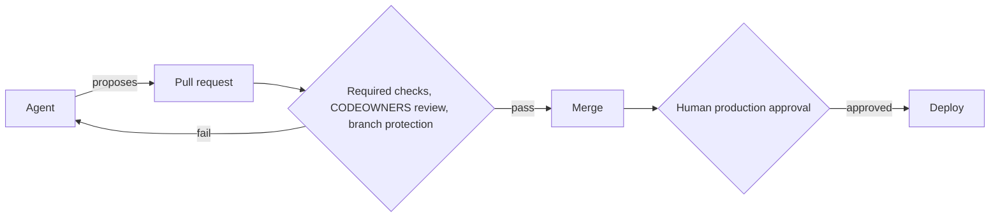

An AI-native software delivery lifecycle (SDLC) puts agents into every stage of delivery while people and policy keep the final say. This page covers the stages, the rule that agents propose while people and required checks accept, how much autonomy to grant by risk, and which work to keep deterministic.

## Stages and practices

An AI-native software delivery lifecycle (SDLC) is a loop of versioned artifacts: each stage consumes the previous stage's committed output, agents speed up the work between gates, and people stay accountable for approvals involving risk or judgment. The goal is not unrestricted autonomy.[^ai-native-sdlc-playbook]

### Stages and their artifacts

| Stage | Committed artifact | Main change |
| --- | --- | --- |
| Plan | `intent.md` | Record the problem, outcome, constraints, and open questions; a product owner accepts it |
| Design | `spec.md` | Turn intent into requirements while applying versioned security, compliance, brand, and UX policy |
| Build | `plan.md`, code, tests | An engineer approves the plan (files, order, risks, proof) before implementation |
| Test | Test, build, screenshot, eval results | The agent runs a runnable definition of done and fixes its work before review |
| Deploy | PR and review findings | Several focused automated reviews; branch protection; human approval for critical changes |
| Maintain | Incident record, then a new `intent.md` | Deterministic monitoring detects; agents diagnose through gated routes; findings return to planning |

As described in the playbook. The return edge from Maintain to Plan is what makes it a loop rather than a pipeline.[^ai-native-sdlc-playbook]

### Practices worth reusing

- Keep a short, reviewed `CLAUDE.md` for build commands, conventions, and recurring mistakes, and put organization-wide policy in skills. See [Claude Code extension mechanisms](../claude-code/extension-mechanisms.md).
- Parallel sessions use separate Git worktrees on independent files; start with two or three streams, because review capacity is the limit.
- For a bug fix, first reproduce the failure as a test and protect that test while the agent fixes the code. Run evaluations whenever instructions, prompts, tools, or models change: evals test the development system, ordinary tests test the product.
- Escalate production signals in tiers: log a small deviation, run a read-only diagnosis for a larger one, allow only a pre-approved PR or runbook at the top tier. A shipped fix adds a regression eval.
- Measure rework, first-pass CI success, review time, change failure rate, and repeat incidents, not lines generated.[^ai-native-sdlc-playbook]

### Adoption order

1. Make build, test, and lint runnable with simple commands.
2. Add a concise, maintained `CLAUDE.md`.
3. Require reviewed intent and implementation plans for meaningful changes.
4. Give agents local feedback loops and add evals for recurring failures.
5. Add read-only CI triage and focused PR reviewers.
6. Permit agent-written changes only through existing review and deployment gates.
7. Close one maintenance loop around a stable, low-noise production signal.

*Source for this section.*[^ai-native-sdlc-playbook]

## Agents propose, people and policy accept

The boundary in this pattern is simple: an agent may propose work (a plan, a branch, a pull request), but controls outside the agent decide whether it is accepted. A confident agent cannot skip a gate, because the gate is enforced by the platform, not by instructions the agent is trusted to follow.[^gh-600-study-notes]

### The same boundary in three sources

| Source | Where the boundary sits |
| --- | --- |
| GH-600 course, module 2 | Required checks, CODEOWNERS review, branch protection, and environment approvals decide what merges and deploys.[^gh-600-study-notes] |
| AI-native SDLC playbook | Agents propose changes only through pull requests and branch protection; the production gate stays human-controlled.[^ai-native-sdlc-playbook] |
| Warp's self-improving agents | Improvements to an agent's own skill file arrive as pull requests the team reviews and can revert.[^warp-self-improving-agents] |

### Making it enforceable on GitHub

The GH-600 module turns the boundary into three mechanisms:[^gh-600-study-notes]

1. A pull request template requiring goal, scope, steps, verifiable success criteria, risks, and a rollback plan.
2. A required status check (for example a "Plan Gate" workflow) that fails when the plan is missing.
3. CODEOWNERS, so changes under paths such as `/security/`, `/.github/workflows/`, or `/infra/` need the owners' sign-off.

### Plan first, or plan with the code

| | Plan-first PR | Plan and execution in one PR |
| --- | --- | --- |
| Plan visible | Before any code exists | Alongside the first commits |
| Human validation | Before code is written | Before merge |
| Suited to | High-risk, hard-to-reverse changes | Low or medium risk, easily reversed |

Both are safe when GitHub protections are configured; the only variable is when code may exist relative to approval. Planning agents should get read-only tools, with a deliberate handoff to an implementation agent.[^gh-600-study-notes]

Version control also supplies the audit log, approval gate, and rollback that a bespoke agent-memory system would have to build (analysis in the Warp note).[^warp-self-improving-agents] The SDLC playbook makes the same point: Git history records what was asked, what the agent produced, which policy applied, and who approved it.[^ai-native-sdlc-playbook]

## Risk-based autonomy

Risk-based autonomy means the amount of work an agent may finish without a person depends on how risky and reversible the change is, and grows only as verification and rollback prove trustworthy. All three sources that discuss it keep production behind a human gate.

### Sizing by path (GH-600)

| Risk | Example paths | Design |
| --- | --- | --- |
| Low | `docs/`, formatting | Auto-merge after required checks |
| Medium | `src/`, dependency bumps | PR, checks, at least one review |
| High | `infra/`, `.github/workflows/` | CODEOWNERS, multiple reviews, stricter rulesets |
| Critical | Production deploys, settings, secrets | Environment approval: the agent prepares but does not execute |

As described in module 2. A GitHub Actions environment with required reviewers pauses any job targeting it until a person approves.[^gh-600-study-notes]

### Widening in steps (AI-native SDLC playbook)

1. Start with read-only work such as build-failure triage and changelog drafts.
2. Let agents propose changes only through pull requests and branch protection.
3. Run jobs in sandboxes with short-lived, scoped credentials.
4. Expose deployment and rollback as allowlisted tools per environment.
5. Allow more autonomy in development than in production.
6. Keep the production gate human and rehearse rollback.

*Source for this section.*[^ai-native-sdlc-playbook]

### Rolling out Claude Code Auto Mode

The [Auto Mode](../claude-code/auto-mode.md#how-auto-mode-works) guidance follows the same shape: start narrow, keep explicit `deny` and `ask` rules, watch what is denied, widen gradually, and keep human review for production infrastructure.[^claude-auto-mode]

### Reliability assumptions

GH-600 adds that agent workflows should assume failure: bounded retries for transient check failures, escalation to a person after a check fails twice (with what failed, what was tried, and a suggested next step), and rollback readiness for high-risk changes.[^gh-600-study-notes]

## Deterministic checks and model judgment

Several sources draw the same line: deterministic code for things that must be exact or enforced, the model for things that need judgment. Many AI engineering problems, one talk argues, come from putting work on the wrong side of this line.

| Source | Deterministic side | Model side |
| --- | --- | --- |
| Company brain talk | Exact storage, constraints, repeatable computation, such as the arrangement of 800 seats | Taste, judgment, interpreting vague intent, such as who should meet |
| AI-native SDLC playbook | Enforcement, and monitoring that detects a breached control band | Judgment and diagnosis |
| Claude Code Auto Mode | Permission rules (`deny`, `ask`, `allow`) as hard enforcement | The classifier's guidance, which is not deterministic |

As stated in each source.[^company-brain-video][^ai-native-sdlc-playbook][^claude-auto-mode]

The practical rule that follows: never rely on a model to enforce a boundary that deterministic code can enforce. (Analysis: this wiki itself applies it, with `wiki_check.py` enforcing the format and the LLM writing the content.)

## Related

- [Delegation contract](../claude-code/subagents.md#delegation-contract): what the proposal must contain.
- [Least-privilege tool access](../claude-code/subagents.md#least-privilege-tool-access)
- [Company brain](ai-native-organization.md#company-brain)
- [Code modernization with agents](code-modernization.md): certificate and tiered promotion policy for large rewrites.

[^ai-native-sdlc-playbook]: [The AI-Native SDLC Playbook](../../sources/ai-native-sdlc-playbook.md), [original](https://github.com/kelvinlee97/engineering/blob/main/Claude/ai-native-sdlc-playbook/README.md)
[^gh-600-study-notes]: [GitHub Certified: Agentic AI Developer (study notes)](../../sources/gh-600-study-notes.md), [original](https://github.com/kelvinlee97/engineering/blob/main/Claude/github-agentic-ai-developer/README.md)
[^warp-self-improving-agents]: [How Warp Builds Self-Improving Agents on Claude](../../sources/warp-self-improving-agents.md), [original](https://github.com/kelvinlee97/engineering/blob/main/Claude/self-improving-agents/README.md)
[^claude-auto-mode]: [How Claude Code Auto Mode Works](../../sources/claude-auto-mode.md), [original](https://github.com/kelvinlee97/engineering/blob/main/Claude/auto-mode/README.md)
[^company-brain-video]: [Every Company Should Have a Brain (video summary)](../../sources/company-brain-video.md), [original](https://github.com/kelvinlee97/engineering/blob/main/YouTube/startup/every-company-should-have-a-brain--eBUyTS7SzV4/summary.md)
