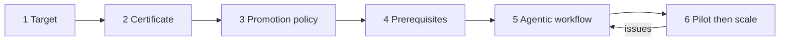

A code modernization upgrades or rewrites a legacy codebase. When agents write the changes, work once scoped as multi-year can finish in months or weeks, but change management, review, and approval still assume a human wrote and a human reviews each diff. The hard part becomes getting the organization ready to accept changes at the rate agents produce them.[^ai-code-modernization]

## Six steps

The source splits the work into six steps. The first four happen before any agent writes code; the fifth and sixth build and run the workflow.

| Step | Output |
| --- | --- |
| 1. Define the target | The stack and behavior the modernized code must have |
| 2. Create the certificate | Conditions a change must meet to count as correct |
| 3. Set the promotion policy | The path certified changes take to production |
| 4. Put prerequisites in place | Environment, CI/CD, review capacity, approvals |
| 5. Build the agentic workflow | A Claude Code workflow that splits the job into many parallel subagent workstreams |
| 6. Run the modernization | An end-to-end pilot on a small partition, then the full codebase |

[^ai-code-modernization]

## Modernization types

The target is the end state, and it decides which of three types the project is.

| Type | What it is | Choose when | The target adds |
| --- | --- | --- | --- |
| Uplift | Same-stack version bump (C++11 to C++20) | The stack is fine but the version is behind: end-of-life runtimes, unpatched security issues, dependencies that can no longer be upgraded | A runtime version and package set |
| Transform | Cross-stack rewrite, behavior fixed (COBOL to Java) | The stack is the problem and the behavior is trusted | Uplift's target plus language, frameworks, and architectural conventions |
| Reimagine | Greenfield rebuild with changed behavior | Behavior must change along with the code | Transform's target plus a written behavioral spec agreed with user groups |

People closest to production tend to want a transform to contain risk; long-time engineers and business stakeholders tend to want a reimagine to pay down tech debt or add requirements. Settle it up front: left open, it resurfaces as arguments over whether each change is correct.

Mapping the current system comes first. Claude can map dependencies and document forgotten workflows; the code modernization plugin's `assess`, `map`, and `extract-rules` commands pull out business rules with source citations for engineers to review. Interviews with users and developers, and internal documents, fill the gaps agent discovery misses.

The business case matters as much as the target. In the authors' experience cost reduction is rarely the driver; risk reduction is, so weigh the risk of *not* modernizing: unpatched vulnerabilities, unsupported runtimes, and a shrinking pool of engineers who understand the system. Consensus from the teams that own and depend on the system is usually the main obstacle, and a leadership-level business case eases it.[^ai-code-modernization]

## The certificate

The certificate is the set of conditions every change must meet. Each condition must be checkable without a human, so the workflow can iterate on a change until it passes or flag it for review. Typical conditions:

- The original test suite passes, and so do Claude-authored tests written during the run.
- Coverage meets an agreed threshold; performance benchmarks stay within an agreed bound.
- Independent adversarial reviews by Claude, each in a fresh context window, find no blocking issues.
- For user interfaces, Claude-driven computer use finds no regressions.
- Current and target versions give the same output for the same input (live, recorded, or generated).
- Persisted state and wire formats round-trip between versions.
- Staging runs for an agreed period with no regressions in error rates, latency, or alerts.
- Static analysis and security scans show no new findings; compiled targets build clean and type-check.

What the certificate checks against depends on the type:

| Type | Parity against | Main evidence |
| --- | --- | --- |
| Uplift | Original codebase | The original test suite |
| Transform | Original codebase | Production traffic replay, differential testing, a prod-parallel deployment (old tests rarely run on the new stack) |
| Reimagine | The behavioral spec | Tests written from the spec, adversarial reviews against the spec, differential checks where behavior is kept; the hardest and most variable case |

Write the certificate with the people who will review and promote changes. A good test of the result: would they merge on its evidence alone? If so, the promotion policy can be lighter. Legacy systems often have thin coverage, flaky tests, and little telemetry; use Claude to build the missing evidence, such as a replay harness, a prod-parallel setup, or new tests.[^ai-code-modernization]

## The promotion policy

Agents produce changes faster than people can review them diff by diff. The promotion policy is a tiered review path, written and agreed in advance, that sets how deeply a human reviews each change. Fit it into existing change management. Rules the source says hold everywhere:

- Tier changes by blast radius (how much breaks if the change is wrong) and agent confidence; keep full human review for critical paths.
- When the same kind of flag recurs, fix its cause in the workflow or the certificate instead of reviewing each instance.
- Design the review output format with the reviewers and have them review early samples.
- Spend subject-matter expert (SME) time on the highest-risk tiers and the flagged agent decisions within them.

This front-loads expert review, the reverse of the traditional pattern where review happens at the end. A hard deadline, such as a runtime losing support, justifies lighter review and an explicit agreement to accept more risk per change; a longer timeline allows deeper review and slower cutover. In regulated environments individual approvers hesitate to sign off, so the directive should come from the top and be agreed beforehand, making responsibility for an escaped bug shared.[^ai-code-modernization]

## Prerequisites

Much of this runs through other teams (platform, QA, security, compliance) with their own backlogs, so start these conversations while steps 1 to 3 are underway.

| Area | Needed |
| --- | --- |
| Environment | A dedicated remote host that reaches the code and sources; test capacity; telemetry, prod-parallel setup, or replay data |
| Codebase and CI/CD | A dependency map grounded in build logs, import analysis, or runtime traces; planned dependency treatment; a CI compatibility check; a code-freeze policy and developer communication plan if modernizing in place |
| Teams | Dependent teams agree how they take part, with reviewer time set aside |
| Security and compliance | An approved model access path for source code; write access only to modernization branches and no production credentials; secrets and PII (personal data) masked; every PR linked to an agent transcript and certificate evidence; license and vulnerability checks on new dependencies |

[^ai-code-modernization]

## Pilot, scale, and cost

Build the workflow in Claude Code, starting from the code modernization plugin, with the target, certificate, policy, code, docs, and tooling reachable on the file system or over MCP. SMEs review Claude's extracted rules and codebase-specific skills before anything depends on them. Refine on small parts of the codebase; when issues surface, change the workflow, not the individual change.

Then run the whole process, including landing changes through the promotion policy, on one small partition, and scale only once confident. Transform and reimagine build the new system alongside the old and cut over at the end. An uplift can also modernize in place while development continues: partition the codebase from the leaves inward, freeze and modernize one partition at a time, and gate CI/CD so new commits cannot undo a finished partition.

Token cost is driven by how much code is read versus changed, how involved the certificate is (in regulated settings verification is usually the larger share), how much test writing and repair it needs, and reconciliation with teams merging around the run. Measure the pilot's token use and extrapolate to get a cost floor, treating what the pilot could not see as unknown. To cut cost, put expensive verification behind cheaper gates, use a model like Sonnet for mechanical work the certificate fully checks, and keep stronger models for hard transformations and adversarial review. Escalating to a stronger model after a failure works, but watch retry rates: several cheap attempts can cost more than one expensive one.

Beyond the code, the project leaves a reusable workflow, a written certificate, an accepted promotion policy, and an evidence trail per change; the source recommends codifying them for the next upgrade.[^ai-code-modernization]

## Related

- [AI-native SDLC](ai-native-sdlc.md): the propose-accept boundary and risk-based autonomy this policy applies.
- [Subagents](../claude-code/subagents.md): the parallel workstreams the workflow runs.
- [Claude Code session cost](../claude-code/session-cost.md)

[^ai-code-modernization]: [How to prepare for AI-driven code modernization projects](../../sources/ai-code-modernization.md), [original](https://github.com/kelvinlee97/engineering/blob/main/raw/2026-09-25-ai-code-modernization.md)
