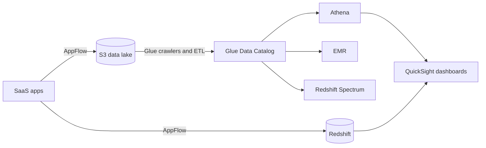

AWS analytics services split the job of turning stored data into answers: AppFlow and Glue bring data in and reshape it, the Glue Data Catalog describes what is in S3, Athena, EMR, and Redshift query or process it, and QuickSight turns the results into dashboards. Data Pipeline is an older orchestrator in maintenance mode.

## How the services fit together

| Question | Athena | EMR | Redshift |
| --- | --- | --- | --- |
| What it is | Serverless SQL over files in S3 | Managed clusters for Spark, Hive, HBase, Flink, Trino, and Presto | Columnar, massively parallel data warehouse |
| Storage | None of its own; reads S3 | S3 through EMRFS, or HDFS on core nodes | Its own managed storage, plus S3 through Spectrum |
| You pay for | Bytes scanned per query | The cluster's instances, or EMR Serverless capacity | Nodes, or Serverless RPUs (not charged when idle) |
| Reach for it when | Ad hoc queries on data already in S3 | Frameworks beyond SQL, or long-running processing | Repeated BI queries over large, modeled tables |

Analysis: the comparison lines up facts from each service's note; the notes do not rank the three against each other.

## Amazon Athena

Athena runs standard SQL against data in S3, with Apache Spark notebooks as a second engine. It stores nothing: it plans each query from table metadata in a Data Catalog, usually Glue's, and bills for the bytes it reads, so everything that lets it skip bytes cuts cost. Workgroups separate teams' queries, result locations, and cost controls; federated queries reach DynamoDB and relational stores through connectors.

- Partition tables by date or Region, and store data as compressed Parquet or ORC.
- Compact small files with `OPTIMIZE` or CTAS maintenance.[^aws-athena]

| Symptom | Check |
| --- | --- |
| Table not found | The database and table in the Glue Data Catalog, and that the Region matches the data |
| No rows returned | Partition locations, format registration, and whether the data matches the schema |
| High cost per query | Partition pruning, columnar formats, and more selective predicates |

## AWS Glue

Glue is serverless data integration. Crawlers connect to sources, infer schemas, and fill the Data Catalog, the shared metadata store that Athena, EMR, and Redshift Spectrum all read. ETL jobs in PySpark, Scala, Python, or Ray transform and load data, in batch or streaming, built in code or in Glue Studio's visual editor, and triggers or workflows chain them by schedule, event, or dependency.

- Run crawlers on a schedule or on events, and review inferred schemas before relying on them.
- Job bookmarks, which track what a job has already processed, only work on append-only sources.
- A failing crawler is usually the IAM role's access to the source or VPC reachability.[^aws-glue]

## Amazon EMR

EMR, formerly Elastic MapReduce, runs big data frameworks on EC2 clusters, on EMR Serverless, or on EKS. A cluster has a master node, core nodes that run HDFS, and task nodes that add compute only. A release label such as emr-7.5.0 pins the application versions, and steps are the ordered jobs submitted to a cluster.

- Keep data in S3 through EMRFS, so clusters can be ephemeral and the data survives termination.
- Use EMR Serverless for intermittent work and EC2 clusters for long-running, latency-sensitive work.
- Put task nodes on Spot and let Cluster Auto Scaling follow demand.[^aws-emr]

| Symptom | Check |
| --- | --- |
| Cluster fails to launch | `EMR_DefaultRole` and `EMR_EC2_DefaultRole`, the subnet, key pair, and quotas |
| Out of memory | Executor memory and cores, dynamic allocation, or more task nodes |

## Amazon Redshift

Redshift is a petabyte-scale warehouse that stores data by column and spreads queries across nodes. You run it either as a provisioned cluster you size (a leader node plus compute nodes) or as Redshift Serverless, whose namespaces and workgroups scale capacity in RPUs (Redshift Processing Units) and stop charging when idle. Spectrum queries cold data in S3 without loading it.

| Deployment | Storage | Fits |
| --- | --- | --- |
| Provisioned RA3 | Managed storage that scales apart from compute | Most workloads |
| Provisioned DC2 | Fixed local storage; a full disk means resizing or moving to RA3 | Fixed-size data |
| Serverless | Managed | Variable or unpredictable demand |

- Choose distribution and sort keys to cut I/O, and keep statistics current with vacuum and analyze or automatic maintenance.
- Load in bulk with `COPY` from S3 instead of row-by-row inserts.
- Slow queries point at keys, statistics, or WLM queues; hitting connection limits calls for pooling or concurrency scaling.[^aws-redshift]

## Amazon QuickSight

QuickSight is the business intelligence part of Amazon Quick, the AI service it evolved into; existing QuickSight APIs and integrations keep working. It connects to Athena, Redshift, RDS, S3, SaaS applications, and databases, then models the data into datasets with joins, calculated fields, and filters. A dataset is served either from SPICE, the in-memory cache, or by live query. You explore in an editable analysis and publish a read-only dashboard to share or embed.

- Use SPICE for large, read-heavy datasets and live queries where freshness matters; watch SPICE capacity.
- Restrict dashboards by user or group, and use row-level security for multi-tenant data.
- If users cannot see a dashboard, check that it was published, not only saved as an analysis.[^aws-quicksight]

## AWS Data Pipeline

Data Pipeline schedules data movement and transformation on EC2 instances it provisions, with activities, preconditions, and dependencies in a definition file and Task Runner agents doing the work. It is closed to new customers and in maintenance mode; existing pipelines keep running, and AWS publishes migration guidance. For existing pipelines, gate dependent activities with preconditions rather than fixed timing, and read failed activities' logs in S3.[^aws-data-pipeline]

## Amazon AppFlow

AppFlow moves records between SaaS applications (Salesforce, Slack, Zendesk, Marketo) and AWS services or Snowflake without integration code. A flow names a source and destination connector, field mapping and filters, and a trigger: on demand, on a schedule, or on a SaaS event for change data capture. PrivateLink keeps transfers on the AWS network, and the Custom Connector SDK reaches private APIs.

- Use scheduled flows for periodic sync and event triggers for near-real-time needs, without overlapping runs.
- Map only the fields you need; missing records usually trace to filters, mapping, or the change-capture cursor.
- Keep OAuth credentials for connector profiles in Secrets Manager and rotate them.[^aws-appflow]

## Related

- [Streaming and search](streaming-and-search.md): Kinesis and MSK feed real-time data into these services.
- [Data stores](data-stores.md): S3 and the operational databases the data comes from.
- [Machine learning](machine-learning.md): SageMaker, which trains on the same data.
- [Domain index](index.md)

[^aws-athena]: [Amazon Athena - Runbook & Reference](../../sources/aws-athena.md), [original](https://github.com/kelvinlee97/engineering/blob/main/AWS/athena/README.md)
[^aws-glue]: [AWS Glue - Runbook & Reference](../../sources/aws-glue.md), [original](https://github.com/kelvinlee97/engineering/blob/main/AWS/glue/README.md)
[^aws-emr]: [Amazon EMR - Runbook & Reference](../../sources/aws-emr.md), [original](https://github.com/kelvinlee97/engineering/blob/main/AWS/emr/README.md)
[^aws-redshift]: [Amazon Redshift - Runbook & Reference](../../sources/aws-redshift.md), [original](https://github.com/kelvinlee97/engineering/blob/main/AWS/redshift/README.md)
[^aws-quicksight]: [Amazon QuickSight - Runbook & Reference](../../sources/aws-quicksight.md), [original](https://github.com/kelvinlee97/engineering/blob/main/AWS/quicksight/README.md)
[^aws-data-pipeline]: [AWS Data Pipeline - Runbook & Reference](../../sources/aws-data-pipeline.md), [original](https://github.com/kelvinlee97/engineering/blob/main/AWS/data-pipeline/README.md)
[^aws-appflow]: [Amazon AppFlow - Runbook & Reference](../../sources/aws-appflow.md), [original](https://github.com/kelvinlee97/engineering/blob/main/AWS/appflow/README.md)
