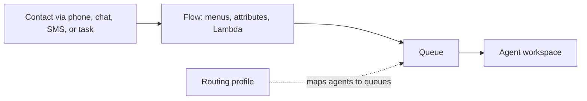

These services connect applications to their clients and to each other: API Gateway and AppSync are front doors for HTTP and GraphQL calls, Step Functions coordinates multi-step workflows, Amazon MQ runs standard message brokers for existing applications, SES sends and receives email, and Amazon Connect runs a contact center. For native AWS queues, topics, and event buses, see [Messaging](messaging.md).

## Choosing a service

| You need to | Use | Choose it over the nearest alternative when |
| --- | --- | --- |
| Expose REST, HTTP, or WebSocket APIs | [API Gateway](#amazon-api-gateway) | Clients call separate endpoints and you want auth and throttling in front of every one |
| Serve one GraphQL schema over several data sources | [AppSync](#aws-appsync) | Clients want one query to fan out to DynamoDB, Lambda, RDS, and HTTP, with subscriptions pushed back |
| Coordinate steps with retries, branches, and waits | [Step Functions](#aws-step-functions) | The logic is a sequence of calls; glue code in one Lambda would hide the state |
| Keep ActiveMQ or RabbitMQ clients unchanged | [Amazon MQ](#amazon-mq) | You are migrating broker workloads; for new AWS-native designs use [SQS or SNS](messaging.md) |
| Send or receive email | [SES](#amazon-ses) | You need transactional or marketing mail with deliverability tracking |
| Route customer calls, chats, SMS, and tasks to agents | [Connect](#amazon-connect) | You run a contact center |

Analysis: the "choose it over" column draws on each service's own note; the notes do not compare the services with one another.

## Amazon API Gateway

API Gateway is a front door for Lambda functions, EC2 workloads, or any HTTP endpoint. Every request passes authentication (IAM, a Lambda authorizer, or a Cognito user pool), throttling, and a stage before it reaches the integration, so backends do not implement those concerns themselves.

| API type | For |
| --- | --- |
| REST API | The full feature set |
| HTTP API | Lighter, simple serverless backends |
| WebSocket API | Stateful, full-duplex connections |

- Publish versions through stages and deployments; use canary deployments for gradual rollout.
- Turn on throttling, and use API keys with usage plans for per-client quotas. Never leave a route open by default.

| Symptom | Check |
| --- | --- |
| `429 Too Many Requests` | Account and per-API throttling limits, and usage plans; add caching |
| `500` from a Lambda integration | The function's logs, its execution role, and the integration ARN |
| `403 Forbidden` | IAM authorization, the authorizer, WAF rules, and API key requirements |
| CORS errors | CORS on the method and `OPTIONS` preflight handling |

Default account throttling is 10,000 requests per second per Region, adjustable.[^aws-api-gateway]

## AWS AppSync

AppSync serves a single GraphQL endpoint whose fields each resolve through their own resolver, written in VTL or JavaScript/TypeScript, against DynamoDB, Lambda, RDS, OpenSearch, or HTTP data sources. Mutations can be pushed to clients as subscriptions over WebSockets, and AppSync Events (available since March 2025) adds WebSocket pub/sub channels.

- Design the schema first and keep resolvers thin.
- Choose authorization per API: Cognito for user-facing apps, IAM between services, API keys for public or development use.
- Batch and paginate DynamoDB requests, and watch for N+1 resolver patterns in slow queries.[^aws-appsync]

| Symptom | Check |
| --- | --- |
| Resolver returns null | The data source's IAM role and the resolver mapping |
| Subscription gets no events | Subscription auth, the WebSocket connection, and that the mutation publishes |

## AWS Step Functions

Step Functions runs state machines written in Amazon States Language: Task, Choice, Parallel, Map, Wait, Pass, Succeed, and Fail states that call Lambda, AWS services, or wait for a human. The two workflow types trade durability for volume.

| | Standard | Express |
| --- | --- | --- |
| Execution | Exactly once | At least once |
| Maximum duration | 1 year | 5 minutes |
| Rate | Up to 2,000 executions per second | Up to 100,000 executions per second |
| Fits | Long-running, auditable processes | High-volume streaming and ingestion |

- Prefer the SDK and optimized service integrations over custom Lambda glue.
- Use `Retry` with backoff for transient errors and `Catch` for business failures.
- A callback that never returns usually means the worker did not send the task token back.[^aws-step-functions]

## Amazon MQ

Amazon MQ runs Apache ActiveMQ or RabbitMQ brokers with AWS handling maintenance, upgrades, failover, CloudWatch monitoring, and encryption, so existing broker clients move without rewrites. Brokers use EBS storage sized at creation.

| Engine | Production topology | Cross-Region |
| --- | --- | --- |
| ActiveMQ | Active/standby (single-instance only for development) | Asynchronous replication to a replica Region, with failover promotion |
| RabbitMQ | Quorum queues replicated across Availability Zones | Not described in its note |

- Keep brokers in private subnets behind VPC endpoints and security groups; require TLS and rotate broker credentials.[^aws-mq]

| Symptom | Check |
| --- | --- |
| Clients cannot connect | Security group ports (61617/61614 for ActiveMQ, 5671/443 for RabbitMQ), TLS, and routing |
| Queue depth grows | Consumer health, message TTL, and broker capacity |
| Storage full | EBS size or retention; watch `StorageUsed` |

## Amazon SES

SES sends transactional and marketing email through its API, SMTP, or the SDKs, and receives email into S3, SNS, or Lambda through receipt rules. You pay per email. Sending requires a verified identity (a domain or address) with DKIM, which Easy DKIM manages, plus SPF and DMARC. SES tracks bounce and complaint rates, adjusts sending quotas by reputation, and keeps a suppression list.

- Attach a configuration set to every workload, sending events to CloudWatch, Data Firehose, SNS, EventBridge, or Pinpoint, and alert on bounce or complaint spikes.
- Warm up new identities gradually.[^aws-ses]

| Symptom | Check |
| --- | --- |
| Daily quota exceeded | `get-send-quota`; ask for an increase after showing low bounce and complaint rates |
| Mail lands in spam | DKIM, SPF, DMARC, warm-up, and content |

## Amazon Connect

Amazon Connect now names a portfolio of agentic business solutions; the contact center product is Amazon Connect Customer. It handles voice, chat, SMS, and task contacts, with phone numbers (local, toll-free, DID), routing, real-time metrics, and pay-per-use pricing. A contact never goes to an agent directly: a flow handles it and places it in a queue, and the routing profile decides which agent takes it. Routing problems and flow problems therefore have different causes, though a caller cannot tell them apart.

- Test flows in a staging instance first, with error handling and escalation paths.
- Use Lambda for customer lookup and Lex for self-service.

| Symptom | Check |
| --- | --- |
| Calls not routing | The flow, the queue and routing profile association, and the number's status |
| Agents get no contacts | The agent's user setup, routing profile, and channel availability |

Contact limits vary by Region and instance type.[^aws-connect]

## Related

- [Messaging](messaging.md): SQS, SNS, and EventBridge for AWS-native decoupling.
- [Containers and serverless](containers-and-serverless.md): Lambda, the usual backend behind API Gateway and Step Functions.
- [Application security](application-security.md): Cognito and WAF in front of these APIs.
- [Domain index](index.md)

[^aws-api-gateway]: [Amazon API Gateway - Runbook & Reference](../../sources/aws-api-gateway.md), [original](https://github.com/kelvinlee97/engineering/blob/main/AWS/api-gateway/README.md)
[^aws-appsync]: [AWS AppSync - Runbook & Reference](../../sources/aws-appsync.md), [original](https://github.com/kelvinlee97/engineering/blob/main/AWS/appsync/README.md)
[^aws-step-functions]: [AWS Step Functions - Runbook & Reference](../../sources/aws-step-functions.md), [original](https://github.com/kelvinlee97/engineering/blob/main/AWS/step-functions/README.md)
[^aws-mq]: [Amazon MQ - Runbook & Reference](../../sources/aws-mq.md), [original](https://github.com/kelvinlee97/engineering/blob/main/AWS/mq/README.md)
[^aws-ses]: [Amazon SES - Runbook & Reference](../../sources/aws-ses.md), [original](https://github.com/kelvinlee97/engineering/blob/main/AWS/ses/README.md)
[^aws-connect]: [Amazon Connect - Runbook & Reference](../../sources/aws-connect.md), [original](https://github.com/kelvinlee97/engineering/blob/main/AWS/connect/README.md)
