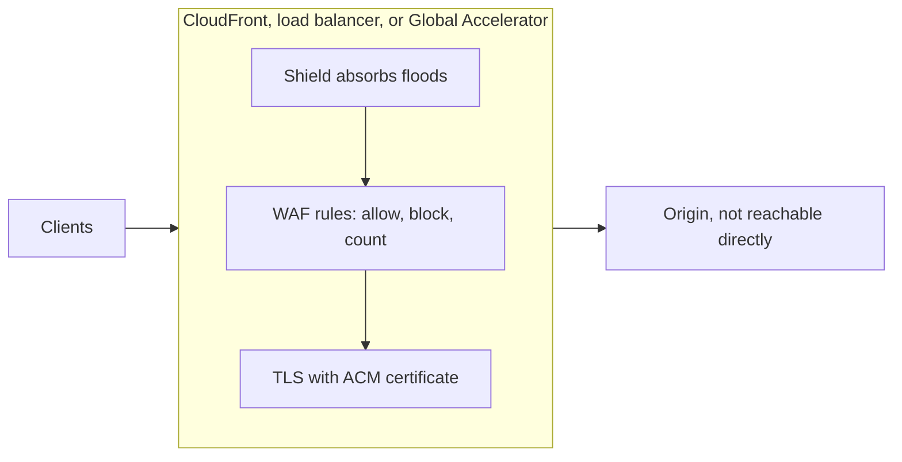
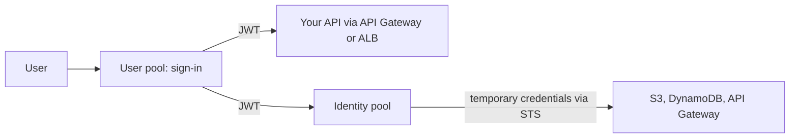

These services protect an application that faces the internet. At the edge, Shield absorbs denial-of-service floods, WAF filters requests by rule, and ACM supplies the TLS certificates. Behind the edge, Cognito signs users in, Directory Service runs or connects Active Directory, and CloudHSM holds keys in hardware you control.

## Choosing a service

| Threat or need | Service | What it decides |
| --- | --- | --- |
| Volumetric and state-exhaustion DDoS | [Shield](#aws-shield) | Whether traffic floods reach you; Standard is free and automatic |
| Malicious or abusive HTTP requests | [WAF](#aws-waf) | Allow, block, count, or custom response per request |
| Encrypting traffic in transit | [ACM](#aws-certificate-manager) | Which certificate a load balancer or CloudFront presents, and its renewal |
| Signing app users in | [Cognito](#amazon-cognito) | Who the user is (user pool) and which AWS resources they may use (identity pool) |
| Windows domain, LDAP, or on-premises AD sign-in | [Directory Service](#aws-directory-service) | Which directory authenticates the workload |
| Keys that must live in your own HSM | [CloudHSM](#aws-cloudhsm) | Who can use the keys; for managed keys, [KMS](encryption-and-secrets.md) is the default |

## The edge: Shield, WAF, and ACM

The three edge services work together on the same entry points: CloudFront, load balancers, and Global Accelerator.

Analysis: the diagram combines the Shield note's advice to keep traffic behind CloudFront, Global Accelerator, or a load balancer with the WAF and ACM notes; the order inside the edge is simplified.

### AWS Shield

Shield Standard is on for every AWS customer at no cost and absorbs common volumetric attacks such as UDP reflection and TCP SYN floods at the AWS edge. Shield Advanced is paid and adds better detection and mitigation, health-based detection from Route 53 health checks and CloudWatch metrics, cost protection during attacks, and the Shield Response Team. It protects named resource ARNs (CloudFront distributions, Route 53 hosted zones, Global Accelerator accelerators, Elastic IPs, and load balancers), grouped into protection groups.

- Keep traffic behind CloudFront, Global Accelerator, or a load balancer and never expose origin IPs; an attack that reaches the origin usually got there directly.
- Use Shield Advanced for business-critical applications; application-layer attacks still need WAF.
- Limits: up to 1,000 protected resources per account per resource type (adjustable), 100 protection groups, and 1,000 listed members per group.[^aws-shield]

### AWS WAF

WAF inspects HTTP(S) requests against a web ACL attached to the protected resource. Rules match on IP addresses, query strings, headers, or body; AWS managed rule groups cover common threats, and rate-based rules limit requests per IP over a window, against bots and floods. Each rule allows, blocks (HTTP 403), counts, or returns a custom response, and can label requests; logs go to S3, CloudWatch Logs, or Data Firehose.

- Start from managed rule groups, then add your own rules.
- Run new rules in count mode, review the logs, then switch to block. Blocked legitimate traffic is found the same way: find the matching rule in the logs.[^aws-waf]

### AWS Certificate Manager

ACM issues public and private TLS certificates, or imports third-party ones, for single names, multiple names, or wildcards. It proves domain ownership by DNS or email validation and renews the certificates it issued automatically; imported certificates are never renewed for you. Certificates are regional: request one in each Region that uses it, and in us-east-1 for CloudFront. ACM Private CA issues certificates for internal PKI. Public certificates used with AWS services carry no ACM charge.

- Use DNS validation, so renewals need no manual step.
- A certificate a service cannot find is usually in the wrong Region.[^aws-acm]

## Amazon Cognito

Cognito answers two questions with two components. A user pool answers "who is this person": it runs sign-up and sign-in with password policies, MFA (TOTP or SMS), account recovery, managed login pages, and federation with Apple, Facebook, Google, Amazon, OIDC, or SAML, and issues JWTs to app clients. An identity pool answers "what AWS resources may they use": it exchanges those tokens for temporary AWS credentials through STS, by role mapping or attribute-based access control, and can give guests scoped credentials. An app that calls only its own API never needs an identity pool.

- Prefer TOTP over SMS for MFA, and restrict each app client's scopes, origins, and callback URLs, one client per platform.[^aws-cognito]

| Symptom | Check |
| --- | --- |
| Login fails | User status (such as `FORCE_CHANGE_PASSWORD`), confirmation, and MFA |
| API Gateway or ALB rejects the token | The JWT audience matches the app client ID, and the token has not expired |
| Identity pool returns no credentials | The link to the user pool or IdP, role mapping, and trust policy |

## AWS Directory Service

Directory Service provides Active Directory for AWS workloads in three forms. For high-scale SaaS user directories with social sign-in, AWS points to Cognito instead.

| Option | What it is | Supports | Choose it when |
| --- | --- | --- | --- |
| AWS Managed Microsoft AD | Real Windows Server AD run by AWS, across Availability Zones | Domain join, RDS for SQL Server, WorkSpaces, Group Policy, schema extensions, LDAPS, MFA, trusts with on-premises AD | You need real AD features |
| AD Connector | A proxy to your on-premises AD, with no sync or federation | Authentication for WorkSpaces, EC2 Windows domain join, console sign-in | The source of truth must stay on premises |
| Simple AD | Samba 4-based, AD-compatible, low cost | Users and groups, domain join, Kerberos SSO, group policy; no MFA, trusts, schema extensions, LDAPS, or RDS SQL Server | Basic needs only |

- Domain join failures are usually DNS, or security groups on TCP/UDP 389, 445, 88, 464, and 3268. LDAPS needs an imported CA certificate and port 636.[^aws-directory-service]

## AWS CloudHSM

CloudHSM gives you dedicated, single-tenant hardware security modules in your VPC. AWS provisions, backs up, and maintains them but cannot see your keys: IAM controls who may call the CloudHSM API to manage clusters, while HSM users, created inside the HSM and invisible to IAM, control who may use the keys. Applications connect through PKCS #11, JCE, CNG, or KSP. A cluster runs in FIPS mode (FIPS 140-2/140-3 Level 3 validated keys and algorithms only) or non-FIPS mode (all supported algorithms). Use it only when you need your own HSMs; otherwise use KMS.

- Run at least two HSMs in different Availability Zones.
- Choose FIPS mode only when validation is required.
- Cluster initialization fails when the signed certificate does not match the cluster or the trust anchor is not a valid CA certificate.[^aws-cloudhsm]

## Related

- [Encryption and secrets](encryption-and-secrets.md): KMS and Secrets Manager.
- [Global traffic](global-traffic.md): CloudFront and Global Accelerator, where Shield and WAF attach.
- [IAM](iam.md): access to the APIs of all these services.
- [Domain index](index.md)

[^aws-shield]: [AWS Shield - Runbook & Reference](../../sources/aws-shield.md), [original](https://github.com/kelvinlee97/engineering/blob/main/AWS/shield/README.md)
[^aws-waf]: [AWS WAF - Runbook & Reference](../../sources/aws-waf.md), [original](https://github.com/kelvinlee97/engineering/blob/main/AWS/waf/README.md)
[^aws-acm]: [AWS Certificate Manager (ACM) - Runbook & Reference](../../sources/aws-acm.md), [original](https://github.com/kelvinlee97/engineering/blob/main/AWS/acm/README.md)
[^aws-cognito]: [Amazon Cognito - Runbook & Reference](../../sources/aws-cognito.md), [original](https://github.com/kelvinlee97/engineering/blob/main/AWS/cognito/README.md)
[^aws-directory-service]: [AWS Directory Service - Runbook & Reference](../../sources/aws-directory-service.md), [original](https://github.com/kelvinlee97/engineering/blob/main/AWS/directory-service/README.md)
[^aws-cloudhsm]: [AWS CloudHSM - Runbook & Reference](../../sources/aws-cloudhsm.md), [original](https://github.com/kelvinlee97/engineering/blob/main/AWS/cloudhsm/README.md)
