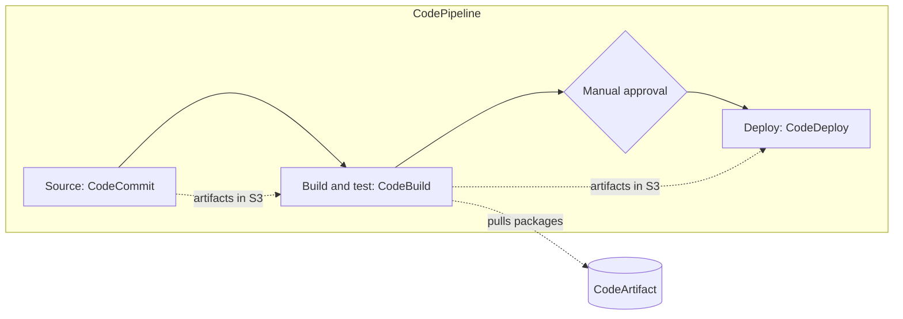

AWS's code services each own one stage of a delivery pipeline: CodeCommit hosts the source, CodeBuild builds and tests it, CodeArtifact stores the packages it depends on and produces, CodeDeploy rolls the result out, and CodePipeline strings the stages together. Two older members are winding down: CodeStar is retired and CodeGuru Reviewer takes no new repositories.

## How the services form a pipeline

| Stage | Service | Status in its note | The one thing to understand |
| --- | --- | --- | --- |
| Source | [CodeCommit](#aws-codecommit) | Available | Plain Git; only access (IAM), encryption (KMS), and notifications (SNS) are AWS-specific |
| Build and test | [CodeBuild](#aws-codebuild) | Available | One `buildspec.yml` scripts the whole run, phase by phase, in a fresh container |
| Packages | [CodeArtifact](#aws-codeartifact) | Available | Repositories chain through upstreams, so one endpoint resolves packages from several |
| Deploy | [CodeDeploy](#aws-codedeploy) | Available | The AppSpec hook sequence; `ValidateService` decides whether a rollout continues |
| Orchestrate | [CodePipeline](#aws-codepipeline) | Available | Stages see only the artifacts earlier actions output by name |
| Project dashboard | [CodeStar](#aws-codestar) | Retired July 31, 2024 | Use CodeCatalyst or the services above |
| Code review, profiling | [CodeGuru](#amazon-codeguru) | Reviewer closed to new repositories November 7, 2025; Profiler available | Two separate tools under one name |

Analysis: the diagram is the common arrangement the CodePipeline note describes (Source, Build, Test, Deploy with an approval before production); each stage can also use third-party tools such as GitHub or Jenkins.

## AWS CodeCommit

CodeCommit hosts private Git repositories. Every Git client and workflow works unchanged, including pull requests; what differs from a self-hosted Git server is that IAM decides who can push, KMS encrypts the repositories at rest, TLS protects them in transit, and SNS carries notifications. It has no limits on repository size or file types.

- Connect over HTTPS with Git credentials or over SSH with a key; prefer IAM roles and short-lived credentials over long-lived Git credentials.
- Keep repositories to code. Databases, backups, and large, frequently changing binaries belong in S3, because Git delta chains slow down on them.
- Prune branches and tags you no longer need to keep operations fast.

| Symptom | Check |
| --- | --- |
| Clone or push authentication fails | Git credentials or SSH key setup, and IAM permissions on the repository |
| Repository not visible | The Region, and `codecommit:ListRepositories` / `GetRepository` for the principal |
| Pull request notifications missing | The SNS topic subscription and notification rules |

Repositories per account, repository and file sizes, and API request rates have quotas.[^aws-codecommit]

## AWS CodeBuild

CodeBuild compiles code, runs tests, and produces artifacts without build servers to patch or scale; you pay for the build minutes used. A build project names the source (CodeCommit, S3, GitHub, GitHub Enterprise, Bitbucket, or none), the environment image, and the artifact destination. The `buildspec.yml` in the source runs its install, pre_build, build, and post_build phases in that order in a fresh container, so the phase that failed tells you which part of the file to read.

- Keep build logic in `buildspec.yml`, so builds are reproducible and reviewed like code.
- Pin image versions, or use a custom image, for deterministic environments.
- Upload artifacts to a versioned S3 bucket with a retention policy.
- Read secrets from Secrets Manager or Parameter Store rather than putting them in the project.

| Symptom | Check |
| --- | --- |
| Fails at install or pre_build | Dependency versions and network access to package registries |
| Artifact not uploaded | The S3 bucket, IAM permissions, and artifact configuration |
| Build stuck | Timeout settings, compute limits, and Docker Hub pulls |

Build projects, concurrent builds, build minutes, and artifact sizes have quotas.[^aws-codebuild]

## AWS CodeArtifact

CodeArtifact stores private packages for npm, yarn, pip, twine, Maven, Gradle, and NuGet, with no limit on the number or total size of packages. A domain groups repositories and carries policy; a repository can list another repository as its upstream, and an external connection links a repository to a public registry (npmjs.com, Maven Central, PyPI, NuGet Gallery), fetching and storing packages on demand. Clients authenticate with short-lived authorization tokens made from AWS credentials, and packages cannot be made public.

- Run one production domain per organization, with repositories per team or project.
- Put public registries behind an upstream, so builds do not depend on the internet source directly and you control which versions come in.
- Grant cross-account access with domain resource policies and least-privilege IAM.

| Symptom | Check |
| --- | --- |
| Package manager authentication fails | Get a fresh authorization token; check the endpoint and Region |
| Cannot publish | `codeartifact:PublishPackageVersion` in IAM and the repository policy |
| Upstream package missing | The upstream configuration and external connection status |

Domains, repositories, upstreams per repository, and API rates have quotas.[^aws-codeartifact]

## AWS CodeDeploy

CodeDeploy rolls application revisions out to EC2 or on-premises servers (through an agent on each instance), Lambda functions, and ECS services. A revision is the application bundle plus an AppSpec file, stored in S3 or GitHub. The AppSpec names lifecycle hooks (`BeforeInstall`, `AfterInstall`, `ApplicationStart`, `ValidateService`); a script's non-zero exit fails its hook, and together with the deployment configuration (speed and minimum healthy instances) that decides whether the rollout continues or rolls back.

| Deployment type | Platforms | How traffic moves |
| --- | --- | --- |
| In-place | EC2 and on-premises only | Instances are updated one group at a time, with health tracking |
| Blue/green | EC2, Lambda, ECS | New instances, Lambda versions, or ECS task sets take traffic by canary, linear, or all-at-once configuration |

- Keep deployments small and frequent; use blue/green for critical workloads so rollback is fast.
- Write a `ValidateService` check, so an unhealthy deployment rolls back on its own.

| Symptom | Check |
| --- | --- |
| Instance deployment fails | Agent logs in `/var/log/aws/codedeploy-agent`, the instance role, and access to the S3 revision |
| Hooks not running | The AppSpec path, script permissions, and exit codes |
| Rollback not triggered | Auto-rollback settings and the alarm or validation criteria |

Applications, deployment groups, concurrent deployments, and revision sizes have quotas.[^aws-codedeploy]

## AWS CodePipeline

CodePipeline models a release as stages run in order, each holding actions: source, build, test, deploy, approval, or invoke, from AWS services or third parties such as GitHub and Jenkins. Actions exchange files only as named input and output artifacts kept in an S3 bucket, so a missing input in one stage usually traces back to a name mismatch in the previous stage's output. A pipeline runs when the source changes or on demand.

- Define the pipeline in code (CloudFormation or CLI JSON) and version it with the application.
- Put an approval action before the production deploy.

| Symptom | Check |
| --- | --- |
| Stuck on approval | Whether approvers got the notification and the action has not expired |
| Artifacts missing between stages | Artifact names on action inputs and outputs, and the artifact bucket policy |
| Source change not triggering | The CodeCommit event, GitHub webhook, or S3 source configuration |

Pipelines, stages and actions per pipeline, artifact sizes, and executions have quotas.[^aws-codepipeline]

## AWS CodeStar

CodeStar was a dashboard that grouped a project's repositories, pipelines, and team members. AWS ended it on July 31, 2024: the console is gone, new projects cannot be created, and the SDK client was removed. Its note exists to help recognize leftover resources. Find them through the underlying services, then migrate or delete them and remove unused IAM roles; use CodeCatalyst for project collaboration and the services above for CI/CD.[^aws-codestar]

## Amazon CodeGuru

CodeGuru names two unrelated machine learning tools. Reviewer analyzes Java and Python source for defects, resource leaks, and security issues before it runs; since November 7, 2025 it takes no new repository associations, though existing ones keep working. Profiler watches running applications in production and points to the most expensive lines of code; it is unaffected.

- Run Profiler continuously on representative traffic to catch regressions and costly code paths.
- If Profiler shows no data, check that the agent runs and IAM allows `codeguruprofiler:PostAgentProfile`.

Profiling groups, profile retention, and API rates have quotas.[^aws-codeguru]

## Related

- [AWS developer tools](developer-tools.md): the CLI, SDKs, and infrastructure-as-code frameworks these pipelines deploy with.
- [Operations tooling](operations-tooling.md): CloudFormation, often a deploy action in CodePipeline.
- [Domain index](index.md)

[^aws-codecommit]: [AWS CodeCommit - Runbook & Reference](../../sources/aws-codecommit.md), [original](https://github.com/kelvinlee97/engineering/blob/main/AWS/codecommit/README.md)
[^aws-codebuild]: [AWS CodeBuild - Runbook & Reference](../../sources/aws-codebuild.md), [original](https://github.com/kelvinlee97/engineering/blob/main/AWS/codebuild/README.md)
[^aws-codeartifact]: [AWS CodeArtifact - Runbook & Reference](../../sources/aws-codeartifact.md), [original](https://github.com/kelvinlee97/engineering/blob/main/AWS/codeartifact/README.md)
[^aws-codedeploy]: [AWS CodeDeploy - Runbook & Reference](../../sources/aws-codedeploy.md), [original](https://github.com/kelvinlee97/engineering/blob/main/AWS/codedeploy/README.md)
[^aws-codepipeline]: [AWS CodePipeline - Runbook & Reference](../../sources/aws-codepipeline.md), [original](https://github.com/kelvinlee97/engineering/blob/main/AWS/codepipeline/README.md)
[^aws-codestar]: [AWS CodeStar - Runbook & Reference](../../sources/aws-codestar.md), [original](https://github.com/kelvinlee97/engineering/blob/main/AWS/codestar/README.md)
[^aws-codeguru]: [Amazon CodeGuru - Runbook & Reference](../../sources/aws-codeguru.md), [original](https://github.com/kelvinlee97/engineering/blob/main/AWS/codeguru/README.md)
