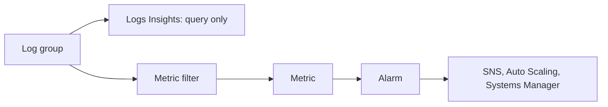

CloudWatch collects metrics, logs, and traces and provides alarms, dashboards, and automated actions. An alarm only ever watches a metric, never a log or a trace, so alarming on a log pattern needs a metric filter in between.[^aws-cloudwatch]

## Concepts

- AWS services publish metrics automatically; you add custom metrics; standard metrics are kept 15 months.[^aws-cloudwatch]
- Logs Insights queries in SQL or PPL; subscription filters stream logs elsewhere.[^aws-cloudwatch]
- The CloudWatch agent adds OS-level metrics (memory, disk) from EC2 and on-premises.[^aws-cloudwatch]
- Application Signals with SLOs, Synthetics canaries, RUM, Container/Lambda/Database Insights, and native OTLP ingestion.[^aws-cloudwatch]

## Troubleshooting

| Symptom | Check |
| --- | --- |
| No instance metrics | Agent running; role allows `cloudwatch:PutMetricData` |
| Alarm not firing | Metric name, namespace, period; state not `INSUFFICIENT_DATA` |
| High cost | Custom metric volume, log ingestion, detailed monitoring |

As tabled in the note.[^aws-cloudwatch]

## Related

- Source: [Amazon CloudWatch - Runbook & Reference](../../sources/aws-cloudwatch.md)

[^aws-cloudwatch]: Amazon CloudWatch - Runbook & Reference
