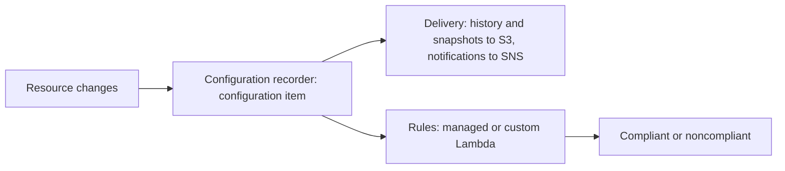

These services answer the questions an auditor or security team asks about an AWS estate. Config records how resources are configured and checks them against rules. Inspector finds software vulnerabilities and network exposure. Macie finds sensitive data in S3. Detective reconstructs what happened behind a finding. Artifact hands over AWS's own audit reports. The threat detectors that feed some of them (CloudTrail, GuardDuty, Security Hub) are in [Security monitoring](security-monitoring.md).

## Choosing a service

| Question | Service | Looks at | Produces |
| --- | --- | --- | --- |
| How is each resource configured, and did that change? Does it comply? | [Config](#aws-config) | Supported resources' configuration | Configuration items and history, compliant or noncompliant results |
| What is vulnerable or exposed? | [Inspector](#amazon-inspector) | EC2 instances, ECR images, Lambda functions | Vulnerability and exposure findings with a risk score |
| Where is sensitive data, and is its bucket safe? | [Macie](#amazon-macie) | S3 buckets and objects | Sensitive-data and bucket-policy findings |
| What led to this finding, and how far did it spread? | [Detective](#amazon-detective) | CloudTrail, VPC Flow Logs, GuardDuty findings | A behavior graph and finding groups |
| What has AWS itself been audited for? | [Artifact](#aws-artifact) | AWS's reports and agreements | ISO, PCI, and SOC reports; accepted agreements |

Inspector, Macie, and Detective all run organization-wide from one administrator account designated through AWS Organizations, and Macie's findings flow to EventBridge or Security Hub CSPM. Enable each across the whole organization, so new accounts are covered without a manual step.[^aws-inspector][^aws-macie][^aws-detective]

## AWS Config

Config records the configuration of supported resources in an account and Region, tracks changes and relationships over time, and evaluates compliance with rules. It does so in three steps that each depend on the one before, so a real resource can still be invisible to Config's history or its rules if an earlier step was off or unauthorized.

An account has one customer managed recorder per Region; integrated services such as Security Hub CSPM create their own service-linked recorders. Conformance packs bundle rules, aggregators collect results across accounts and Regions, and advanced queries search the recorded state.

- Record every resource type your compliance scope needs, continuously for real-time monitoring.
- Standardize checks across accounts with managed rules and conformance packs.
- Keep the delivery bucket private and encrypted.

| Symptom | Check |
| --- | --- |
| Resources not recorded | The recorder is started, its IAM role, and resource type support in the Region |
| No compliance results | Rules deployed, their resource types recorded, evaluations finished |
| Aggregator shows no data | Source accounts authorized it and the Regions are selected |

Limits: 1,000 rules per Region per account, 50 conformance packs of up to 130 rules each, 50 aggregators (adjustable) of up to 10,000 accounts each, and 300 saved queries.[^aws-config]

## Amazon Inspector

Inspector discovers EC2 instances, container images in ECR, and Lambda functions, then scans them continuously for software vulnerabilities and unintended network exposure. It rescans when packages change or a new CVE affecting a resource is published, and closes findings once they are fixed. Its risk score adjusts CVSS severity to your environment, using network reachability and exploitability.

- Scan all three resource types, and prioritize by the risk score rather than raw CVSS.
- No EC2 coverage usually means the scan type is off or SSM Agent is not running (agentless options also exist); ECR images pushed before scanning was enabled are not scanned.[^aws-inspector]

## Amazon Macie

Macie inventories S3 general purpose buckets and flags public access, shared access, and encryption problems as policy findings. For the data itself, automated discovery continuously samples representative objects across buckets, and discovery jobs analyze chosen buckets in depth. Managed data identifiers detect PII, financial information, and credentials for many countries; custom identifiers add your own patterns, and allow lists suppress known sample text.

- Enable Macie before S3 data grows, so the inventory and baseline exist early.
- Use automated discovery for breadth and targeted jobs for high-value buckets or compliance deadlines.
- Object analysis errors usually mean object permissions or KMS key access; findings missing from Security Hub CSPM mean the integration is off in that Region.[^aws-macie]

## Amazon Detective

Detective helps find the root cause of security findings. It extracts time-based events (sign-ins, API calls, network traffic) from CloudTrail management events and VPC Flow Logs, ingests GuardDuty findings, keeps up to a year of history, and links it all into a behavior graph. Finding groups gather related findings and entities around one potential security event, showing the sequence and scope behind a high-severity GuardDuty finding. Detective Investigation triages IAM users and roles against indicators of compromise, from the console or the `StartInvestigation` API, and raw logs in Amazon Security Lake can be queried from it.

- Enroll every account that generates GuardDuty findings or sensitive traffic.
- An empty graph means CloudTrail or VPC Flow Logs are off, or members have not enrolled.
- New enablement starts with a 30-day free trial.[^aws-detective]

## AWS Artifact

Artifact is a free, read-only portal for AWS's own audited compliance reports (ISO, PCI, SOC, and certifications) and for accepting and tracking agreements with AWS. It is not a compliance service: evidence for your own controls remains yours to produce. Assurance Assistant answers first-pass due-diligence questions.

- Download reports again each audit cycle; they are reissued, and auditors may reject older versions.
- Accept organization-wide agreements from the management account, where they are visible to all.
- Check Assurance Assistant answers against the reports themselves.[^aws-artifact]

## Related

- [Security monitoring](security-monitoring.md): CloudTrail, GuardDuty, and Security Hub CSPM.
- [Multi-account governance](multi-account-governance.md): the Organizations structure these services are enabled across.
- [Management and governance](management-and-governance.md): Control Tower, which sets up many of these controls in a landing zone.
- [Domain index](index.md)

[^aws-inspector]: [Amazon Inspector - Runbook & Reference](../../sources/aws-inspector.md), [original](https://github.com/kelvinlee97/engineering/blob/main/AWS/inspector/README.md)
[^aws-macie]: [Amazon Macie - Runbook & Reference](../../sources/aws-macie.md), [original](https://github.com/kelvinlee97/engineering/blob/main/AWS/macie/README.md)
[^aws-detective]: [Amazon Detective - Runbook & Reference](../../sources/aws-detective.md), [original](https://github.com/kelvinlee97/engineering/blob/main/AWS/detective/README.md)
[^aws-config]: [AWS Config - Runbook & Reference](../../sources/aws-config.md), [original](https://github.com/kelvinlee97/engineering/blob/main/AWS/config/README.md)
[^aws-artifact]: [AWS Artifact - Runbook & Reference](../../sources/aws-artifact.md), [original](https://github.com/kelvinlee97/engineering/blob/main/AWS/artifact/README.md)
