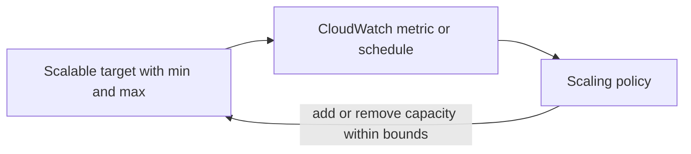

Beyond raw EC2, AWS offers compute shaped around a kind of workload: Batch for queued jobs, Lightsail for simple fixed-price servers, Elastic Beanstalk for web apps you hand over as code, and Outposts for AWS hardware in your own building. Application Auto Scaling is the control loop that grows and shrinks capacity for services other than EC2 fleets. For EC2 itself, see [Compute](compute.md).

## Choosing a platform

| Workload | Use | You manage | AWS manages |
| --- | --- | --- | --- |
| Queued, containerized batch jobs | [Batch](#aws-batch) | Job definitions, queues, and priorities | Provisioning compute on ECS, EKS, EC2, or Fargate |
| A small site or server at a predictable monthly price | [Lightsail](#amazon-lightsail) | The instance and its firewall | A bundle of server, database, load balancer, CDN, DNS, and storage |
| A web app or worker you deliver as code | [Elastic Beanstalk](#aws-elastic-beanstalk) | Code and environment configuration | Capacity, load balancing, scaling, health, and platform updates, on resources you can still see |
| Low-latency or local-data workloads on premises | [Outposts](#aws-outposts) | The site: power, cooling, space, and network | The racks or servers, as an extension of a Region |
| Scaling a non-EC2 resource | [Application Auto Scaling](#application-auto-scaling) | Targets, bounds, and policies | Adding and removing capacity |

Analysis: the Lightsail note itself draws the upgrade line: move to EC2 and RDS when you need advanced features or deep AWS integration.

## AWS Batch

Batch is a queue in front of elastic compute. A job waits in a priority-ordered job queue until a compute environment (EC2 On-Demand or Spot, Fargate, or EKS) has room, then runs as a container defined by its job definition: image, vCPU and memory, IAM role, and parameters. Array jobs run many copies of one job with different index values. Batch also queues SageMaker Training jobs.

- Use Fargate for simple container jobs, and EC2 with Spot for large or GPU work.
- Separate queues by priority or team, and use scheduling policies for fairness.
- Make jobs idempotent; retry logic belongs in the application.[^aws-batch]

| Symptom | Check |
| --- | --- |
| Job stuck in `RUNNABLE` | Compute environment capacity, subnet IP availability, and the job definition |
| Container fails | CloudWatch logs and exit codes; run the image locally |
| Not enough compute | Raise maximum vCPU or add Spot capacity; check quotas |

## Amazon Lightsail

Lightsail sells virtual private servers at low, predictable monthly prices, with everything a small site needs in one console: instances launched from blueprints (an OS, WordPress, LAMP, Nginx), fixed-size bundles of RAM, vCPU, storage, and transfer, managed MySQL or PostgreSQL, a container service, load balancers, CDN distributions, static IPs, DNS, and snapshots.

- Open only the ports you need in the built-in firewall, and take a snapshot before changes.
- Use the managed database rather than running MySQL or PostgreSQL on the instance.
- An unreachable instance is usually its state, firewall rules, or a detached static IP.

Instances, databases, load balancers, static IPs, and transfer are capped per account and plan.[^aws-lightsail]

## AWS Elastic Beanstalk

Elastic Beanstalk deploys and scales web applications and worker processes: you upload code, and it provisions EC2 instances, S3, and load balancers, then handles scaling, health monitoring, and platform updates while leaving those resources under your control. It has no charge of its own; you pay for what it provisions. An application holds versions and environments; each environment runs one version on a platform: Go, Java (Corretto, Tomcat), .NET (Linux), Node.js, PHP, Python, Ruby, or Docker.

Deployment policies are all at once, rolling, rolling with an additional batch, immutable, traffic splitting (canary), and blue/green through a swap of the environment CNAME.

- Use one environment per stage and keep application versions immutable.
- Put settings in environment configuration and secrets in Secrets Manager.[^aws-elastic-beanstalk]

| Symptom | Check |
| --- | --- |
| Environment `Degraded` or `Severe` | The health page, instance-level causes, and recent events |
| Deployment fails | `eb logs`, and that the artifact fits the platform |
| Worker jobs not processed | The SQS queue, worker scaling, and application logs |

## AWS Outposts

An Outpost extends an AWS Region into your building. AWS installs, owns, and manages the hardware; you use the same APIs and console as in the Region. A service link carries traffic back to the Region, and a local gateway connects Outpost resources to your on-premises network.

| Form factor | For |
| --- | --- |
| Outposts rack (42U) | Capacity; four or more compute racks also need an aggregation, core, and edge (ACE) rack |
| Outposts server (1U or 2U) | Sites with limited space or smaller needs |

- Check power, cooling, space, and networking before ordering, and plan the service link bandwidth.
- Launch failures usually mean the Outpost lacks capacity or the instance type; high latency to the Region points at the service link or local gateway routing. AWS replaces failed hardware through a support case.[^aws-outposts]

## Application Auto Scaling

Application Auto Scaling runs one control loop for many resource types other than EC2 fleets: DynamoDB capacity, ECS service desired count, Lambda provisioned concurrency, Aurora replicas, and EMR clusters. You register a resource as a scalable target with minimum and maximum capacity and attach policies; the loop adds or removes capacity within those bounds.

| Policy | Scales |
| --- | --- |
| Target tracking | To keep a metric, such as CPU or queue depth, near a target value |
| Step | By amounts that grow with the size of the alarm breach |
| Scheduled | At set times, once or recurring |
| Predictive | Ahead of load forecast from history |

- Prefer target tracking on a metric that reflects real load, and add scheduled scaling for known peaks such as business hours.
- If nothing scales, confirm the target is registered, the namespace and dimension match the resource, and the policy's alarm fires.[^aws-application-auto-scaling]

## Related

- [Compute](compute.md): EC2, EC2 Auto Scaling, and load balancers.
- [Containers and serverless](containers-and-serverless.md): ECS, EKS, and Lambda, which Batch and Application Auto Scaling build on.
- [Domain index](index.md)

[^aws-batch]: [AWS Batch - Runbook & Reference](../../sources/aws-batch.md), [original](https://github.com/kelvinlee97/engineering/blob/main/AWS/batch/README.md)
[^aws-lightsail]: [Amazon Lightsail - Runbook & Reference](../../sources/aws-lightsail.md), [original](https://github.com/kelvinlee97/engineering/blob/main/AWS/lightsail/README.md)
[^aws-elastic-beanstalk]: [AWS Elastic Beanstalk - Runbook & Reference](../../sources/aws-elastic-beanstalk.md), [original](https://github.com/kelvinlee97/engineering/blob/main/AWS/elastic-beanstalk/README.md)
[^aws-outposts]: [AWS Outposts - Runbook & Reference](../../sources/aws-outposts.md), [original](https://github.com/kelvinlee97/engineering/blob/main/AWS/outposts/README.md)
[^aws-application-auto-scaling]: [Application Auto Scaling - Runbook & Reference](../../sources/aws-application-auto-scaling.md), [original](https://github.com/kelvinlee97/engineering/blob/main/AWS/application-auto-scaling/README.md)
