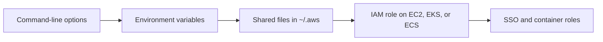
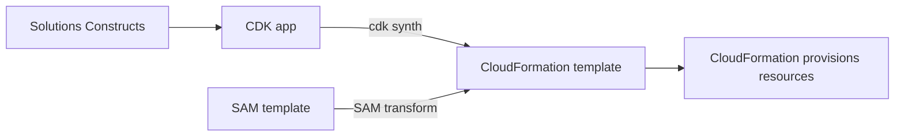

Developers reach AWS in two ways: by calling service APIs directly, from the shell with the AWS CLI or from code with an SDK such as boto3, and by describing infrastructure in code with CDK, Solutions Constructs, or SAM, all of which end up as [CloudFormation](operations-tooling.md) templates. Amplify and Cloud9 are hosted environments for building and shipping applications.

## Choosing a tool

| You want to | Use | Why this one |
| --- | --- | --- |
| Run one-off or scripted API calls from a shell | [AWS CLI](#aws-cli) | Same APIs as the console, with `--query` and `--output` for scripting |
| Call AWS from application code | [An SDK](#aws-sdks), [boto3](#boto3) in Python | Signs requests, retries transient failures, and maps errors for you |
| Define infrastructure in a general-purpose language | [CDK](#aws-cdk) | Compiles to CloudFormation, with defaults built into L2 constructs |
| Start from a tested multi-service pattern | [Solutions Constructs](#aws-solutions-constructs) | Prebuilt CDK patterns such as API Gateway + Lambda + DynamoDB |
| Build a serverless app from a template | [SAM](#aws-sam-and-the-serverless-application-repository) | CloudFormation shorthand plus a CLI for local testing |
| Host a web or mobile front end with its backend | [Amplify](#aws-amplify) | Git-triggered deploys to the AWS CDN, and a TypeScript-defined backend |
| Edit code in a browser | [Cloud9](#aws-cloud9) | Only if you already use it; closed to new customers |

## Calling AWS APIs

The CLI, every SDK, and boto3 find credentials the same way: they walk a fixed chain and use the first source that answers. Most "the command is broken" problems are really a profile or credential problem.

Analysis: the diagram follows the order the CLI note lists; the SDK and boto3 notes list the same sources.

### AWS CLI

The AWS CLI calls the same service APIs as the console, plus higher-level commands for some services. Version 2 is current and installed with the official bundled installer; version 1 is in maintenance and lacks v2 features. Named profiles in `~/.aws/config` and `~/.aws/credentials` hold credentials and Region per account or environment; select one with `--profile` or `AWS_PROFILE`. `aws configure sso` sets up IAM Identity Center sign-in and `aws sso login` refreshes it. The CLI itself has no quotas; each service's API limits apply.[^aws-cli]

| Symptom | Check |
| --- | --- |
| `Unable to locate credentials` | The profile, environment variables, and the chain order |
| `AccessDenied` | The IAM policy, and that the intended profile or role is in use |
| Expired SSO session | Run `aws sso login --profile <profile>` |
| Results from the wrong Region | Pass `--region` or fix the profile default |

### AWS SDKs

The SDKs are libraries for Python (boto3), Java, JavaScript v3, Go, .NET, Ruby, PHP, C++, and more. They sign every request with Signature Version 4, accept temporary STS credentials, and retry transient failures by default, with a `standard`, `adaptive`, or `legacy` retry mode. Several share the AWS Common Runtime for HTTP/2, event streams, and checksums.

- Use a role for the code's identity: an EC2 instance profile, EKS IRSA, an ECS task role, a Lambda execution role, or SSO. Where a static key cannot be avoided, use short-lived STS credentials.
- Set timeouts, retry mode, and maximum retries explicitly on latency-sensitive paths.
- Signature errors often mean clock skew; check that the host's time is synchronized.[^aws-sdk]

### boto3

boto3 is the Python SDK. A client (`boto3.client('s3')`) maps almost one-to-one to API operations; a resource (`boto3.resource('s3')`) offers objects and collections for a subset of services; a session holds configuration and credentials.

- Reuse clients and sessions instead of creating one per call; boto3 pools connections.
- Use paginators (`client.get_paginator(...)`) for list APIs, and waiters instead of sleep loops.
- `NoCredentialsError` points at the chain; `ThrottlingException` calls for more retries and backoff, or a quota increase.[^aws-boto3]

## Infrastructure as code

CDK, Solutions Constructs, and SAM never create resources themselves. Each produces a CloudFormation template, and CloudFormation provisions it, so a failed deployment is read in the CloudFormation event log whichever tool wrote the template.

| | CDK | Solutions Constructs | SAM |
| --- | --- | --- | --- |
| You write | TypeScript, JavaScript, Python, Java, C#/.NET, or Go | TypeScript, JavaScript, Python, or Java | YAML or JSON template with serverless shorthand |
| Unit of reuse | Constructs (L1, L2, L3) | Prebuilt CDK patterns | Templates, shared through the Serverless Application Repository |
| Local testing | Not covered in its note | Through CDK | `sam local invoke` and `sam local start-api` |

### AWS CDK

A CDK app holds one or more stacks, each deployed as one CloudFormation stack. L1 constructs map to raw CloudFormation resources, L2 constructs add sensible defaults, and L3 constructs are patterns. `cdk synth` writes the template; `cdk bootstrap` creates the staging bucket and roles a Region needs before the first deploy. CDK v2 is current; v1 entered maintenance on June 1, 2022 and ended support on June 1, 2023.

- Start from L2 constructs and drop to L1 only for a property L2 does not expose.
- Split stacks along dependency boundaries such as state, networking, and application.
- Keep the CDK CLI and construct libraries on compatible, pinned versions.

| Symptom | Check |
| --- | --- |
| `BootstrapError` | Run `cdk bootstrap` for the target account and Region |
| Stack update failed | The CloudFormation event log |
| Asset upload fails | The staging bucket policy and IAM permissions |

CloudFormation quotas apply, such as template size and resources per stack.[^aws-cdk]

### AWS Solutions Constructs

Solutions Constructs is an open-source library of well-architected CDK patterns that combine services for common jobs, such as API Gateway + Lambda + DynamoDB or S3 + Lambda. Use one instead of wiring the services by hand, but read its defaults for encryption, logging, and cost before deploying, and override any that do not fit. If synthesis fails, check that the CDK and construct versions are compatible.[^aws-solutions-constructs]

### AWS SAM and the Serverless Application Repository

A SAM template is CloudFormation with shorthand types such as `AWS::Serverless::Function`, `AWS::Serverless::Api`, and `AWS::Serverless::SimpleTable`, which the `AWS::Serverless-2016-10-31` transform expands into standard resources. Connectors and policy templates (for example, DynamoDB CRUD) generate scoped IAM permissions. The SAM CLI runs the lifecycle: `sam init`, `sam build`, `sam local`, `sam deploy`, and `sam sync`. The Serverless Application Repository is a catalog for publishing finished templates publicly or privately and deploying them from the Lambda console.[^aws-sam]

| Symptom | Check |
| --- | --- |
| `sam build` fails | Runtime dependencies, and Docker for native modules |
| Deploy fails | CloudFormation events, the transform line, and permissions |
| Repository publish rejected | Metadata: semantic version, readme, and source URL |

## AWS Amplify

Amplify has two mostly independent halves. Amplify Hosting connects a GitHub, Bitbucket, GitLab, or CodeCommit repository and deploys the front end to the AWS CDN on every push, with an environment per connected branch, pull request previews, and custom domains. The backend half defines `data`, `auth`, `storage`, and `functions` in TypeScript and deploys them with `ampx`; that is Gen 2, the current version, while Gen 1 apps use the legacy Amplify CLI and Studio.

- Use Gen 2 for new projects, and keep auth rules in the backend schema.
- If the backend does not update, run `ampx deploy` (or `amplify push` on Gen 1) and redeploy the front end.

Build minutes, hosting storage and transfer, and backend usage have account limits.[^aws-amplify]

## AWS Cloud9

Cloud9 is a browser IDE attached to one compute resource per environment: an EC2 instance it manages, or your own server over SSH. It is closed to new customers; existing environments keep working. For new projects the note suggests IDE toolkits with EC2 or CloudShell. On an existing environment, keep the instance patched and give it a least-privilege instance profile rather than stored keys.[^aws-cloud9]

## Related

- [CI/CD on AWS](ci-cd.md): the pipeline services that build and deploy what these tools define.
- [Operations tooling](operations-tooling.md): CloudFormation, which all three infrastructure-as-code tools target.
- [IAM](iam.md): the roles and policies behind the credential chain.
- [Domain index](index.md)

[^aws-cli]: [AWS CLI - Runbook & Reference](../../sources/aws-cli.md), [original](https://github.com/kelvinlee97/engineering/blob/main/AWS/cli/README.md)
[^aws-sdk]: [AWS SDKs and Tools - Runbook & Reference](../../sources/aws-sdk.md), [original](https://github.com/kelvinlee97/engineering/blob/main/AWS/sdk/README.md)
[^aws-boto3]: [boto3 (AWS SDK for Python) - Runbook & Reference](../../sources/aws-boto3.md), [original](https://github.com/kelvinlee97/engineering/blob/main/AWS/boto3/README.md)
[^aws-cdk]: [AWS Cloud Development Kit (CDK) - Runbook & Reference](../../sources/aws-cdk.md), [original](https://github.com/kelvinlee97/engineering/blob/main/AWS/cdk/README.md)
[^aws-solutions-constructs]: [AWS Solutions Constructs - Runbook & Reference](../../sources/aws-solutions-constructs.md), [original](https://github.com/kelvinlee97/engineering/blob/main/AWS/solutions-constructs/README.md)
[^aws-sam]: [AWS Serverless Application Model (SAM) & Serverless Application Repository - Runbook & Reference](../../sources/aws-sam.md), [original](https://github.com/kelvinlee97/engineering/blob/main/AWS/sam/README.md)
[^aws-amplify]: [AWS Amplify - Runbook & Reference](../../sources/aws-amplify.md), [original](https://github.com/kelvinlee97/engineering/blob/main/AWS/amplify/README.md)
[^aws-cloud9]: [AWS Cloud9 - Runbook & Reference](../../sources/aws-cloud9.md), [original](https://github.com/kelvinlee97/engineering/blob/main/AWS/cloud9/README.md)
