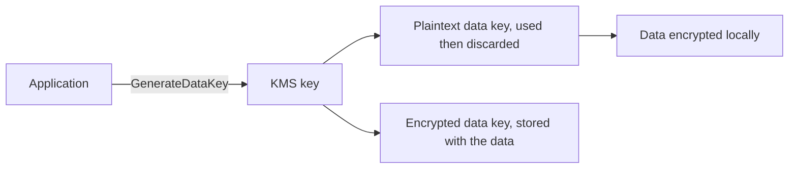

Two AWS services keep sensitive data protected: AWS KMS holds the keys used for envelope encryption, and Secrets Manager stores and rotates credentials. This page explains envelope encryption first, because both services build on it.

## Envelope encryption

In envelope encryption, KMS never sees your bulk data, only the small data key that protects it. `GenerateDataKey` returns a plaintext data key and an encrypted copy; you encrypt the data locally, discard the plaintext key, and store the encrypted key beside the ciphertext. To read it, you ask KMS to decrypt the data key.[^aws-kms]

### Why and when

- Never encrypt large payloads directly with KMS; KMS request quotas are low by design.
- Bind ciphertext to its purpose with an encryption context, and reference keys by alias so rotation is transparent.[^aws-kms]
- Services apply it for you: Secrets Manager encrypts secrets with `aws/secretsmanager` or a customer KMS key, and a decryption failure there usually means the key policy lacks `kms:Decrypt` for the caller.[^aws-secrets-manager]

- [AWS KMS](#aws-kms)

## AWS KMS

AWS Key Management Service (KMS) creates and controls keys used to encrypt and sign data. Keys are protected by FIPS 140-3 Security Level 3 validated HSMs and never leave the service unencrypted.[^aws-kms] The core pattern is [envelope encryption](#envelope-encryption).

### Concepts

- Symmetric, asymmetric, and HMAC keys, controlled by key policies and grants.
- Aliases such as `alias/my-key`; applications should reference aliases so rotation does not break them.
- Automatic annual rotation for symmetric keys; on-demand rotation for asymmetric and HMAC keys.
- Encryption contexts: additional authenticated data bound to an operation.
- Integrated as SSE-KMS in S3, EBS, RDS, and many other services.[^aws-kms]

### Troubleshooting

| Symptom | Check |
| --- | --- |
| `AccessDenied` on `kms:Decrypt` | Key policy, grants, caller's IAM permissions |
| `InvalidCiphertextBlob` | Right key and encryption context; ciphertext is Region- and key-bound |
| Key deleted | Unrecoverable after the pending window; restore or re-encrypt |
| Throttling | Quotas are low by design; back off or reduce calls |

As tabled in the note. The default quota is 5,500 symmetric encrypt/decrypt requests per second per Region, adjustable.[^aws-kms]

## AWS Secrets Manager

Secrets Manager stores versioned secret values behind an API call, so applications fetch credentials at runtime instead of hard-coding them, and a Lambda function can rotate them on a schedule without code changes.[^aws-secrets-manager]

### Concepts

- Versions carry staging labels (`AWSCURRENT`, `AWSPREVIOUS`).
- Encryption with the AWS managed key `aws/secretsmanager` or a customer KMS key; see [envelope encryption](#envelope-encryption).
- Service boundaries it recommends: AWS credentials in IAM, encryption keys in KMS, SSH keys through EC2 Instance Connect, certificates in ACM, and non-secret configuration in SSM Parameter Store.[^aws-secrets-manager]

### Practices

- Rotate database and application credentials automatically every 30 to 90 days.
- Grant `secretsmanager:GetSecretValue` only on specific secret ARNs.
- Never store secrets in plain-text config files or environment variables.
- Keep the deletion recovery window of 7 to 30 days unless the secret is disposable.[^aws-secrets-manager]

### Troubleshooting

| Symptom | Check |
| --- | --- |
| Rotation fails | Rotation Lambda logs, permissions, rotation config |
| `GetSecretValue` denied | Caller's IAM policy and the secret's resource policy |
| KMS decryption errors | The key policy grants `kms:Decrypt` to the caller |
| Deleted by accident | `restore-secret` within the recovery window |

As tabled in the note.[^aws-secrets-manager]

## Related
- [Domain index](index.md): other pages in this domain.

[^aws-kms]: [AWS KMS - Runbook & Reference](../../sources/aws-kms.md), [original](https://github.com/kelvinlee97/engineering/blob/main/AWS/kms/README.md)
[^aws-secrets-manager]: [AWS Secrets Manager - Runbook & Reference](../../sources/aws-secrets-manager.md), [original](https://github.com/kelvinlee97/engineering/blob/main/AWS/secrets-manager/README.md)
