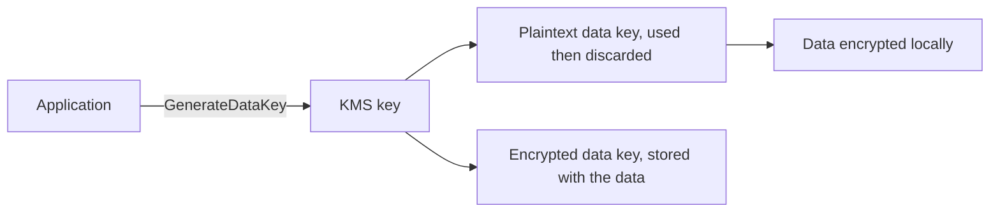

In envelope encryption, KMS never sees your bulk data, only the small data key that protects it. `GenerateDataKey` returns a plaintext data key and an encrypted copy; you encrypt the data locally, discard the plaintext key, and store the encrypted key beside the ciphertext. To read it, you ask KMS to decrypt the data key.[^aws-kms]

## Why and when

- Never encrypt large payloads directly with KMS; KMS request quotas are low by design.[^aws-kms]
- Bind ciphertext to its purpose with an encryption context, and reference keys by alias so rotation is transparent.[^aws-kms]
- Services apply it for you: Secrets Manager encrypts secrets with `aws/secretsmanager` or a customer KMS key, and a decryption failure there usually means the key policy lacks `kms:Decrypt` for the caller.[^aws-secrets-manager]

- [AWS KMS](kms.md)

## Related

- Source: [AWS KMS - Runbook & Reference](../../sources/aws-kms.md)
- Source: [AWS Secrets Manager - Runbook & Reference](../../sources/aws-secrets-manager.md)

[^aws-kms]: AWS KMS - Runbook & Reference
[^aws-secrets-manager]: AWS Secrets Manager - Runbook & Reference
