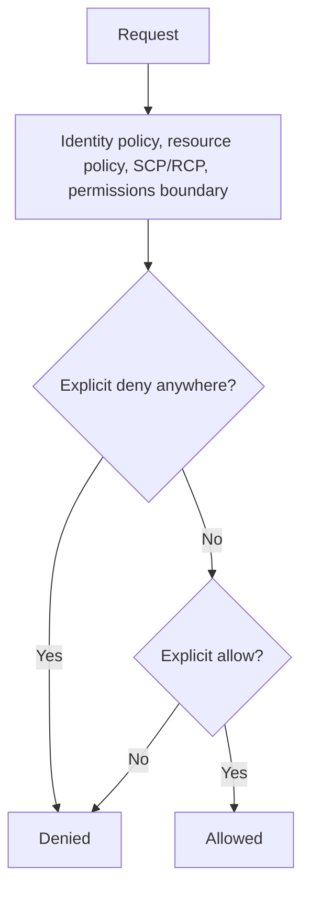

AWS evaluates every request against several independent policy layers. An explicit deny in any layer wins, and a request is denied unless an applicable layer explicitly allows it.[^aws-iam]

## Layers that only narrow

Two layers can only take permissions away. A permissions boundary caps what identity-based policies can grant.[^aws-iam] Organization SCPs and RCPs set cross-account boundaries and grant nothing by themselves; SCPs also do not apply to the management account, which is why an SCP can appear to have no effect.[^aws-iam][^aws-organizations]

## Debugging `AccessDenied`

Check each layer in turn: identity policy, resource policy, SCP or RCP, permissions boundary, and session policy. IAM is eventually consistent, so a just-made change may need time to propagate.[^aws-iam]

- [Least-privilege tool access](../claude-code/least-privilege-tool-access.md): the same layered model in agent tooling.

## Related

- Source: [AWS IAM - Runbook & Reference](../../sources/aws-iam.md)
- Source: [AWS Organizations - Runbook & Reference](../../sources/aws-organizations.md)

[^aws-iam]: AWS IAM - Runbook & Reference
[^aws-organizations]: AWS Organizations - Runbook & Reference
