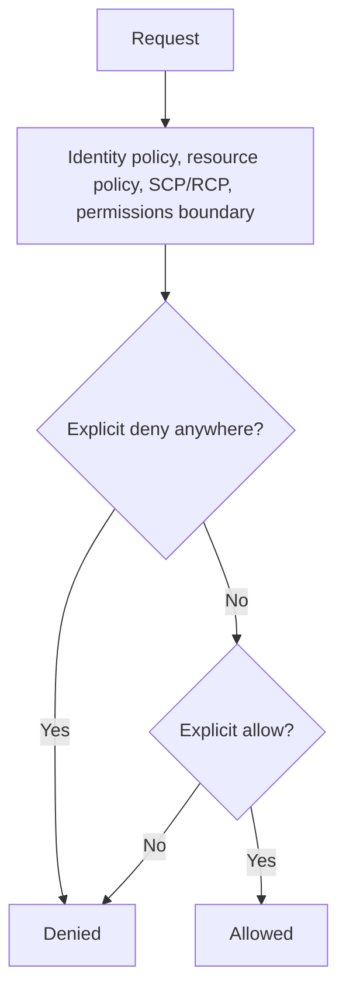

AWS Identity and Access Management (IAM) decides who can sign in to AWS and what each identity may do. This page covers the building blocks (users, groups, roles, and policies), how IAM evaluates the policies on a request, and IAM Identity Center for giving a workforce single sign-on across accounts.

## What IAM is

AWS Identity and Access Management (IAM) controls authentication (who is signed in) and authorization (what they may do) for AWS resources. IAM, IAM Identity Center, and AWS STS carry no additional charge, and IAM is eventually consistent.[^aws-iam] How a request is decided is covered under [IAM policy evaluation](#iam-policy-evaluation).

### Building blocks

| Piece | Role |
| --- | --- |
| Root user | The initial full-access identity; not for everyday work |
| Users, groups, roles | Identities for people and workloads; roles give temporary credentials |
| Policies | JSON documents on identities or resources defining permissions |
| AWS STS | Issues temporary credentials, for example `AssumeRole` |
| Permissions boundaries | Cap what identity-based policies can grant |
| Organization SCPs and RCPs | Cross-account boundaries that grant nothing by themselves |

As defined in the note.[^aws-iam]

### Practices

- Temporary credentials everywhere: federated sign-in through [IAM Identity Center](#aws-iam-identity-center) for people, roles for workloads (instance profiles, Lambda execution roles, ECS/EKS task roles).
- MFA for the root user and any long-term credentials; never use root routinely.
- Least privilege, starting from AWS managed policies; IAM Access Analyzer can generate least-privilege policies from CloudTrail activity and detect public or cross-account access.
- Remove unused users, roles, policies, and keys using last-accessed information.[^aws-iam]

### Troubleshooting

| Symptom | Check |
| --- | --- |
| `AccessDenied` | Identity policy, resource policy, SCP/RCP, boundary, session policy; retry after propagation |
| `AssumeRole` fails | The trust policy allows the principal, external ID, session duration within the role maximum (up to 12 hours) |
| Cannot delete a user or role | Remove policies, keys, and memberships first |

As tabled in the note.[^aws-iam]

### Default quotas

1,000 roles, 1,500 customer managed policies, 300 groups, 20 managed policies per role and 10 per user, a managed policy size of 6,144 characters, a maximum session of 12 hours, and 600 STS requests per second per account per Region.[^aws-iam]

## IAM policy evaluation

AWS evaluates every request against several independent policy layers. An explicit deny in any layer wins, and a request is denied unless an applicable layer explicitly allows it.[^aws-iam]

### Layers that only narrow

Two layers can only take permissions away. A permissions boundary caps what identity-based policies can grant. Organization SCPs and RCPs set cross-account boundaries and grant nothing by themselves; SCPs also do not apply to the management account, which is why an SCP can appear to have no effect.[^aws-iam][^aws-organizations]

### Debugging `AccessDenied`

Check each layer in turn: identity policy, resource policy, SCP or RCP, permissions boundary, and session policy. IAM is eventually consistent, so a just-made change may need time to propagate.[^aws-iam]

The same layered model applies to agent tooling; see [Least-privilege tool access](../claude-code/subagents.md#least-privilege-tool-access).

## AWS IAM Identity Center

IAM Identity Center (the successor to AWS Single Sign-On, renamed in July 2022) centrally manages workforce identities and their access to AWS accounts and cloud applications. It is AWS's recommended service for multi-account access.[^aws-iam-identity-center]

### How access is granted

Users and groups come from the Identity Center directory or an external IdP (such as Okta or Microsoft Entra ID, via SCIM provisioning and SAML 2.0). An **account assignment** gives a user or group a **permission set** (a named collection of IAM policies plus a session duration) in an account, and people sign in through the **access portal** with MFA. The APIs keep the old `sso`, `sso-admin`, and `identitystore` namespaces; CLI login is `aws sso login`.[^aws-iam-identity-center]

### Practices

- Create the instance in the organization's management account and assign access to groups, not individuals.
- Use an external IdP as the source of truth with SCIM provisioning; require MFA.
- Keep permission sets least-privilege with a suitable session duration, and review assignments with CloudTrail.[^aws-iam-identity-center]

### Troubleshooting

| Symptom | Check |
| --- | --- |
| No access to an account | Assignment, group membership, permission set, instance in the management account |
| External IdP users missing | SCIM enabled, bearer token valid, SAML metadata current |
| CLI login error | Re-run `aws configure sso`; session name and start URL match |
| New account invisible | Account is in the organization; re-run assignments |

As tabled in the note.[^aws-iam-identity-center] See also [Multi-account governance](multi-account-governance.md#why-many-accounts).

## Related
- [Domain index](index.md): other pages in this domain.

[^aws-iam]: [AWS IAM - Runbook & Reference](../../sources/aws-iam.md), [original](https://github.com/kelvinlee97/engineering/blob/main/AWS/iam/README.md)
[^aws-organizations]: [AWS Organizations - Runbook & Reference](../../sources/aws-organizations.md), [original](https://github.com/kelvinlee97/engineering/blob/main/AWS/organizations/README.md)
[^aws-iam-identity-center]: [AWS IAM Identity Center - Runbook & Reference](../../sources/aws-iam-identity-center.md), [original](https://github.com/kelvinlee97/engineering/blob/main/AWS/iam-identity-center/README.md)
