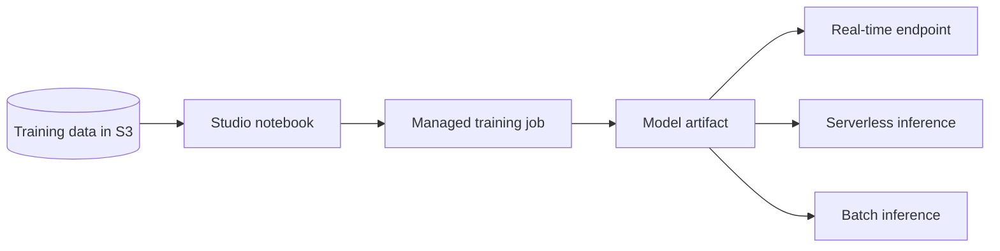

AWS offers machine learning at two levels of control. SageMaker AI is the platform for building, training, and hosting your own models. Personalize and Forecast are managed services that train a model on your data for one job each, recommendations and time-series forecasts, without ML expertise. For pre-trained APIs that need no training at all, see [AI services](ai-services.md).

## Choosing a level

| | SageMaker AI | Personalize | Forecast |
| --- | --- | --- | --- |
| You bring | Data, and an algorithm or framework (or use a managed one) | User-item interactions, items, users | Historical time series |
| You get | A hosted endpoint: real-time, serverless, or batch | Recommendations, user segments, next best action | Forecasts over a horizon you set |
| Algorithm choice | Yours | Use-case recommenders, or custom solutions | Automated (AutoPredictor) |
| Status | Available | Available | Closed to new customers |

## Amazon SageMaker AI

SageMaker AI takes a model from a notebook, through a managed training job, to a hosted endpoint. Studio and Unified Studio are the development environments for data preparation, experiments, and MLOps; training runs managed or bring-your-own algorithms with distributed options; deployment serves real-time, serverless, or batch inference.

Amazon SageMaker was renamed SageMaker AI on December 3, 2024, when "Amazon SageMaker" became the name of a wider data, analytics, and AI platform that includes Lakehouse, Data and AI Governance, SQL analytics, Unified Studio, and Amazon Bedrock. Nothing technical changed: the `sagemaker` API namespace, CLI commands, managed policies, CloudFormation resources, service-linked roles, and URLs keep their names.

- Keep training data versioned in S3, share features through a managed feature store, and track experiments so they can be reproduced.
- Pick the smallest instance that works and use managed Spot training.
- For slow inference, right-size the endpoint, use serverless inference for spiky traffic, or batch inference when results need not be real time.[^aws-sagemaker]

| Symptom | Check |
| --- | --- |
| Training job fails | CloudWatch job logs, input data format, and the IAM role |
| Endpoint creation fails | The model artifact path, instance type, and production variant |
| Notebook cannot read S3 | The notebook's role and instance profile |

## Amazon Personalize

Personalize trains recommendation models on your data. It imports datasets of interactions (user-item events), items, users, and actions, in bulk from CSV and as real-time events, then trains either a use-case recommender (such as "Top picks", "More like X", or "Recommended for you") or a custom solution. A trained solution version serves live recommendations through a campaign, or offline lists and user segments through batch jobs.

- Collect clean interactions (user, item, timestamp) and stream real-time events so recommendations stay fresh.
- Start with a use-case recommender and move to a custom solution when you need deeper tuning; test with offline metrics and A/B tests before rollout.
- Serve popular items to cold-start users who have no history, and retrain when recommendations go stale.[^aws-personalize]

## Amazon Forecast

Forecast predicts future values, such as demand, traffic, capacity, or financial metrics, from historical time series, choosing and training the algorithm itself (AutoPredictor) and handling missing values and holiday features. It is closed to new customers; existing customers can keep using it.

- Import regular series with timestamps, item IDs, and target values, plus related series where you have them.
- Validate accuracy with backtests before production, and pick a horizon that matches the planning cycle, such as 30 or 90 days.[^aws-forecast]

## Related

- [AI services](ai-services.md): pre-trained APIs for language, vision, and speech.
- [Analytics](analytics.md): Glue, Athena, and Redshift, where training data is prepared.
- [Domain index](index.md)

[^aws-sagemaker]: [Amazon SageMaker AI - Runbook & Reference](../../sources/aws-sagemaker.md), [original](https://github.com/kelvinlee97/engineering/blob/main/AWS/sagemaker/README.md)
[^aws-personalize]: [Amazon Personalize - Runbook & Reference](../../sources/aws-personalize.md), [original](https://github.com/kelvinlee97/engineering/blob/main/AWS/personalize/README.md)
[^aws-forecast]: [Amazon Forecast - Runbook & Reference](../../sources/aws-forecast.md), [original](https://github.com/kelvinlee97/engineering/blob/main/AWS/forecast/README.md)
