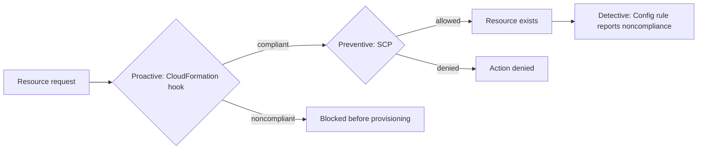

These services govern many AWS accounts once [Organizations](multi-account-governance.md) exists. Control Tower builds and polices a landing zone, a governed multi-account baseline. Service Catalog offers approved infrastructure for self-service. Service Quotas, License Manager, Resource Access Manager (RAM), and Resource Groups manage limits, licenses, sharing, and tags across accounts. AWS Managed Services (AMS) hands day-to-day operations to AWS.

## Choosing a service

| Job | Service | Scope |
| --- | --- | --- |
| Set up and police a multi-account baseline | [Control Tower](#aws-control-tower) | The organization |
| Let teams launch only approved stacks | [Service Catalog](#aws-service-catalog) | Portfolios granted to IAM groups and roles |
| See and raise service limits | [Service Quotas](#aws-service-quotas) | Account, Region, or resource |
| Stay within software license terms | [License Manager](#aws-license-manager) | Across accounts and Regions |
| Use one account's resource from another | [RAM](#aws-resource-access-manager) | Accounts, OUs, or the organization |
| Find, group, and tag resources | [Resource Groups and Tag Editor](#aws-resource-groups-and-tag-editor) | One Region per group |
| Outsource operations | [AMS](#aws-managed-services) | Your environment, under AMS change control; AMS Advanced ends June 30, 2027 |

## AWS Control Tower

Control Tower orchestrates a landing zone on top of Organizations, Service Catalog, and IAM Identity Center: a management account, organizational units such as workload and sandbox, shared accounts, and guardrails. It adds governance rather than replacing Organizations. Account Factory creates accounts with their baselines, through the console, Service Catalog, or APIs. Drift detection periodically finds changes that break the landing zone, such as a manual SCP edit, and shows them on the dashboard.

Its controls act at three different moments:

Analysis: the diagram puts proactive before preventive for a CloudFormation-provisioned resource; the note describes each control's moment, not their ordering.

- Plan OUs and guardrails before creating the landing zone; restructuring later means reviewing drift.
- Keep the management account for administration, and put workloads in Control Tower-managed accounts.
- Use preventive controls for high-impact actions such as Region restrictions and public access, and detective controls for monitoring.
- A control shown as "not applicable" often applies only to certain resource types or Regions; Account Factory failures show up in Service Catalog and CloudFormation StackSets.[^aws-control-tower]

## AWS Service Catalog

Service Catalog lets administrators publish approved products, from a single server or database to a multi-tier application, built from CloudFormation templates (or Terraform open source) and versioned. Products sit in portfolios with constraints: launch constraints (such as instance type limits and the IAM role used to launch), template constraints, stack-set constraints for multi-account rollout, and notification constraints. Users browse and launch only what their portfolios grant, without direct access to the underlying services, and can update or terminate what they launched. One product can sit in many portfolios, and a new version reaches all of them.

- Test a new product version in a lower environment before offering it in production portfolios.
- Grant portfolios to groups or roles, not individuals, and use tag options for consistent tagging.
- A user who cannot see a product usually lacks portfolio access, or the version is not available.[^aws-service-catalog]

## AWS Service Quotas

Service Quotas shows and manages the limits of every service in one place, with current usage and utilization (150 of 200 resources is 75%). The default quota is AWS's starting value; the applied quota is the value after an approved increase. Adjustable quotas can be raised at account or resource level, and AWS may approve, deny, or partly approve a request. Global quotas are raised from us-east-1 for public AWS (GovCloud US-West or China Beijing in those partitions).

- Check quotas before a large launch, and use Automatic Management for alerts near a limit.
- Request increases early; approval takes time. Resource-level quotas may need CLI version 2.13.20 or later.[^aws-service-quotas]

## AWS License Manager

License Manager tracks licenses from Microsoft, SAP, Oracle, IBM, and others across accounts and Regions, including bring-your-own-license. A license configuration models an agreement as hard or soft limits on vCPUs, physical cores, sockets, or machines; a hard limit stops noncompliant use before it happens, and violations are reported. License asset groups manage licenses across an organization; granted licenses cover AWS Marketplace, Data Exchange, and sellers using managed entitlements.

- Attach license configurations to EC2 and RDS resources, and manage asset groups from the management account.
- Use Systems Manager Inventory to measure on-premises usage before migrating; for RDS Oracle and Db2 vCPU licensing, use the RDS integration.[^aws-license-manager]

## AWS Resource Access Manager

RAM shares resources across accounts, OUs, or the organization, so every account does not need its own copy. A resource share bundles resources, principals, and a managed permission that sets what recipients may do, such as read-only or read-write on a subnet. Inside your organization a share takes effect immediately; outside it, the recipient must accept an invitation. Shares of global resources, such as Aurora global databases, are made in the Home Region, us-east-1. RAM itself is free.

- Share by OU or organization so new accounts get access automatically, and use the least-privilege managed permission that works.
- For VPC sharing, share subnets so other accounts launch into them, instead of building overlapping VPCs.
- A recipient who cannot see a resource: check the Region, the principal list, and whether the invitation was accepted.[^aws-ram]

## AWS Resource Groups and Tag Editor

Tags are key/value metadata for billing and administration; never put PII or confidential data in them. A resource group is a saved query over tags and resource types that returns matching resources in one Region, giving an operational view for bulk actions. Tag Editor searches resources by tag and type and edits tags in bulk.

- Define a company-wide tag taxonomy (environment, owner, cost center, application) and enforce it with tag policies in Organizations.
- Activate cost allocation tags in Billing, or Cost Explorer cannot group costs by them.[^aws-resource-groups-tag-editor]

## AWS Managed Services

AMS is an operations team consumed as a service: it provisions, monitors (24x7), patches, secures, and backs up your AWS infrastructure following ITSM practice. Changes, including your own, go through an AMS change request workflow with approval gates, which keeps its guardrails intact; AMS-managed roles mean direct access is often denied by design. AWS has announced end of support for AMS Advanced on June 30, 2027.[^aws-managed-services]

## Related

- [Multi-account governance](multi-account-governance.md): Organizations, OUs, and SCPs underneath Control Tower.
- [Compliance and posture](compliance-and-posture.md): Config, which runs Control Tower's detective controls.
- [Cost](cost.md): billing tools that use cost allocation tags.
- [Domain index](index.md)

[^aws-control-tower]: [AWS Control Tower - Runbook & Reference](../../sources/aws-control-tower.md), [original](https://github.com/kelvinlee97/engineering/blob/main/AWS/control-tower/README.md)
[^aws-service-catalog]: [AWS Service Catalog - Runbook & Reference](../../sources/aws-service-catalog.md), [original](https://github.com/kelvinlee97/engineering/blob/main/AWS/service-catalog/README.md)
[^aws-service-quotas]: [AWS Service Quotas - Runbook & Reference](../../sources/aws-service-quotas.md), [original](https://github.com/kelvinlee97/engineering/blob/main/AWS/service-quotas/README.md)
[^aws-license-manager]: [AWS License Manager - Runbook & Reference](../../sources/aws-license-manager.md), [original](https://github.com/kelvinlee97/engineering/blob/main/AWS/license-manager/README.md)
[^aws-ram]: [AWS Resource Access Manager (RAM) - Runbook & Reference](../../sources/aws-ram.md), [original](https://github.com/kelvinlee97/engineering/blob/main/AWS/ram/README.md)
[^aws-resource-groups-tag-editor]: [AWS Resource Groups & Tag Editor - Runbook & Reference](../../sources/aws-resource-groups-tag-editor.md), [original](https://github.com/kelvinlee97/engineering/blob/main/AWS/resource-groups-tag-editor/README.md)
[^aws-managed-services]: [AWS Managed Services (AMS) - Runbook & Reference](../../sources/aws-managed-services.md), [original](https://github.com/kelvinlee97/engineering/blob/main/AWS/managed-services/README.md)
