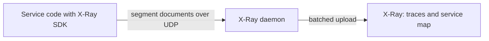

These services tell you what is happening in and around your workloads, beyond the metrics and logs in [CloudWatch](operations-tooling.md). X-Ray traces single requests across services. AWS Health reports AWS's own disruptions and planned changes that affect your accounts. Trusted Advisor checks your accounts against best practices. OpsWorks, a retired configuration management service, appears here only as a map for migrating off it.

## Choosing a service

| Question | Service | Source of truth | Cost and access |
| --- | --- | --- | --- |
| Where is this request slow or failing? | [X-Ray](#aws-x-ray) | Traces your code sends | Sampling rules control cost; traces kept 30 days |
| Is AWS itself having a problem, or changing something, that affects me? | [AWS Health](#aws-health) | AWS's events for your account | Dashboard and EventBridge events free; the API needs a qualifying support plan |
| What in my account breaks best practice? | [Trusted Advisor](#aws-trusted-advisor) | Automated checks on your resources | Full checks and the API need Business Support+ or above |
| How do I get off OpsWorks Stacks? | [OpsWorks](#aws-opsworks) | Your existing stacks | Discontinued May 26, 2024 |

Health and Trusted Advisor both send changes to EventBridge, so route both into the same alerting path (SNS, Slack, or incident tooling) rather than checking consoles.[^aws-health][^aws-trusted-advisor]

## AWS X-Ray

X-Ray records the path of each request through your front end, microservices, databases, and downstream AWS APIs. Each service contributes a segment, and each call within it a subsegment; a trace joins them into one request path, and the service map draws the calls between services with latency and errors.

- The SDKs (Java, Python, Node.js, Go, .NET, Ruby) create subsegments automatically for HTTP clients, AWS SDK calls, and database queries; instrument at service boundaries.
- Run the daemon yourself on EC2 or on premises; Lambda and Elastic Beanstalk include it.
- Sampling rules set how many requests are traced; lower them on high-traffic, low-value endpoints to control cost.[^aws-x-ray]

| Symptom | Check |
| --- | --- |
| No traces | SDK instrumentation, daemon status, and IAM permissions |
| Downstream calls missing | SDK version, and that HTTP and AWS SDK clients are instrumented |
| Trace breaks between services | Trace header propagation through proxies and Lambda |

## AWS Health

AWS Health reports service disruptions, scheduled changes, and account notifications (such as security and billing) that affect your resources, each with affected entities and guidance. The Health Dashboard needs no setup and shows only the current account. Every customer can receive the same events through EventBridge (source `aws.health`); the Health API, for integrating with other tools, needs Business Support+ or above.

- Subscribe to Health events through EventBridge for all accounts and Regions.
- Watch scheduled changes early, so maintenance windows are not a surprise.[^aws-health]

## AWS Trusted Advisor

Trusted Advisor runs best-practice checks in five categories: cost optimization, security, fault tolerance, performance, and service limits. Examples include underutilized EC2 instances, MFA on the root account, RDS backups, and usage near a quota. The console shows each check as green, yellow, or red with a recommended action.

| Support plan | Checks | API and EventBridge |
| --- | --- | --- |
| Basic | Service limits plus selected security and fault-tolerance checks; security checks refresh manually | No |
| Business Support+, Enterprise Support, or AWS Unified Operations | All checks | Yes |

- Review on a schedule with an owner per recommendation, and act first on security and service-limit findings such as root MFA and open security groups.[^aws-trusted-advisor]

## AWS OpsWorks

OpsWorks Stacks used Chef to configure EC2 instances: a stack per Region held layers of identically configured instances, and Chef recipes ran at lifecycle events (setup, configure, deploy, undeploy, shutdown), with auto-healing and load- or time-based scaling. It was discontinued for all customers on May 26, 2024.

| OpsWorks piece | Migrate to |
| --- | --- |
| Instance operations and Chef recipes | Systems Manager documents, or user data |
| Stacks and layers as infrastructure | CloudFormation |
| Application deployments | CodeDeploy |
| Whole application platform | Containers or Elastic Beanstalk |

Test the migration on a subset of workloads before decommissioning the old stacks.[^aws-opsworks]

## Related

- [Operations tooling](operations-tooling.md): CloudWatch, CloudFormation, and Systems Manager.
- [Management and governance](management-and-governance.md): Service Quotas, which Trusted Advisor's service-limit checks track.
- [CI/CD](ci-cd.md): CodeDeploy, the deployment target for OpsWorks migrations.
- [Domain index](index.md)

[^aws-health]: [AWS Health - Runbook & Reference](../../sources/aws-health.md), [original](https://github.com/kelvinlee97/engineering/blob/main/AWS/health/README.md)
[^aws-trusted-advisor]: [AWS Trusted Advisor - Runbook & Reference](../../sources/aws-trusted-advisor.md), [original](https://github.com/kelvinlee97/engineering/blob/main/AWS/trusted-advisor/README.md)
[^aws-x-ray]: [AWS X-Ray - Runbook & Reference](../../sources/aws-x-ray.md), [original](https://github.com/kelvinlee97/engineering/blob/main/AWS/x-ray/README.md)
[^aws-opsworks]: [AWS OpsWorks - Runbook & Reference](../../sources/aws-opsworks.md), [original](https://github.com/kelvinlee97/engineering/blob/main/AWS/opsworks/README.md)
