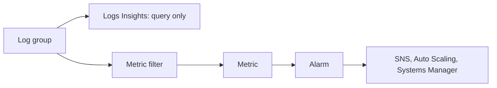

Three AWS services cover day-to-day operations: CloudWatch for metrics, logs, and alarms, CloudFormation for defining infrastructure as templates, and Systems Manager for managing instances without SSH.

## Amazon CloudWatch

CloudWatch collects metrics, logs, and traces and provides alarms, dashboards, and automated actions. An alarm only ever watches a metric, never a log or a trace, so alarming on a log pattern needs a metric filter in between.[^aws-cloudwatch]

### Concepts

- AWS services publish metrics automatically; you add custom metrics; standard metrics are kept 15 months.
- Logs Insights queries in SQL or PPL; subscription filters stream logs elsewhere.
- The CloudWatch agent adds OS-level metrics (memory, disk) from EC2 and on-premises.
- Application Signals with SLOs, Synthetics canaries, RUM, Container/Lambda/Database Insights, and native OTLP ingestion.[^aws-cloudwatch]

### Troubleshooting

| Symptom | Check |
| --- | --- |
| No instance metrics | Agent running; role allows `cloudwatch:PutMetricData` |
| Alarm not firing | Metric name, namespace, period; state not `INSUFFICIENT_DATA` |
| High cost | Custom metric volume, log ingestion, detailed monitoring |

As tabled in the note.[^aws-cloudwatch]

## AWS CloudFormation

CloudFormation provisions AWS resources from YAML or JSON templates as one unit, a stack, resolving dependencies. Every update is really "compute a change set, then execute it"; the change set exists so the diff can be reviewed first, and skipping to `update-stack` removes only that review.[^aws-cloudformation]

### Concepts

- Stacks, stack sets (many accounts and Regions), nested stacks, drift detection.
- Templates up to 51,200 bytes inline, 1 MB from S3.[^aws-cloudformation]

### Practices

- Review change sets for production; set `DeletionPolicy` and `UpdateReplacePolicy` on stateful resources.
- Parameters and Secrets Manager references instead of hard-coded values; be deliberate with `CAPABILITY_IAM`.
- Separate stacks by lifecycle (network, data, application) and run drift detection.[^aws-cloudformation]

### Troubleshooting

| Symptom | Check |
| --- | --- |
| Create fails and rolls back | `describe-stack-events`: the first `CREATE_FAILED` is the root cause |
| IAM resource errors | `--capabilities CAPABILITY_NAMED_IAM` |
| Cross-stack dependency errors | Output names and `Fn::ImportValue` |

As tabled in the note.[^aws-cloudformation]

## AWS Systems Manager

Systems Manager operates nodes at scale across AWS, on-premises, and other clouds. Nodes running the SSM Agent register as managed nodes, and tools act on them without logging in.

| Tool | Purpose |
| --- | --- |
| Run Command | Commands on many nodes without SSH or RDP |
| Session Manager | Audited shells with no inbound ports or bastions |
| Patch Manager | Patch baselines and compliance |
| Automation | Runbooks (SSM documents) for tasks and remediation |
| Parameter Store | Versioned configuration; SecureString with KMS |
| State Manager, Inventory, OpsCenter | Desired state, metadata, operational issues |

As listed in the note.[^aws-systems-manager]

### Practices

- Give nodes a role with `AmazonSSMManagedInstanceCore`; prefer Session Manager to SSH and record sessions.
- Restrict `SendCommand` and `StartSession` with IAM and SCPs.[^aws-systems-manager]

### Troubleshooting

| Symptom | Check |
| --- | --- |
| Node not managed | Agent running, instance role, outbound access to SSM endpoints |
| Session won't start | Session Manager config, IAM, SSM VPC endpoint or NAT |
| Patching not applied | Baseline, maintenance window, registration |

As tabled in the note.[^aws-systems-manager]

## Related

- [Safe change procedure](../operations/incident-operations.md#safe-change-procedure): the same preview-then-apply discipline in general operations.

[^aws-cloudwatch]: [Amazon CloudWatch - Runbook & Reference](../../sources/aws-cloudwatch.md), [original](https://github.com/kelvinlee97/engineering/blob/main/AWS/cloudwatch/README.md)
[^aws-cloudformation]: [AWS CloudFormation - Runbook & Reference](../../sources/aws-cloudformation.md), [original](https://github.com/kelvinlee97/engineering/blob/main/AWS/cloudformation/README.md)
[^aws-systems-manager]: [AWS Systems Manager - Runbook & Reference](../../sources/aws-systems-manager.md), [original](https://github.com/kelvinlee97/engineering/blob/main/AWS/systems-manager/README.md)
