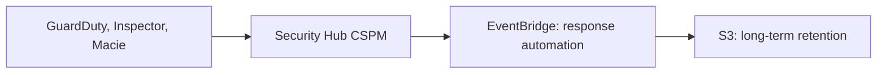

AWS's detective services each produce findings, but none keeps them long. The notes describe the same pipeline: detect, aggregate, route, and export.

## Retention is short everywhere

| Service | Built-in retention |
| --- | --- |
| GuardDuty findings | 90 days, fixed[^aws-guardduty] |
| Security Hub CSPM findings | 90 days[^aws-security-hub] |
| CloudTrail event history | 90 days, cannot be extended[^aws-cloudtrail] |

So every note recommends exporting: GuardDuty findings to S3, Security Hub findings archived through EventBridge, and CloudTrail events to a trail or Lake event data store.[^aws-guardduty][^aws-security-hub][^aws-cloudtrail]

## Wiring rules

- A service's findings reach Security Hub only if that service and its integration are enabled in the same Region.[^aws-security-hub]
- Filters and suppression rules hide findings; they do not fix causes.[^aws-guardduty]

- [AWS multi-account governance](multi-account-governance.md)

## Related

- Source: [Amazon GuardDuty - Runbook & Reference](../../sources/aws-guardduty.md)
- Source: [AWS Security Hub CSPM - Runbook & Reference](../../sources/aws-security-hub.md)
- Source: [AWS CloudTrail - Runbook & Reference](../../sources/aws-cloudtrail.md)

[^aws-guardduty]: Amazon GuardDuty - Runbook & Reference
[^aws-security-hub]: AWS Security Hub CSPM - Runbook & Reference
[^aws-cloudtrail]: AWS CloudTrail - Runbook & Reference
